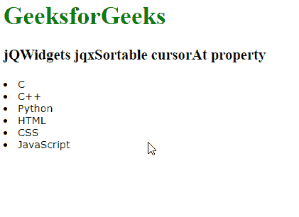

# jQWidgets jqxSortable cursorAt 属性

> 原文:[https://www . geesforgeks . org/jqwidgets-jqxsortable-cursorat-property/](https://www.geeksforgeeks.org/jqwidgets-jqxsortable-cursorat-property/)

**jQWidgets** 是一个 JavaScript 框架，用于为 PC 和移动设备制作基于 web 的应用程序。它是一个非常强大和优化的框架，独立于平台，并得到广泛支持。 **jqxSortable** 代表一个 jQuery 插件，允许你用鼠标重新排序 HTML 列表或 div 标签中的元素。

**光标**属性用于定义拖动时显示的位置。位置坐标可以通过使用一个或两个键的组合来作为散列给出:{上、左、右、下}。它接受对象类型值，默认值为 false。

**语法:**

*   它用于设置 cursorAt 属性。

    ```
    $('Selector').jqxSortable({ cursorAt : object});
    ```

*   它用于返回 cursorAt 属性。

    ```
    var cursorAt = $('Selector').jqxSortable('cursorAt ');
    ```

**链接文件:**从给定链接下载 [jQWidgets](https://www.jqwidgets.com/download/) 。在 HTML 文件中，找到下载文件夹中的脚本文件。

> <link type="”text/css”" rel="”Stylesheet”" href="”jqwidgets/styles/jqx.base.css”">
> <脚本类型=【文本/JavaScript】src =【脚本/jquery-1 . 11 . 1 . min . js】></脚本>
> <脚本类型=【文本/JavaScript】src =【jqwidgets/jqxcore . js】></脚本>
> <脚本类型=【文本/JavaScript】src =【jqwidgets/全球化/GLO Bali

**示例:**下面的示例说明了 jQWidgets 中的 jqxSortable cursorAt 属性。

## 超文本标记语言

```
<!DOCTYPE html>
<html lang="en">

<head>
    <link type="text/css" rel="Stylesheet" 
          href="jqwidgets/styles/jqx.base.css" />
    <script type="text/javascript" 
            src="scripts/jquery-1.11.1.min.js">
    </script>
    <script type="text/javascript" 
            src="jqwidgets/jqxcore.js">
    </script>
    <script type="text/javascript" 
            src="jqwidgets/globalization/globalize.js">
    </script>
    <script type="text/javascript" 
            src="jqwidgets/jqxsortable.js">
    </script>
</head>

<body>
    <h1 style="color: green">
          GeeksforGeeks 
    </h1>
    <h3>jQWidgets jqxSortable cursorAt property</h3>
    <div id="sort1">
        <div class='gfg'><li>C</li></div>
        <div><li>C++</li></div>
        <div><li>Python</li></div>
        <div><li>HTML</li></div>
        <div><li>CSS</li></div>
        <div><li>JavaScript</li></div>
    </div>    

    <script type="text/javascript">
        $(document).ready(function () {
            $("#sort1").jqxSortable({
               cursorAt: { left: 5, top:5 }
            });
        });
    </script>
</body>

</html>
```

**输出:**



**参考:**[https://www . jqwidgets . com/jquery-widgets-documentation/documentation/jqxsortable/jquery-sortable-API . htm？搜索=](https://www.jqwidgets.com/jquery-widgets-documentation/documentation/jqxsortable/jquery-sortable-api.htm?search=)