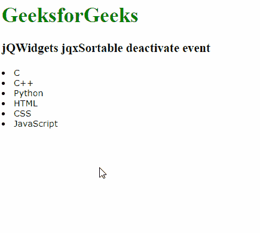

# jQWidgets jqxSortable 停用事件

> 原文:[https://www . geesforgeks . org/jqwidgets-jqxsortable-deactivate-event/](https://www.geeksforgeeks.org/jqwidgets-jqxsortable-deactivate-event/)

**jQWidgets** 是一个 JavaScript 框架，用于为 PC 和移动设备制作基于 web 的应用程序。它是一个非常强大、优化、独立于平台并且得到广泛支持的框架。 **jqxSortable** 代表一个 jQuery 插件，允许你使用鼠标对 [HTML 列表](https://www.geeksforgeeks.org/html-lists/)或 [*div*](https://www.geeksforgeeks.org/div-tag-html/) 标签中的元素重新排序。

当可分类停止时，触发**停用**事件。

**语法:**

```html
$('.jqxSortable').on('deactivate', function (){
    // Code
});  
```

**链接文件:**从给定链接下载 [jQWidgets](https://www.jqwidgets.com/download/) 。在 HTML 文件中，找到下载文件夹中的脚本文件。

> <link type="”text/css”" rel="”Stylesheet”" href="”jqwidgets/styles/jqx.base.css”">
> <脚本类型= " text/JavaScript " src = " scripts/jquery-1 . 11 . 1 . min . js "></脚本类型>
> <脚本类型= " text/JavaScript " src = " jqwidgets/jqxcore . js "></脚本类型>
> <脚本类型= " text/JavaScript " src = " jqwidgets/globalize . js

**示例:**下面的示例说明了 jQWidgets 中的 jqxSortable **停用**事件。

## 超文本标记语言

```html
<!DOCTYPE html>
<html lang="en">

<head>
    <link type="text/css" rel="stylesheet" 
          href="jqwidgets/styles/jqx.base.css" />
    <script type="text/javascript" 
            src="scripts/jquery-1.11.1.min.js">
    </script>
    <script type="text/javascript" 
            src="jqwidgets/jqxcore.js">
    </script>
    <script type="text/javascript" 
            src="jqwidgets/globalization/globalize.js">
    </script>
    <script type="text/javascript" 
            src="jqwidgets/jqxsortable.js">
    </script>
</head>

<body>
    <h1 style="color: green">
          GeeksforGeeks 
    </h1>
    <h3>jQWidgets jqxSortable deactivate event</h3>

    <div class="gfg">
        <div id="sort1">
            <div><li>C</li></div>
            <div><li>C++</li></div>
            <div><li>Python</li></div>
            <div><li>HTML</li></div>
            <div><li>CSS</li></div>
            <div><li>JavaScript</li></div>
        </div> 
    </div>

    <script type="text/javascript">
        $(document).ready(function () {
            $("#sort1").jqxSortable({
            });

            $('#sort1').on("deactivate", function(){
                $('#sort1').append(`<br>`+'deactivated' );
            })
        });
    </script>
</body>

</html>
```

**输出:**



**参考:**[https://www . jqwidgets . com/jquery-widgets-documentation/documentation/jqxsortable/jquery-sortable-API . htm？搜索=](https://www.jqwidgets.com/jquery-widgets-documentation/documentation/jqxsortable/jquery-sortable-api.htm?search=)