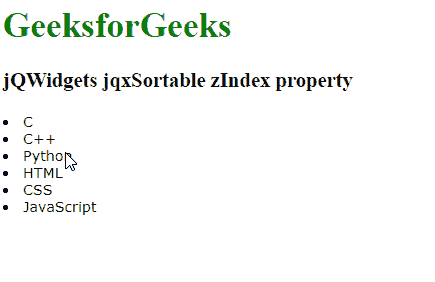

# jQWidgets jqxSortable zIndex 属性

> 原文:[https://www . geesforgeks . org/jqwidgets-jqxsortable-zindex-property/](https://www.geeksforgeeks.org/jqwidgets-jqxsortable-zindex-property/)

**jQWidgets** 是一个 JavaScript 框架，用于为 PC 和移动设备制作基于 web 的应用程序。它是一个非常强大和优化的框架，独立于平台，并得到广泛支持。 **jqxSortable** 代表一个 jQuery 插件，它允许你用鼠标对一个 Html 列表或 div 标签中的元素重新排序。

**zIndex 属性**用于设置或返回元素的 *z 索引*，该索引用于指定元素的堆叠顺序。它接受数字类型值，默认值为 1000。

**语法:**

*   用于设置 *zIndex* 属性

    ```
    $('Selector').jqxSortable({ zIndex : number });
    ```

*   用于返回 *zIndex* 属性。

    ```
    var zIndex = $('Selector').jqxSortable('zIndex')
    ```

**链接文件:**从给定链接下载 [jQWidgets](https://www.jqwidgets.com/download/) 。在 HTML 文件中，找到下载文件夹中的脚本文件。

> <link type="”text/css”" rel="”Stylesheet”" href="”jqwidgets/styles/jqx.base.css”">
> <脚本类型=【文本/JavaScript】src =【脚本/jquery-1 . 11 . 1 . min . js】></脚本>
> <脚本类型=【文本/JavaScript】src =【jqwidgets/jqxcore . js】></脚本>
> <脚本类型=【文本/JavaScript】src =【jqwidgets/全球化/GLO Bali

**示例:**以下示例说明了 jQWidgets 中的 jqxSortable **zIndex 属性**。

## 超文本标记语言

```
<!DOCTYPE html>
<html lang="en">

<head>
    <link type="text/css" rel="stylesheet" 
          href="jqwidgets/styles/jqx.base.css" />
    <script type="text/javascript" 
            src="scripts/jquery-1.11.1.min.js">
    </script>
    <script type="text/javascript" 
            src="jqwidgets/jqxcore.js">
    </script>
    <script type="text/javascript" 
            src="jqwidgets/globalization/globalize.js">
    </script>
    <script type="text/javascript" 
            src="jqwidgets/jqxsortable.js">
    </script>
</head>

<body>
    <h1 style="color: green">
          GeeksforGeeks 
    </h1>
    <h3>jQWidgets jqxSortable zIndex property</h3>

    <div class="gfg">
        <div id="sort1">
            <div><li>C</li></div>
            <div><li>C++</li></div>
            <div><li>Python</li></div>
            <div><li>HTML</li></div>
            <div><li>CSS</li></div>
            <div><li>JavaScript</li></div>
        </div> 
    </div>

    <script type="text/javascript">
        $(document).ready(function () {
            $("#sort1").jqxSortable({
                zIndex : 200            
            });
        });
    </script>
</body>

</html>
```

**输出:**



**参考:**[https://www . jqwidgets . com/jquery-widgets-documentation/documentation/jqxsortable/jquery-sortable-API . htm](https://www.jqwidgets.com/jquery-widgets-documentation/documentation/jqxsortable/jquery-sortable-api.htm)