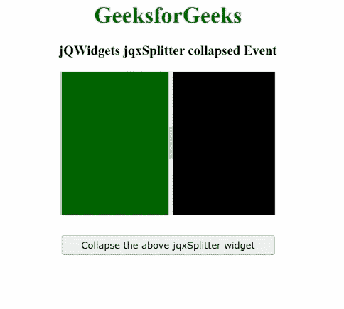

# jQWidgets jqxSplitter 折叠事件

> 原文:[https://www . geesforgeks . org/jqwidgets-jqxsplitter-collated-event/](https://www.geeksforgeeks.org/jqwidgets-jqxsplitter-collapsed-event/)

***jQWidgets*** 是一个 JavaScript 框架，用于为 PC 和移动设备制作基于 web 的应用程序。它是一个非常强大、优化、独立于平台并且得到广泛支持的框架。 ***jqxSplitter*** 用于表示一个小部件，该小部件由一个可移动的分割条组成，该分割条将容器的显示区域分成两个或多个可调整大小和可折叠的面板。

当指定 jqxSplitter 的面板折叠时，会触发**折叠事件。**

****语法:****

```html
$('#jqxSplitter').on('collapsed',  
function (event) {        
   var panels = event.args.panels;

   // Get first panel
   var panel1 = panels[0];

   // Get second panel
   var panel2 = panels[1];

   // Panel index
   var index = event.args.index;
});
```

****链接文件:**从给定链接下载 [jQWidgets](https://www.jqwidgets.com/download/) 。在 HTML 文件中，找到下载文件夹中的脚本文件。**

> <link rel="”stylesheet”" href="”jqwidgets/styles/jqx.base.css”" type="”text/css”/"> **<脚本类型=“text/JavaScript”src =“scripts/jquery . js”></script>
> <脚本类型=“text/JavaScript”src =“jqwidgets/jqxcore . js”></script>
> <脚本类型=“text/JavaScript”src =“jqwidgets/jqxbuttons . js”>**

****示例:**下面的示例说明了 jQWidgets jqxSplitter ***坍塌*** 事件。**

## **超文本标记语言**

```html
<!DOCTYPE html>
<html lang="en">

<head>
    <link rel="stylesheet"
          href="jqwidgets/styles/jqx.base.css"
          type="text/css"/>
    <script type="text/javascript" 
            src="scripts/jquery.js">
    </script>
    <script type="text/javascript" 
            src="jqwidgets/jqxcore.js">
    </script>
    <script type="text/javascript" 
            src="jqwidgets/jqxbuttons.js">
    </script>
    <script type="text/javascript" 
            src="jqwidgets/jqxsplitter.js">
    </script>
    <script type="text/javascript" 
            src="jqwidgets/jqxscrollbar.js">
    </script>
    <script type="text/javascript" 
            src="jqwidgets/jqxpanel.js">
    </script>
    <script type="text/javascript" 
            src="jqwidgets/jqx-all.js">
    </script>
</head>

<body>
    <center>
        <h1 style="color:green;">
            GeeksforGeeks
        </h1>
        <h3>
            jQWidgets jqxSplitter collapsed Event
        </h3>
        <div id='jqx_Splitter'>
            <div style="background-color: #006400">
            </div>
            <div style="background-color: #000000">
            </div>
        </div>
        <input type="button" style="margin: 28px;" 
               id="button_for_collapsed"
         value="Collapse the above jqxSplitter widget"/>
        <div id="log"></div>
        <script type="text/javascript">
            $(document).ready(function () {
                $("#jqx_Splitter").jqxSplitter({
                    width: 300,
                    height: 200
                });
                $("#button_for_collapsed").jqxButton({
                    width: 300
                });
                $("#button_for_collapsed").jqxButton().
                    click(function () {
                        $('#jqx_Splitter').jqxSplitter(
                          'collapse');
                    });
                $('#jqx_Splitter').on('collapsed',
                    function () {
                        $("#log").html(
                            "Collapsed"
                        );
                    });
            });
        </script>
    </center>
</body>

</html>
```

****输出:****

****

****参考:**[https://www . jqwidgets . com/jquery-widgets-documentation/documentation/jqxsplitter/jquery-splitter-API . htm？搜索=](https://www.jqwidgets.com/jquery-widgets-documentation/documentation/jqxsplitter/jquery-splitter-api.htm?search=)**