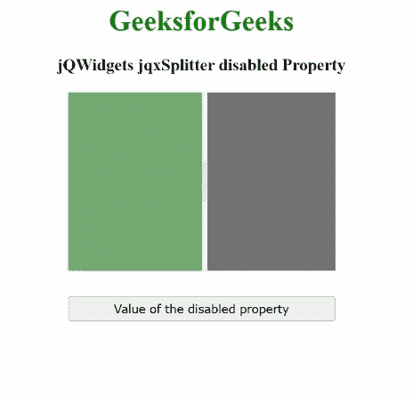

# jQWidgets jqxSplitter 禁用属性

> 原文:[https://www . geesforgeks . org/jqwidgets-jqxsplitter-disabled-property/](https://www.geeksforgeeks.org/jqwidgets-jqxsplitter-disabled-property/)

**jQWidgets** 是一个 JavaScript 框架，用于为 PC 和移动设备制作基于 web 的应用程序。它是一个非常强大、优化、独立于平台并且得到广泛支持的框架。 **jqxSplitter** 用于表示一个小部件，该小部件由一个可移动的分割条组成，该分割条将容器的显示区域分成两个或多个可调整大小和可折叠的面板。

**禁用属性**用于设置或获取禁用属性，该属性用于禁用小部件。

**语法:**

*   要设置*禁用的*属性:

    ```html
    $('#jqxSplitter').jqxSplitter({ disabled: true });
    ```

*   要禁用*属性:*

    ```html
    *var disabled = $('#jqxSplitter').jqxSplitter('disabled');*
    ```

***链接文件:**从给定链接下载 [jQWidgets](https://www.jqwidgets.com/download/) 。在 HTML 文件中，找到下载文件夹中的脚本文件。*

> <link rel="”stylesheet”" href="”jqwidgets/styles/jqx.base.css”" type="”text/css”/"> *<脚本类型=“text/JavaScript”src =“scripts/jquery . js”></script>
> <脚本类型=“text/JavaScript”src =“jqwidgets/jqxcore . js”></script>
> <脚本类型=“text/JavaScript”src =“jqwidgets/jqxbuttons . js”>*

***示例:**以下示例说明了 jQWidgets **jqxSplitter 禁用的** 属性。在下面的例子中，*禁用的*属性的值被设置为真。*

## *超文本标记语言*

```html
*<!DOCTYPE html>
<html lang="en">

<head>
    <link rel="stylesheet" href=
    "jqwidgets/styles/jqx.base.css" type="text/css" />
    <script type="text/javascript" 
        src="scripts/jquery.js"></script>
    <script type="text/javascript" 
        src="jqwidgets/jqxcore.js"></script>
    <script type="text/javascript" 
        src="jqwidgets/jqxbuttons.js"></script>
    <script type="text/javascript" 
        src="jqwidgets/jqxsplitter.js"></script>
    <script type="text/javascript" 
        src="jqwidgets/jqxscrollbar.js"></script>
    <script type="text/javascript" 
        src="jqwidgets/jqxpanel.js"></script>
    <script type="text/javascript" 
        src="jqwidgets/jqx-all.js"></script>
</head>

<body>
    <center>
        <h1 style="color:green;">
            GeeksforGeeks
        </h1>
        <h3>
            jQWidgets jqxSplitter disabled Property
        </h3>
        <div id='jqx_Splitter'>
            <div style="background-color: #006400">
            </div>
            <div style="background-color: #000000">
            </div>
        </div>
        <input type="button" style="margin: 28px;" 
            id="button_for_disabled" 
            value="Value of the disabled property" />

        <div id="log"></div>

        <script type="text/javascript">
            $(document).ready(function () {
                $("#jqx_Splitter").jqxSplitter({
                    width: 300,
                    height: 200,
                    disabled: true
                });

                $("#button_for_disabled").jqxButton({
                    width: 300
                });

                $("#button_for_disabled").jqxButton()
                .click(function () {
                    var Value_of_disabled = 
                        $('#jqx_Splitter').jqxSplitter('disabled');

                    $("#log").html((Value_of_disabled));
                });
            });
        </script>
    </center>
</body>

</html>*
```

***输出:***

**

***参考:**[https://www . jqwidgets . com/jquery-widgets-documentation/documentation/jqxsplitter/jquery-splitter-API . htm](https://www.jqwidgets.com/jquery-widgets-documentation/documentation/jqxsplitter/jquery-splitter-api.htm)*