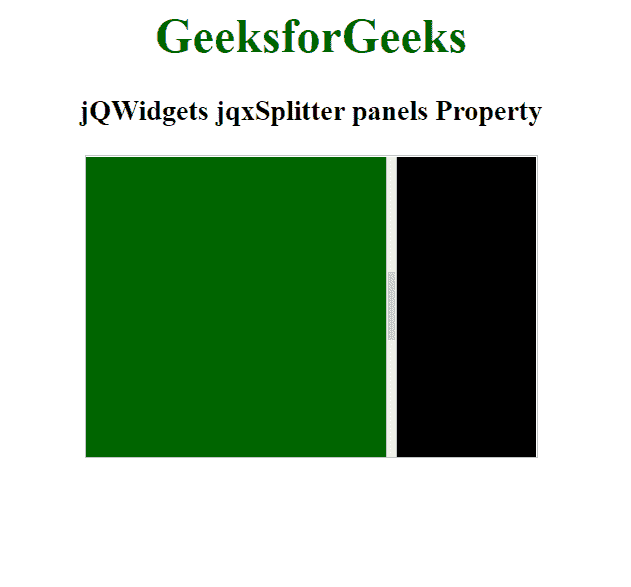

# jQWidgets jqxSplitter 面板属性

> 原文:[https://www . geesforgeks . org/jqwidgets-jqxsplitter-panels-property/](https://www.geeksforgeeks.org/jqwidgets-jqxsplitter-panels-property/)

**jQWidgets** 是一个 JavaScript 框架，用于为 PC 和移动设备制作基于 web 的应用程序。它是一个非常强大、优化、独立于平台并且得到广泛支持的框架。 **jqxSplitter** 用于表示一个小部件，该小部件由一个可移动的分割条组成，该分割条将容器的显示区域分成两个或多个可调整大小和可折叠的面板。

**panels** 属性用于为指定的 jqxSplitter 设置或获取 panels 属性。这里，每个面板用下面指定的字段表示一个对象。

*   **尺寸:**用于设置面板的尺寸。
*   **min:** 用于设置面板的最小尺寸。
*   **可折叠:**用于设置面板是否可折叠。
*   **折叠:**用于设置面板是否折叠。

**语法:**

*   设置*面板*属性:

    ```html
    $('#jqxSplitter').jqxSplitter({ 
        panels: [{ size: 200 },{ min: 50 }]
    });
    ```

*   获取*面板*属性:

    ```html
    var disabled = $('#jqxSplitter').jqxSplitter('panels');
    ```

**链接文件:**从给定链接下载 [jQWidgets](https://www.jqwidgets.com/download/) 。在 HTML 文件中，找到下载文件夹中的脚本文件。

> <link rel="”stylesheet”" href="”jqwidgets/styles/jqx.base.css”" type="”text/css”/">
> <脚本类型=“text/JavaScript”src =“scripts/jquery . js”></script>
> <脚本类型=“text/JavaScript”src =“jqwidgets/jqxcore . js”></script>
> <脚本类型=“text/JavaScript”src =“jqwidgets/jqxbuttons . js”>

**示例:**以下示例说明了 jQWidgets jqxSplitter **面板**属性。在以下示例中，**面板** 属性的值已设置为[{ size: 200 }，{ min: 50 }]。

## 超文本标记语言

```html
<!DOCTYPE html>
<html lang="en">

<head>
    <link rel="stylesheet" 
          href="jqwidgets/styles/jqx.base.css"
          type="text/css"/>
    <script type="text/javascript" 
            src="scripts/jquery.js">
    </script>
    <script type="text/javascript" 
            src="jqwidgets/jqxcore.js">
    </script>
    <script type="text/javascript" 
            src="jqwidgets/jqxbuttons.js">
    </script>
    <script type="text/javascript" 
            src="jqwidgets/jqxsplitter.js">
    </script>
    <script type="text/javascript" 
            src="jqwidgets/jqxscrollbar.js">
    </script>
    <script type="text/javascript" 
            src="jqwidgets/jqxpanel.js">
    </script>
    <script type="text/javascript" 
            src="jqwidgets/jqx-all.js">
    </script>
</head>

<body>
    <center>
        <h1 style="color:green;">
            GeeksforGeeks
        </h1>
        <h3>
            jQWidgets jqxSplitter panels Property
        </h3>
        <div id='jqx_Splitter'>
            <div style="background-color: #006400">
            </div>
            <div style="background-color: #000000">
            </div>
        </div>
        <script type="text/javascript">
            $(document).ready(function () {
                $("#jqx_Splitter").jqxSplitter({
                    width: 300,
                    height: 200,
                    panels: [{ size: 200 },
                             { min: 50 }]
                });
            });
        </script>
    </center>
</body>

</html>
```

**输出:**



**参考:**[https://www . jqwidgets . com/jquery-widgets-documentation/documentation/jqxsplitter/jquery-splitter-API . htm？搜索=](https://www.jqwidgets.com/jquery-widgets-documentation/documentation/jqxsplitter/jquery-splitter-api.htm?search=)