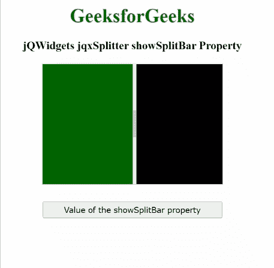

# jQWidgets jqxSplitter showSplitBar 属性

> 原文:[https://www . geesforgeks . org/jqwidgets-jqxsplitter-showsplitbar-property/](https://www.geeksforgeeks.org/jqwidgets-jqxsplitter-showsplitbar-property/)

**jQWidgets** 是一个 JavaScript 框架，用于为 PC 和移动设备制作基于 web 的应用程序。它是一个非常强大、优化、独立于平台并且得到广泛支持的框架。**jqxSplitter****用于表示由可移动分割条组成的小部件，该分割条将容器的显示区域分成两个或更多可调整大小和可折叠的面板。**

****showSplitBar 属性**用于设置或获取指定 jqxSplitter 的拆分条是否显示。**

****语法:****

*   **设置 *showSplitBar* 属性:**

    ```html
    $('#jqxSplitter').jqxSplitter({ showSplitBar: true });
    ```

*   **要获取 *showSplitBar* 属性:**

    ```html
    var disabled = $('#jqxSplitter').jqxSplitter('showSplitBar');
    ```

****链接文件:**从给定链接下载 [jQWidgets](https://www.jqwidgets.com/download/) 。在 HTML 文件中，找到下载文件夹中的脚本文件。**

> <link rel="”stylesheet”" href="”jqwidgets/styles/jqx.base.css”" type="”text/css”/"> **<脚本类型=“text/JavaScript”src =“scripts/jquery . js”></script>
> <脚本类型=“text/JavaScript”src =“jqwidgets/jqxcore . js”></script>
> <脚本类型=“text/JavaScript”src =“jqwidgets/jqxbuttons . js”>**

****示例:**下面的示例说明了 jQWidgets**jqxSplitter showSplitBar****属性。在下面的示例中， *showSplitBar* 属性的值已设置为 true。****

## ****超文本标记语言****

```html
**<!DOCTYPE html>
<html lang="en">

<head>
    <link rel="stylesheet"
          href="jqwidgets/styles/jqx.base.css"
          type="text/css"/>
    <script type="text/javascript" 
            src="scripts/jquery.js">
    </script>
    <script type="text/javascript" 
            src="jqwidgets/jqxcore.js">
    </script>
    <script type="text/javascript" 
            src="jqwidgets/jqxbuttons.js">
    </script>
    <script type="text/javascript" 
            src="jqwidgets/jqxsplitter.js">
    </script>
    <script type="text/javascript" 
            src="jqwidgets/jqxscrollbar.js">
    </script>
    <script type="text/javascript" 
            src="jqwidgets/jqxpanel.js">
    </script>
    <script type="text/javascript" 
            src="jqwidgets/jqx-all.js">
    </script>
</head>

<body>
    <center>
        <h1 style="color:green;">
            GeeksforGeeks
        </h1>
        <h3>
            jQWidgets jqxSplitter showSplitBar Property
        </h3>
        <div id='jqx_Splitter'>
            <div style="background-color: #006400">
            </div>
            <div style="background-color: #000000">
            </div>
        </div>
        <input type="button" style="margin: 28px;" 
               id="button_for_showSplitBar" 
          value="Value of the showSplitBar property"/>
        <div id="log"></div>
        <script type="text/javascript">
            $(document).ready(function () {
                $("#jqx_Splitter").jqxSplitter({
                    width: 300,
                    height: 200,
                    showSplitBar: true
                });
                $("#button_for_showSplitBar").jqxButton({
                    width: 300
                });
                $("#button_for_showSplitBar").jqxButton().
                    click(function () {
                        var Value_of_showSplitBar = 
                   $('#jqx_Splitter').jqxSplitter(
                            'showSplitBar');
                        $("#log").html((
                            Value_of_showSplitBar));
                    });
            });
        </script>
    </center>
</body>

</html>**
```

******输出:******

********

******参考:**[https://www . jqwidgets . com/jquery-widgets-documentation/documentation/jqxsplitter/jquery-splitter-API . htm](https://www.jqwidgets.com/jquery-widgets-documentation/documentation/jqxsplitter/jquery-splitter-api.htm)****