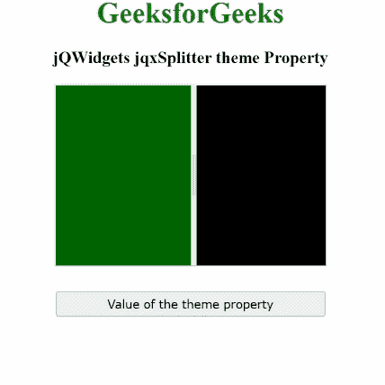

# jQWidgets jqxSplitter 主题属性

> 原文:[https://www . geesforgeks . org/jqwidgets-jqxsplitter-theme-property/](https://www.geeksforgeeks.org/jqwidgets-jqxsplitter-theme-property/)

**jQWidgets** 是一个 JavaScript 框架，用于为 PC 和移动设备制作基于 web 的应用程序。它是一个非常强大、优化、独立于平台并且得到广泛支持的框架。**jqxSplitter****用于表示由可移动分割条组成的小部件，该分割条将容器的显示区域分成两个或更多可调整大小和可折叠的面板。**

****主题属性**用于为指定的 jqxSplitter 设置或获取主题。**

****语法:****

*   **设置*主题*属性:**

    ```
    $('#jqxSplitter').jqxSplitter({ theme: 'energyblue' });
    ```

*   **获取*主题*属性:**

    ```
    var disabled = $('#jqxSplitter').jqxSplitter('theme');
    ```

****链接文件:**从给定链接下载 [jQWidgets](https://www.jqwidgets.com/download/) 。在 HTML 文件中，找到下载文件夹中的脚本文件。**

> <link rel="”stylesheet”" href="”jqwidgets/styles/jqx.base.css”" type="”text/css”/"> **< link rel= "样式表" href = " jqwidgets/style/jqx . energy blue . CSS " type = " text/CSS "/>
> <脚本类型= " text/JavaScript " src = " scripts/jquery . js "></脚本>
> <脚本类型= " text/JavaScript " src = " jqwidgets/jqxcore . js ">**

****示例:**以下示例说明了 jQWidgets**jqxSplitter****主题** 属性。在下面的例子中，*主题*属性的值被设置为“能量值”。**

## **超文本标记语言**

```
<!DOCTYPE html>
<html lang="en">

<head>
    <link rel="stylesheet" 
          href="jqwidgets/styles/jqx.base.css" 
          type="text/css"/>
    <link rel="stylesheet" 
          href="jqwidgets/styles/jqx.energyblue.css"
          type="text/css"/>
    <script type="text/javascript" 
            src="scripts/jquery.js">
    </script>
    <script type="text/javascript" 
            src="jqwidgets/jqxcore.js">
    </script>
    <script type="text/javascript" 
            src="jqwidgets/jqxbuttons.js">
    </script>
    <script type="text/javascript" 
            src="jqwidgets/jqxsplitter.js">
    </script>
    <script type="text/javascript" 
            src="jqwidgets/jqxscrollbar.js">
    </script>
    <script type="text/javascript" 
            src="jqwidgets/jqxpanel.js">
    </script>
    <script type="text/javascript" 
            src="jqwidgets/jqx-all.js">
    </script>
</head>

<body>
    <center>
        <h1 style="color:green;">
            GeeksforGeeks
        </h1>
        <h3>
            jQWidgets jqxSplitter theme Property
        </h3>
        <div id='jqx_Splitter'>
            <div style="background-color: #006400">
            </div>
            <div style="background-color: #000000">
            </div>
        </div>
        <input type="button" style="margin: 28px;" 
               id="button_for_theme" 
          value="Value of the theme property"/>
        <div id="log"></div>
        <script type="text/javascript">
            $(document).ready(function () {
                $("#jqx_Splitter").jqxSplitter({
                    width: 300,
                    height: 200,
                    theme: 'energyblue'
                });
                $("#button_for_theme").jqxButton({
                    width: 300
                });
                $("#button_for_theme").jqxButton().
                    click(function () {
                        var Value_of_theme = 
                   $('#jqx_Splitter').jqxSplitter(
                            'theme');
                        $("#log").html((
                            Value_of_theme));

                    });
            });
        </script>
    </center>
</body>

</html>
```

****输出:****

****

****参考:**[https://www . jqwidgets . com/jquery-widgets-documentation/documentation/jqxsplitter/jquery-splitter-API . htm](https://www.jqwidgets.com/jquery-widgets-documentation/documentation/jqxsplitter/jquery-splitter-api.htm)**