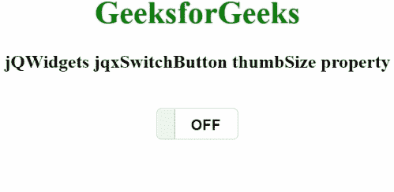

# jQWidgets jqxSwitchButton 拇指大小属性

> 原文:[https://www . geesforgeks . org/jqwidgets-jqxswitchbutton-thumb size-property/](https://www.geeksforgeeks.org/jqwidgets-jqxswitchbutton-thumbsize-property/)

**jQWidgets** 是一个 JavaScript 框架，用于为 PC 和移动设备制作基于 web 的应用程序。它是一个非常强大、优化、独立于平台并且得到广泛支持的框架。jqxSwitchButton 用于说明一个 jQuery 按钮小部件，它在被单击后会改变其验证状态。此外，它与 jqxToggleButton 完全相同，但拥有独特的用户界面视图。

**拇指大小属性**用于设置或获取拇指的百分比大小。它属于字符串类型，默认值为“40%”。

**语法:**

设置拇指大小属性。

```
$('Selector').jqxSwitchButton({ thumbSize:'50%' });  
```

获取拇指大小属性。

```
var thumbSize = $('Selector').jqxSwitchButton('thumbSize');
```

**链接文件:**从链接下载 https://www.jqwidgets.com/download/。在 HTML 文件中，找到下载文件夹中的脚本文件。

> <link rel="”stylesheet”" href="”jqwidgets/styles/jqx.base.css”" type="”text/css”">
> <脚本类型= " text/JavaScript " src = " jqwidgets/style/jqx . base . CSS "></脚本>
> <脚本类型= " text/JavaScript " src = " jqwidgets/jqx-all . js "></脚本>
> <脚本类型= " text/JavaScript " src = " jqwidgets/style/jqx . energy blue

下面的例子说明了 jQWidgets 中的 jqxSwitchButton 拇指大小属性。

**示例:**

## 超文本标记语言

```
<!DOCTYPE html>
<html lang="en">
  <head>
    <link
      rel="stylesheet"
      href="jqwidgets/styles/jqx.base.css"
      type="text/css"
    />
    <script type="text/javascript" 
        src="jqwidgets/styles/jqx.base.css"></script>
    <script type="text/javascript" 
        src="jqwidgets/jqx-all.js"></script>
    <script type="text/javascript" 
        src="jqwidgets/styles/jqx.energyblue.css"></script>
  </head>
  <body>
    <center>
      <h1 style="color: green">GeeksforGeeks</h1>
      <h3>jQWidgets jqxSwitchButton thumbSize property</h3>
      <br />
      <div id="jqxSB"></div>
      <div id="log"></div>
    </center>

    <script type="text/javascript">
      $(document).ready(function () {
        $("#jqxSB").jqxSwitchButton({
          height: "30px",
          width: "80px",
          thumbSize: "20%",
        });
      });
      $("#jqxSB").on("checked", function () {
          var ts = $("#jqxSB").jqxSwitchButton("thumbSize");
          $("#log").html("Size of thumb: " + ts);
        });
    </script>
  </body>
</html>
```

**输出:**



**参考:**[https://www . jqwidgets . com/jquery-widgets-documentation/documentation/jqxbutton/jquery-button-API . htm？搜索=](https://www.jqwidgets.com/jquery-widgets-documentation/documentation/jqxbutton/jquery-button-api.htm?search=)