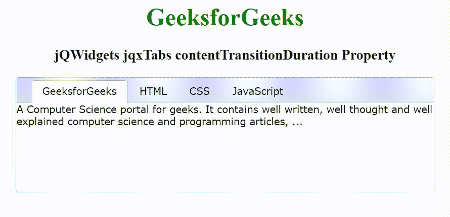

# jQWidgets jqxTabs contentTransitionDuration 属性

> 原文:[https://www . geesforgeks . org/jqwidgets-jqxtabs-contenttransitionduration-property/](https://www.geeksforgeeks.org/jqwidgets-jqxtabs-contenttransitionduration-property/)

**jQWidgets** 是一个 JavaScript 框架，用于为 PC 和移动设备制作基于 web 的应用程序。它是一个非常强大、优化、独立于平台并且得到广泛支持的框架。jqxTabs 表示一个 jQuery Tab 小部件，用于将内容分成多个部分。标签标题使用< li >元素，标签内容使用< div >元素。

*contentTransitionDuration*属性用于设置或返回用户选择标签时内容渐变动画的持续时间。它与“*动画类型*属性一起使用，属性值为“淡化”。它接受数字类型值，默认值为 450。

**语法:**

设置*contentTransitionDuration*属性。

```
$('selector').jqxTabs({ contentTransitionDuration: Number });
```

返回*contentTransitionDuration*属性。

```
var CTD = $('selector').jqxTabs('contentTransitionDuration');
```

**链接文件:**从给定链接下载 [jQWidgets](https://www.jqwidgets.com/download/) 。在 HTML 文件中，找到下载文件夹中的脚本文件。

> <link rel="”stylesheet”" href="”jqwidgets/styles/jqx.base.css”" type="”text/css”">
> < link rel= "样式表" href = " jqwidgets/style/jqx . energy blue . CSS " type = " text/CSS "/>
> <脚本类型= " text/JavaScript " src = " scripts/jquery-1 . 11 . 1 . min . js "></脚本>
> <脚本类型= " text/JavaScript " src = " jqwidgets/jqx-all

**示例:**以下示例说明了 jQWidgets jqxTabs*contentTransitionDuration*属性。

## 超文本标记语言

```
<!DOCTYPE html>
<html lang="en">

<head>
    <link rel="stylesheet" href=
        "jqwidgets/styles/jqx.base.css" type="text/css" />
    <link rel="stylesheet" href="
        jqwidgets/styles/jqx.energyblue.css" type="text/css" />
    <script type="text/javascript" 
        src="scripts/jquery-1.11.1.min.js"></script>
    <script type="text/javascript" 
        src="jqwidgets/jqx-all.js"></script>
    <script type="text/javascript" 
        src="jqwidgets/jqxcore.js"></script>
    <script type="text/javascript" 
        src="jqwidgets/jqxtabs.js"></script>
</head>

<body>
    <center>
        <h1 style="color: green;">
            GeeksforGeeks
        </h1>

        <h3>
            jQWidgets jqxTabs contentTransitionDuration Property
        </h3>

        <div id='jqxTabs'>
            <ul style='margin-left: 20px;'>
                <li>GeeksforGeeks</li>
                <li>HTML</li>
                <li>CSS</li>
                <li>JavaScript</li>
            </ul>

            <div>
                A Computer Science portal for geeks. 
                It contains well written, well thought 
                and well explained computer science 
                and programming articles, ...
            </div>
            <div>
                HTML stands for HyperText Markup 
                Language. It is used to design web 
                pages using a markup language. HTML 
                is the combination of Hypertext and 
                Markup language. Hypertext defines 
                the link between the web pages.
            </div>
            <div>
                Cascading Style Sheets, fondly referred 
                to as CSS, is a simply designed language 
                intended to simplify the process of making 
                web pages presentable. CSS allows you to 
                apply styles to web pages. More importantly, 
                CSS enables you to do this independent of 
                the HTML that makes up each web page.
            </div>
            <div>
                JavaScript is a lightweight, cross-platform, 
                and interpreted scripting language. It is 
                well-known for the development of web pages, 
                many non-browser environments also use it. 
                JavaScript can be used for Client-side 
                developments as well as Server-side developments.
            </div>
        </div>
    </center>

    <script type="text/javascript">
        $(document).ready(function() {
            $('#jqxTabs').jqxTabs({ 
                theme: 'energyblue',
                width: 550,
                height: 150,
                animationType: 'fade',
                contentTransitionDuration: 1000
            });
        });
    </script>
</body>

</html>
```

**输出:**



**参考:**[https://www . jqwidgets . com/jquery-widgets-documentation/documentation/jqxtabs/jquery-tab s-API . htm](https://www.jqwidgets.com/jquery-widgets-documentation/documentation/jqxtabs/jquery-tabs-api.htm)