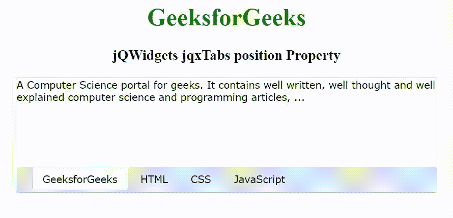

# jQWidgets jqxTabs 位置属性

> 原文:[https://www . geeksforgeeks . org/jqwidgets-jqxtabs-position-property/](https://www.geeksforgeeks.org/jqwidgets-jqxtabs-position-property/)

jQWidgets 是一个 JavaScript 框架，用于为 PC 和移动设备制作基于 web 的应用程序。它是一个非常强大和优化的框架，独立于平台，并得到广泛支持。jqxTabs 表示一个 jQuery Tab 小部件，用于将内容分成多个部分。

*   The element is used for tag title, and theelement is used for tag content.

**位置属性**用于设置或返回标签是位于“顶部”还是“底部”。它接受字符串类型值，默认值为“top”。

它的可能值是–

*   ' top '
*   '底部'

**语法:**

设置 position 属性。

```html
$('selector').jqxTabs({ position: Boolean });
```

返回 position 属性。

```html
var position = $('selector').jqxTabs('position');
```

**链接文件:**从给定的链接 https://www.jqwidgets.com/download/.下载 jQWidgets 在 HTML 文件中，找到下载文件夹中的脚本文件。

> <link rel="”stylesheet”" href="”jqwidgets/styles/jqx.base.css”" type="”text/css”">
> < link rel= "样式表" href = " jqwidgets/style/jqx . energy blue . CSS " type = " text/CSS "/>
> <脚本类型= " text/JavaScript " src = " scripts/jquery-1 . 11 . 1 . min . js "></脚本>
> <脚本类型= " text/JavaScript " src = " jqwidgets/jqx-all

下面的例子说明了 jQWidgets jqxTabs 位置属性。

**示例:**

## 超文本标记语言

```html
<!DOCTYPE html>
<html lang="en">

<head>
    <link rel="stylesheet" href=
        "jqwidgets/styles/jqx.base.css" type="text/css" />
    <link rel="stylesheet" href="
        jqwidgets/styles/jqx.energyblue.css" type="text/css" />
    <script type="text/javascript" 
        src="scripts/jquery-1.11.1.min.js"></script>
    <script type="text/javascript" 
        src="jqwidgets/jqx-all.js"></script>
    <script type="text/javascript" 
        src="jqwidgets/jqxcore.js"></script>
    <script type="text/javascript" 
        src="jqwidgets/jqxtabs.js"></script>
</head>

<body>
    <center>
        <h1 style="color: green;">
            GeeksforGeeks
        </h1>

        <h3>
            jQWidgets jqxTabs position Property
        </h3>

        <div id='jqxTabs'>
            <ul style='margin-left: 20px;'>
                <li>GeeksforGeeks</li>
                <li>HTML</li>
                <li>CSS</li>
                <li>JavaScript</li>
            </ul>

            <div>
                A Computer Science portal for geeks. 
                It contains well written, well thought 
                and well explained computer science 
                and programming articles, ...
            </div>
            <div>
                HTML stands for HyperText Markup 
                Language. It is used to design web 
                pages using a markup language. HTML 
                is the combination of Hypertext and 
                Markup language. Hypertext defines 
                the link between the web pages.
            </div>
            <div>
                Cascading Style Sheets, fondly referred 
                to as CSS, is a simply designed language 
                intended to simplify the process of making 
                web pages presentable. CSS allows you to 
                apply styles to web pages. More importantly, 
                CSS enables you to do this independent of 
                the HTML that makes up each web page.
            </div>
            <div>
                JavaScript is a lightweight, cross-platform, 
                and interpreted scripting language. It is 
                well-known for the development of web pages, 
                many non-browser environments also use it. 
                JavaScript can be used for Client-side 
                developments as well as Server-side developments.
            </div>
        </div>
    </center>

    <script type="text/javascript">
        $(document).ready(function() {
            $('#jqxTabs').jqxTabs({ 
                theme: 'energyblue',
                width: 550,
                height: 150,
                position: "bottom"
            });
        });
    </script>
</body>

</html>
```

**输出:**



**参考:**[https://www . jqwidgets . com/jquery-widgets-documentation/documentation/jqxtabs/jquery-tab s-API . htm](https://www.jqwidgets.com/jquery-widgets-documentation/documentation/jqxtabs/jquery-tabs-api.htm)