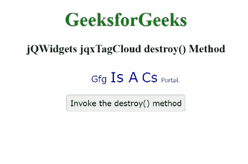

# jQWidgets jqxTagCloud 销毁()方法

> 原文:[https://www . geesforgeks . org/jqwidgets-jqxtagcloud-destroy-method/](https://www.geeksforgeeks.org/jqwidgets-jqxtagcloud-destroy-method/)

**jQWidgets** 是一个 JavaScript 框架，用于为 PC 和移动设备制作基于 web 的应用程序。它是一个非常强大、优化、独立于平台并且得到广泛支持的框架。jqxTagCloud 用于显示网站上文章、帖子或视频附带的用户生成的标签集合。

**销毁()**方法用于调用小部件销毁功能，销毁所有打印的指定数据。

**语法:**

```html
$('selector').jqxTagCloud('destroy'); 
```

**链接文件:**从给定链接下载 [jQWidgets](https://www.jqwidgets.com/download/) 。在 HTML 文件中，找到下载文件夹中的脚本文件。

> <link rel="”stylesheet”" href="”jqwidgets/styles/jqx.base.css”" type="”text/css”">
> <脚本类型=【text/JavaScript】src =【scripts/jquery-1 . 11 . 1 . min . js】></脚本>
> <脚本类型=【text/JavaScript】src =【jqwidgets/jqxcore . js】></脚本>
> 脚本类型=【text/JavaScript】src =【jqwidgets/jqx-all。

**示例:**下面的示例说明了 jQWidgets **destroy()** 方法。

## 超文本标记语言

```html
<!DOCTYPE html>
<html lang="en">

<head>
    <link rel="stylesheet" 
          href="jqwidgets/styles/jqx.base.css" />
    <script type="text/javascript" 
            src="scripts/jquery-1.11.1.min.js">
    </script>
    <script type="text/javascript" 
            src="jqwidgets/jqxcore.js">
    </script>
   <script type="text/javascript" 
            src="jqwidgets/jqx-all.js">
    </script>
    <script type="text/javascript" 
            src="jqwidgets/jqxdata.js">
    </script>
    <script type="text/javascript" 
            src="jqwidgets/jqxtagcloud.js">
    </script>
    <script>
        $(document).ready(function () {
            var data = [
                { name: "GFG", rating: 35,
                  url: "community" },
                { name: "is a", rating: 60,
                  url: "community" },
                { name: "CS", rating: 55, 
                  url: "community" },
                { name: "Portal.", rating: 20, 
                  url: "community" },
            ];
            var source =
            {
                localData: data,
                dataType: "array",
                dataFields: [
                    { name: 'name', 
                      type: 'string' },
                    { name: 'url', 
                      type: 'string' },
                    { name: 'rating', 
                      type: 'number' }
                ]
            };
            var dataAdapter = new 
            $.jqx.dataAdapter(source, {});

            $('#tagCloud').jqxTagCloud({
                width: 450,
                source: dataAdapter,
                displayMember: 'name',
                valueMember: 'rating',
                alterTextCase: 'titleCase'
            });
            $("button").jqxButton().
            click(function () {
                $('#tagCloud').jqxTagCloud(
                  'destroy');
            });
        });
    </script>
</head>

<body class='default'>
    <center>
        <h2 style="color:green;"> 
          GeeksforGeeks 
        </h2>
        <h3> 
          jQWidgets jqxTagCloud destroy() Method 
        </h3>
        <div id="tagCloud"></div>
        <button>Invoke the destroy() method</button>
    </center>
</body>

</html>
```

**输出:**



**参考:**[https://www . jqwidgets . com/jquery-widgets-documentation/documentation/jqxtagcloud/jquery-tag cloud-API . htm？搜索=](https://www.jqwidgets.com/jquery-widgets-documentation/documentation/jqxtagcloud/jquery-tagcloud-api.htm?search=)