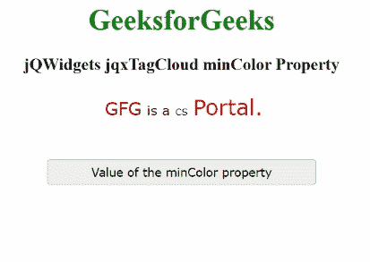

# jQWidgets jqxTagCloud minColor 属性

> 原文:[https://www . geesforgeks . org/jqwidgets-jqxtagcloud-min color-property/](https://www.geeksforgeeks.org/jqwidgets-jqxtagcloud-mincolor-property/)

**jQWidgets** 是一个 JavaScript 框架，用于为 PC 和移动设备制作基于 web 的应用程序。它是一个非常强大、优化、独立于平台并且得到广泛支持的框架。 **jqxTagCloud** 用于显示一组用户生成的标签，这些标签与网站上的文章、帖子或视频相匹配。

***minColor*** 属性用于设置或获取 *minColor* 属性，以指定具有最低值属性的元素的标签颜色。该属性与 *maxColor* 属性一起将根据标签的值属性以渐变方式设置标签的颜色，使其朝向最高值。它的可能值是所有浏览器支持的颜色，包括 rgba。

**语法:**

*   用于设置*最小颜色*属性。

    ```html
    $('#jqxTagCloud').jqxTagCloud({ minColor: 'black' });
    ```

*   获取 *minColor* 属性。

    ```html
    var value = $('#jqxTagCloud').jqxTagCloud({ 'minColor' });
    ```

**链接文件:**从给定链接下载 [jQWidgets](https://www.jqwidgets.com/download/) 。在 HTML 文件中，找到下载文件夹中的脚本文件。

> <link rel="”stylesheet”" href="”jqwidgets/styles/jqx.base.css”" type="”text/css”">
> <脚本类型=“text/JavaScript”src =“scripts/jquery . js”></脚本>
> <脚本类型=“text/JavaScript”src =“jqwidgets/jqxcore . js”></脚本>
> <脚本类型=“text/JavaScript”src =“jqwidgets/jqxdata . js”><

**示例:**下面的示例说明了 jQWidgets jqxTagCloud***minColor***属性。在下面的例子中， ***minColor*** 属性的值被设置为“黑色”。

## 超文本标记语言

```html
<!DOCTYPE html>
<html lang="en">

<head>
    <link rel="stylesheet"
          href="jqwidgets/styles/jqx.base.css" 
          type="text/css"/>
    <script type="text/javascript" 
            src="scripts/jquery.js">
    </script>
    <script type="text/javascript" 
            src="jqwidgets/jqxcore.js">
    </script>
    <script type="text/javascript" 
            src="jqwidgets/jqxdata.js">
    </script>
    <script type="text/javascript" 
            src="jqwidgets/jqxtagcloud.js">
    </script>
    <script type="text/javascript" 
            src="jqwidgets/jqx-all.js">
    </script>
</head>

<body>
    <center>
        <h1 style="color:green;">
            GeeksforGeeks
        </h1>
        <h3>
            jQWidgets jqxTagCloud minColor Property
        </h3>
        <div id="Tag_Cloud"></div>
        <input type="button" style="margin:28px;" 
               id="button_for_minColor"
               value="Value of the minColor property"/>
        <div id="log"></div>

        <script type="text/javascript">

            $(document).ready(function () {
                var Data_for_TagCloud = [
                    { Name: "GFG", Rating: 4 },
                    { Name: "is a", Rating: 3 },
                    { Name: "CS", Rating: 2 },
                    { Name: "Portal.", Rating: 5 },
                ];
                var dataAdapter = new
                    $.jqx.dataAdapter({
                        localData: Data_for_TagCloud
                    });
                $('#Tag_Cloud').jqxTagCloud({
                    width: 450,
                    source: dataAdapter,
                    displayMember: 'Name',
                    valueMember: 'Rating',
                    maxColor: 'red',
                    minColor: 'black'
                });
                $("#button_for_minColor").
                    jqxButton({
                        width: 300
                    });
                $("#button_for_minColor").jqxButton().
                    click(function () {
                        var Value_of_minColor =
                            $('#Tag_Cloud').jqxTagCloud('minColor');
                        $("#log").html((Value_of_minColor));
                    });
            });
        </script>
    </center>
</body>

</html>
```

**输出:**



**参考:**[https://www . jqwidgets . com/jquery-widgets-documentation/documentation/jqxtagcloud/jquery-tag cloud-API . htm？搜索=](https://www.jqwidgets.com/jquery-widgets-documentation/documentation/jqxtagcloud/jquery-tagcloud-api.htm?search=)