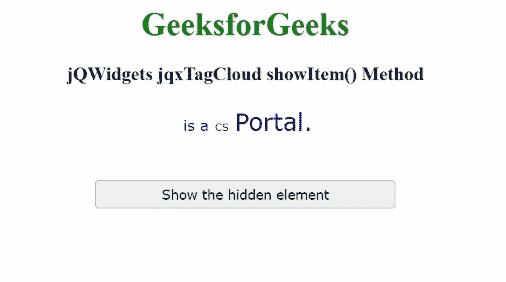

# jQWidgets jqxTagCloud showItem()方法

> 原文:[https://www . geesforgeks . org/jqwidgets-jqxtagcloud-show item-method/](https://www.geeksforgeeks.org/jqwidgets-jqxtagcloud-showitem-method/)

**jQWidgets** 是一个 JavaScript 框架，用于为 PC 和移动设备制作基于 web 的应用程序。它是一个非常强大、优化、独立于平台并且得到广泛支持的框架。 **jqxTagCloud** 用于显示一组用户生成的标签，这些标签与网站上的文章、帖子或视频相匹配。每个标签都有一个权重值，该值对应于其在页面上的受欢迎程度、重要性或重复度。云中的关键字可以有自己的网址，该网址导航到与相关标签相关联的项目集合。

**showItem()** 方法用于显示一个隐藏元素，该元素带有指定 jqxTagCloud 的特定索引。

**语法:**

```html
$('#jqxTagCloud').jqxTagCloud('showItem', index);
```

**参数:**该方法接受如下所示的参数:

*   **索引:**这是隐藏元素的索引。它是数字类型的。

**返回值:**此方法不返回值。

**链接文件:**从给定链接下载 [jQWidgets](https://www.jqwidgets.com/download/) 。在 HTML 文件中，找到下载文件夹中的脚本文件。

> <link rel="”stylesheet”" href="”jqwidgets/styles/jqx.base.css”" type="”text/css”">
> <脚本类型=“text/JavaScript”src =“scripts/jquery . js”></脚本>
> <脚本类型=“text/JavaScript”src =“jqwidgets/jqxcore . js”></脚本>
> <脚本类型=“text/JavaScript”src =“jqwidgets/jqxdata . js”><

**示例:**下面的示例说明了 jQWidgets**jqxTagCloud**showItem()**方法。**

## **超文本标记语言**

```html
<!DOCTYPE html>
<html lang="en">

<head>
    <link rel="stylesheet" 
          href="jqwidgets/styles/jqx.base.css"
          type="text/css"/>
    <script type="text/javascript" 
            src="scripts/jquery.js">
    </script>
    <script type="text/javascript" 
            src="jqwidgets/jqxcore.js">
    </script>
    <script type="text/javascript" 
            src="jqwidgets/jqxdata.js">
    </script>
    <script type="text/javascript" 
            src="jqwidgets/jqxtagcloud.js">
    </script>
    <script type="text/javascript" 
            src="jqwidgets/jqx-all.js">
    </script>
</head>

<body>
    <center>
        <h1 style="color:green;">
            GeeksforGeeks
        </h1>
        <h3>
            jQWidgets jqxTagCloud showItem() Method
        </h3>
        <div id="Tag_Cloud"></div>
        <input type="button" style="margin: 28px;" 
               id="button_for_showItem" 
               value="Show the hidden element"/>
        <div id="log"></div>
        <script type="text/javascript">
            $(document).ready(function () {
                var Data_for_TagCloud = [
                    { Name: "GFG", Rating: 4 },
                    { Name: "is a", Rating: 3 },
                    { Name: "CS", Rating: 2 },
                    { Name: "Portal.", Rating: 5 },
                ];
                var dataAdapter = new
                    $.jqx.dataAdapter({
                        localData: Data_for_TagCloud
                    });
                $('#Tag_Cloud').jqxTagCloud({
                    width: 450,
                    source: dataAdapter,
                    displayMember: 'Name',
                    valueMember: 'Rating'
                });
                $("#button_for_showItem").
                    jqxButton({
                        width: 300
                    });
                $('#Tag_Cloud').jqxTagCloud(
                  'hideItem', 0);
                $("#button_for_showItem").jqxButton().
                    click(function () {
                        var Index = 0;
                        $('#Tag_Cloud').jqxTagCloud(
                            'showItem',
                            Index);
                    });
            });
        </script>
    </center>
</body>

</html>
```

****输出:****

****

****参考:**[https://www . jqwidgets . com/jquery-widgets-documentation/documentation/jqxtagcloud/jquery-tag cloud-API . htm？搜索=](https://www.jqwidgets.com/jquery-widgets-documentation/documentation/jqxtagcloud/jquery-tagcloud-api.htm?search=)**