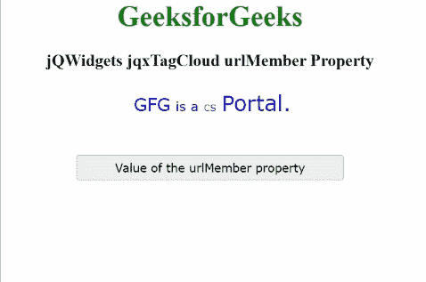

# jQWidgets jqxTagCloud URL member 属性

> 原文:[https://www . geesforgeks . org/jqwidgets-jqxtagcloud-URL member-property/](https://www.geeksforgeeks.org/jqwidgets-jqxtagcloud-urlmember-property/)

**jQWidgets** 是一个 JavaScript 框架，用于为 PC 和移动设备制作基于 web 的应用程序。它是一个非常强大、优化、独立于平台并且得到广泛支持的框架。****jqxTagCloud**用于显示一组与网站上的文章、帖子或视频相匹配的用户生成的标签。**

*****urlemember***属性用于设置或获取指定 **jqxTagCloud** 的锚点元素所使用的字段名。**

****语法:****

*   **用于设置 *urlMember* 属性。**

    ```html
    $('#jqxTagCloud').jqxTagCloud({ urlMember: 'URL' });
    ```

*   **获取 *urlMember* 属性。**

    ```html
    var value = $('#jqxTagCloud')
        .jqxTagCloud({ 'urlMember' });
    ```

****链接文件:**从给定链接下载 [jQWidgets](https://www.jqwidgets.com/download/) 。在 HTML 文件中，找到下载文件夹中的脚本文件。**

> <link rel="”stylesheet”" href="”jqwidgets/styles/jqx.base.css”" type="”text/css”"> **<脚本类型=“text/JavaScript”src =“scripts/jquery . js”></脚本>
> <脚本类型=“text/JavaScript”src =“jqwidgets/jqxcore . js”></脚本>
> <脚本类型=“text/JavaScript”src =“jqwidgets/jqxdata . js”><**

****示例:**下面的示例说明了 jQWidgets jqxTagCloud***URL member***属性。在下面的示例中， ***urlMember*** 属性的值已设置为“URL”。**

## **超文本标记语言**

```html
<!DOCTYPE html>
<html lang="en">

<head>
    <link rel="stylesheet" 
          href="jqwidgets/styles/jqx.base.css" 
          type="text/css"/>
    <script type="text/javascript" 
            src="scripts/jquery.js">
    </script>
    <script type="text/javascript" 
            src="jqwidgets/jqxcore.js">
    </script>
    <script type="text/javascript" 
            src="jqwidgets/jqxdata.js">
    </script>
    <script type="text/javascript" 
            src="jqwidgets/jqxtagcloud.js">
    </script>
    <script type="text/javascript" 
            src="jqwidgets/jqx-all.js">
    </script>
</head>
<body>
    <center>
        <h1 style="color:green;">
            GeeksforGeeks
        </h1>
        <h3>
            jQWidgets jqxTagCloud urlMember Property
        </h3>
        <div id="Tag_Cloud"></div>
        <input type="button" style="margin: 28px;" 
                id="button_for_urlMember"
                value="Value of the urlMember property"/>
        <div id="log"></div>

        <script type="text/javascript">
            $(document).ready(function () 
            {
                var Data_for_TagCloud = [
                    { Name: "GFG", Rating: 4, 
                      URL: "GeeksforGeeks" },
                    { Name: "is a", Rating: 3, 
                      URL: "GeeksforGeeks" },
                    { Name: "CS", Rating: 2, 
                      URL: "GeeksforGeeks" },
                    { Name: "Portal.", Rating: 5, 
                      URL: "GeeksforGeeks" },
                ];
                var dataAdapter = new
                    $.jqx.dataAdapter({
                        localData: Data_for_TagCloud
                    });
                $('#Tag_Cloud').jqxTagCloud({
                    width: 450,
                    source: dataAdapter,
                    displayMember: 'Name',
                    valueMember: 'Rating',
                    urlMember: 'URL'
                });
                $("#button_for_urlMember").
                    jqxButton({
                        width: 300
                    });
                $("#button_for_urlMember")
                .jqxButton().click(function () {
                    var Value_of_urlMember =
                        $('#Tag_Cloud').jqxTagCloud('urlMember');
                    $("#log").html((Value_of_urlMember));
                });
            });
        </script>
    </center>
</body>
</html>
```

****输出:****

****

****参考:**[https://www . jqwidgets . com/jquery-widgets-documentation/documentation/jqxtagcloud/jquery-tag cloud-API . htm？搜索=](https://www.jqwidgets.com/jquery-widgets-documentation/documentation/jqxtagcloud/jquery-tagcloud-api.htm?search=)**