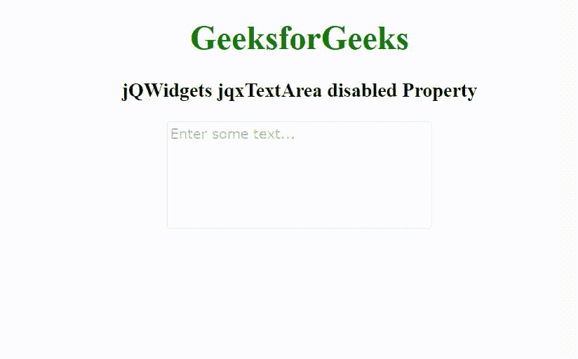

# jQWidgets jqxTextArea 禁用属性

> 原文:[https://www . geeksforgeeks . org/jqwidgets-jqxtextarea-disabled-property/](https://www.geeksforgeeks.org/jqwidgets-jqxtextarea-disabled-property/)

jQWidgets 是一个 JavaScript 框架，用于为 PC 和移动设备制作基于 web 的应用程序。它是一个非常强大和优化的框架，独立于平台，并得到广泛支持。jqxTextArea 表示一个 jQuery textarea 小部件，用于在文本框中插入文本内容。

**禁用属性**用于启用或禁用 jqxTextArea。它接受布尔类型值，默认值为 false。

**语法:**

设置禁用属性。

```
$('selector').jqxTextArea({ disabled: false });
```

返回禁用的属性。

```
var disabled = $('selector').jqxTextArea('disabled');
```

**链接文件:**从给定的链接 https://www.jqwidgets.com/download/.下载 jQWidgets 在 HTML 文件中，找到下载文件夹中的脚本文件。

> <link rel="”stylesheet”" href="”jqwidgets/styles/jqx.base.css”" type="”text/css”">
> <脚本类型=【text/JavaScript】src =【scripts/jquery-1 . 11 . 1 . min . js】></脚本>
> <脚本类型=【text/JavaScript】src =【jqwidgets/jqx-all . js】></脚本>
> <脚本类型=【text/JavaScript】src =【jqwidgets/jqxcorejqwidgets/jqxbuttons . js "></script>
> <script type = " text/JavaScript " src = " jqwidgets/jqxscrollbar . js "></script>
> <script type = " text/JavaScript " src = " jqwidgets/jqxtextarea . js ">/script>

以下示例说明了 jQWidgets jqxTextArea disabled 属性。

**示例:**

## 超文本标记语言

```
<!DOCTYPE html>
<html lang="en">

<head>
    <link rel="stylesheet" href=
        "jqwidgets/styles/jqx.base.css" 
        type="text/css" />
    <script type="text/javascript" 
        src="scripts/jquery-1.11.1.min.js"></script>
    <script type="text/javascript" 
        src="jqwidgets/jqx-all.js"></script>
    <script type="text/javascript" 
        src="jqwidgets/jqxcore.js"></script>
    <script type="text/javascript" 
        src=".jqwidgets/jqxbuttons.js"></script>
    <script type="text/javascript" 
        src="jqwidgets/jqxscrollbar.js"></script>
    <script type="text/javascript" 
        src="jqwidgets/jqxtextarea.js"></script>
</head>

<body>
    <center>
        <h1 style="color: green;">
            GeeksforGeeks
        </h1>

        <h3>
            jQWidgets jqxTextArea disabled Property
        </h3>

        <textarea id='jqxTA'></textarea>
    </center>

    <script type="text/javascript">
        $(document).ready(function() {
            $('#jqxTA').jqxTextArea({
                width: 250,
                height: 100,
                placeHolder: 'Enter some text...',
                disabled: true
            })
        });
    </script>
</body>

</html>
```

**输出:**



**参考:**[https://www . jqwidgets . com/jquery-widgets-documentation/documentation/jqxtextarea/jquery-textarea-API . htm](https://www.jqwidgets.com/jquery-widgets-documentation/documentation/jqxtextarea/jquery-textarea-api.htm)