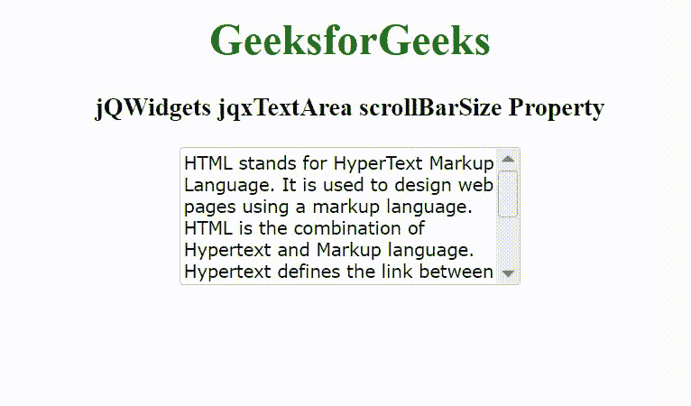

# jQWidgets jqxTextArea scrollBarSize 属性

> 原文:[https://www . geeksforgeeks . org/jqwidgets-jqxtextarea-scrollbarsize-property/](https://www.geeksforgeeks.org/jqwidgets-jqxtextarea-scrollbarsize-property/)

**jQWidgets** 是一个 JavaScript 框架，用于为 PC 和移动设备制作基于 web 的应用程序。它是一个非常强大、优化、独立于平台并且得到广泛支持的框架。jqxTextArea 表示一个 jQuery Textarea 小部件，用于在文本框中插入文本内容。

*滚动条大小*属性用于设置或返回滚动条的大小。它接受数字类型值，默认值为 15。

**语法:**

*   设置*滚动条大小*属性。

    ```html
    $('selector').jqxTextArea({ scrollBarSize: Number });
    ```

*   返回*禁用的*属性。

    ```html
    var scrollBarSize = $('selector').jqxTextArea('scrollBarSize');
    ```

**链接文件:**从给定链接下载 [jQWidgets](https://www.jqwidgets.com/download/) 。在 HTML 文件中，找到下载文件夹中的脚本文件。

> <link rel="”stylesheet”" href="”jqwidgets/styles/jqx.base.css”" type="”text/css”">
> <脚本类型=【text/JavaScript】src =【scripts/jquery-1 . 11 . 1 . min . js】></脚本>
> <脚本类型=【text/JavaScript】src =【jqwidgets/jqx-all . js】></脚本>
> <脚本类型=【text/JavaScript】src =【jqwidgets/jqxcorejqwidgets/jqxbuttons . js "></script>
> <script type = " text/JavaScript " src = " jqwidgets/jqxscrollbar . js "></script>
> <script type = " text/JavaScript " src = " jqwidgets/jqxtextarea . js ">/script>

**示例:**以下示例说明了 jQWidgets jqxTextArea*scrollBarSize*属性。

## 超文本标记语言

```html
<!DOCTYPE html>
<html lang="en">

<head>
    <link rel="stylesheet" href=
"jqwidgets/styles/jqx.base.css" 
          type="text/css" />
    <script type="text/javascript" 
            src="scripts/jquery-1.11.1.min.js">
    </script>
    <script type="text/javascript" 
            src="jqwidgets/jqx-all.js">
    </script>
    <script type="text/javascript" 
            src="jqwidgets/jqxcore.js">
    </script>
    <script type="text/javascript" 
            src=".jqwidgets/jqxbuttons.js">
    </script>
    <script type="text/javascript" 
            src="jqwidgets/jqxscrollbar.js">
    </script>
    <script type="text/javascript" 
            src="jqwidgets/jqxtextarea.js">
    </script>
</head>

<body>
    <center>
        <h1 style="color: green;">
            GeeksforGeeks
        </h1>

        <h3>
            jQWidgets jqxTextArea scrollBarSize Property
        </h3>

        <textarea id='jqxTA'></textarea>
    </center>

    <script type="text/javascript">
        $(document).ready(function() {
            $('#jqxTA').jqxTextArea({
                width: 250,
                height: 100,
                scrollBarSize: 40
            })

            $('#jqxTA').jqxTextArea('val', 
                'HTML stands for HyperText Markup Language.'+
                'It is used to design web pages using a markup language.'+
                'HTML is the combination of Hypertext and Markup language.'+ 
                'Hypertext defines the link between the web pages.'+
                'A markup language is used to define the text document'+
                'within tag which defines the structure of web pages. '
            );
        });
    </script>
</body>
</html>
```

**输出:**



**参考:**[https://www . jqwidgets . com/jquery-widgets-documentation/documentation/jqxtextarea/jquery-textarea-API . htm](https://www.jqwidgets.com/jquery-widgets-documentation/documentation/jqxtextarea/jquery-textarea-api.htm)