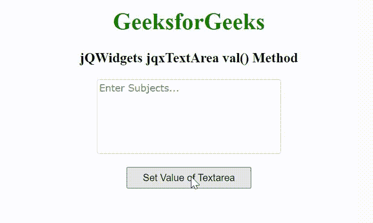

# jQWidgets jqxteareval()方法

> 原文:[https://www . geeksforgeeks . org/jqwidgets-jqxtextarea-val-method/](https://www.geeksforgeeks.org/jqwidgets-jqxtextarea-val-method/)

jQWidgets 是一个 JavaScript 框架，用于为 PC 和移动设备制作基于 web 的应用程序。它是一个非常强大和优化的框架，独立于平台，并得到广泛支持。jqxTextArea 表示一个 jQuery textarea 小部件，用于在文本框中插入文本内容。

**val()方法**用于设置或返回文本区域的值。它接受字符串类型的单个参数值并返回一个字符串值。

**语法:**

设置 textarea 的值。

```
$('selector').jqxTextArea({ 'val', 'String Value' });  or
$('selector').val('String Value');
```

返回 textarea 的值。

```
var value = $('selector').jqxTextArea('val'); or 
var value = $('selector').val();
```

**链接文件:**从给定的链接 https://www.jqwidgets.com/download/.下载 jQWidgets 在 HTML 文件中，找到下载文件夹中的脚本文件。

> <link rel="”stylesheet”" href="”jqwidgets/styles/jqx.base.css”" type="”text/css”">
> <脚本类型=【text/JavaScript】src =【scripts/jquery-1 . 11 . 1 . min . js】></脚本>
> <脚本类型=【text/JavaScript】src =【jqwidgets/jqx-all . js】></脚本>
> <脚本类型=【text/JavaScript】src =【jqwidgets/jqxcorejqwidgets/jqxbuttons . js "></script>
> <script type = " text/JavaScript " src = " jqwidgets/jqxscrollbar . js "></script>
> <script type = " text/JavaScript " src = " jqwidgets/jqxtextarea . js ">/script>

下面的例子说明了 jQWidgets jqxTextArea val()方法。

**示例:**

## 超文本标记语言

```
<!DOCTYPE html>
<html lang="en">

<head>
    <link rel="stylesheet" href=
        "jqwidgets/styles/jqx.base.css" type="text/css" />
    <script type="text/javascript" 
        src="scripts/jquery-1.11.1.min.js"></script>
    <script type="text/javascript" 
        src="jqwidgets/jqx-all.js"></script>
    <script type="text/javascript" 
        src="jqwidgets/jqxcore.js"></script>
    <script type="text/javascript" 
        src=".jqwidgets/jqxbuttons.js"></script>
    <script type="text/javascript" 
        src="jqwidgets/jqxscrollbar.js"></script>
    <script type="text/javascript" 
        src="jqwidgets/jqxtextarea.js"></script>
</head>

<body>
    <center>
        <h1 style="color: green;">
            GeeksforGeeks
        </h1>

        <h3>
            jQWidgets jqxTextArea val() Method
        </h3>

        <textarea id='jqxTA'></textarea>
        <br>
        <input type="button" id='jqxBtn' 
            style="padding: 5px 20px;" 
            value="Set Value of Textarea" />
    </center>

    <script type="text/javascript">
        $(document).ready(function() {
            var data = [
                "Computer Science",
                "C Programming",
                "C++ Programming",
                "Java Programming",
                "Python Programming",
                "HTML",
                "CSS",
                "JavaScript",
                "jQuery",
                "PHP",
                "Bootstrap"
            ];

            $('#jqxTA').jqxTextArea({
                source: data,
                width: 250,
                height: 100,
                placeHolder: 'Enter Subjects...'
            })

            $('#jqxBtn').on('click', function() {
                $('#jqxTA').jqxTextArea('val', "Python Programming");
            });
        });
    </script>
</body>

</html>
```

**输出:**



**参考:**[https://www . jqwidgets . com/jquery-widgets-documentation/documentation/jqxtextarea/jquery-textarea-API . htm](https://www.jqwidgets.com/jquery-widgets-documentation/documentation/jqxtextarea/jquery-textarea-api.htm)