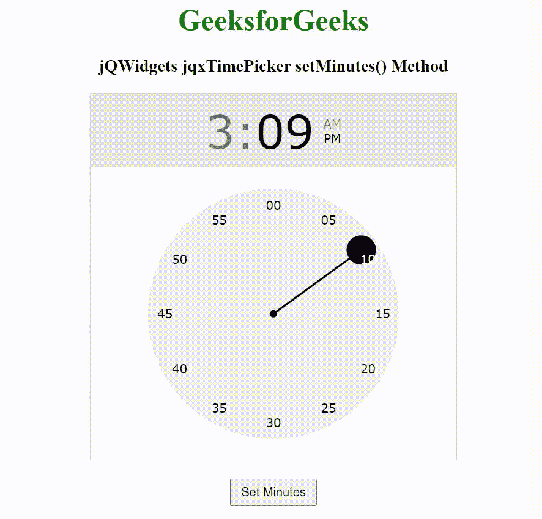

# jQWidgets jqxTimePicker setMinutes()方法

> 原文:[https://www . geesforgeks . org/jqwidgets-jqxtimepicker-setminutes-method/](https://www.geeksforgeeks.org/jqwidgets-jqxtimepicker-setminutes-method/)

jQWidgets 是一个 JavaScript 框架，用于为 PC 和移动设备制作基于 web 的应用程序。它是一个非常强大和优化的框架，独立于平台，并得到广泛支持。jqxTimePicker 代表一个 jQuery 小部件，用于以小时和分钟格式选择时间。

**设置分钟()方法**用于设置分钟时间。它接受数字类型的单参数分钟，并且不返回任何值。

**语法:**

```html
$('Selector').jqxTimePicker('setMinutes', minute_time);
```

**链接文件:**从给定的链接 https://www.jqwidgets.com/download/.下载 jQWidgets 在 HTML 文件中，找到下载文件夹中的脚本文件。

> <link rel="”stylesheet”" href="”jqwidgets/styles/jqx.base.css”" type="”text/css”">
> <脚本类型=【text/JavaScript】src =【scripts/jquery-1 . 11 . 1 . min . js】></脚本>
> <脚本类型=【text/JavaScript】src =【jqwidgets/jqx-all . js】></脚本>
> 脚本类型=【text/JavaScript】src =【jqwidgets/jqxcore。

下面的例子说明了 jQWidgets jqxTimePicker setMinutes()方法。

**示例:**

## 超文本标记语言

```html
<!DOCTYPE html>
<html lang="en">

<head>
    <link rel="stylesheet" href=
        "jqwidgets/styles/jqx.base.css" type="text/css" />
    <script type="text/javascript" 
        src="scripts/jquery-1.11.1.min.js"></script>
    <script type="text/javascript" 
        src="jqwidgets/jqx-all.js"></script>
    <script type="text/javascript" 
        src="jqwidgets/jqxcore.js"></script>
    <script type="text/javascript" 
        src="jqwidgets/jqxdraw.js"></script>
    <script type="text/javascript" 
        src="jqwidgets/jqxtimepicker.js"></script>
</head>

<body>
    <center>
        <h1 style="color: green;">
            GeeksforGeeks
        </h1>

        <h3>
            jQWidgets jqxTimePicker setMinutes() Method
        </h3>

        <div id="jqxTP"></div>

        <input type="button" value="Set Minutes" id="GFG"
            style="padding: 5px 10px; margin-top: 20px;">
    </center>

    <script type="text/javascript">
        $(document).ready(function() {
            $("#jqxTP").jqxTimePicker({
                width: 400,
                height: 400,
                selection: 'minute'
            });

            $("#GFG").on('click', function() {
                $('#jqxTP').jqxTimePicker('setMinutes', 24);
            });
        });
    </script>
</body>

</html>
```

**输出:**



**参考:**[https://www . jqwidgets . com/jquery-widgets-documentation/documentation/jqxtimepicker/jquery-time picker-入门. htm](https://www.jqwidgets.com/jquery-widgets-documentation/documentation/jqxtimepicker/jquery-timepicker-getting-started.htm)