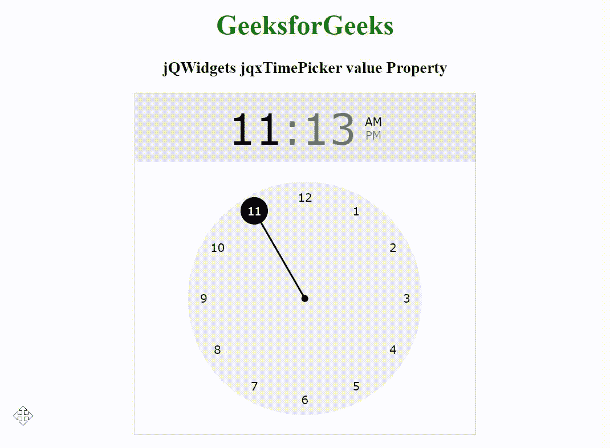

# jQWidgets jqxTimePicker 值属性

> 原文:[https://www . geesforgeks . org/jqwidgets-jqxtimepicker-value-property/](https://www.geeksforgeeks.org/jqwidgets-jqxtimepicker-value-property/)

**简介:jQWidgets** 是一个 JavaScript 框架，用于为 PC 和移动设备制作基于 web 的应用程序。它是一个非常强大、优化、独立于平台并且得到广泛支持的框架。jqxTimePicker 代表一个 jQuery 小部件，用于以小时和分钟格式选择时间。

*值*属性用于设置或返回 jqxTimePicker 小部件的值。它接受日期类型值，默认值为“新日期()”。

**语法:**

设置*值*属性。

```html
$('selector').jqxTimePicker({ value: false });
```

返回*值*属性。

```html
var value = $('selector').jqxTimePicker('value');
```

**链接文件:**从给定链接下载 [jQWidgets](https://www.jqwidgets.com/download/) 。在 HTML 文件中，找到下载文件夹中的脚本文件。

> <link rel="”stylesheet”" href="”jqwidgets/styles/jqx.base.css”" type="”text/css”">
> <脚本类型=【text/JavaScript】src =【scripts/jquery-1 . 11 . 1 . min . js】></脚本>
> <脚本类型=【text/JavaScript】src =【jqwidgets/jqx-all . js】></脚本>
> 脚本类型=【text/JavaScript】src =【jqwidgets/jqxcore。

**示例:**以下示例说明了 jQWidgets jqxTimePicker *值*属性。

## 超文本标记语言

```html
<!DOCTYPE html>
<html lang="en">

<head>
    <link rel="stylesheet" href=
        "jqwidgets/styles/jqx.base.css" type="text/css" />
    <script type="text/javascript" 
        src="scripts/jquery-1.11.1.min.js"></script>
    <script type="text/javascript" 
        src="jqwidgets/jqx-all.js"></script>
    <script type="text/javascript" 
        src="jqwidgets/jqxcore.js"></script>
    <script type="text/javascript" 
        src="jqwidgets/jqxdraw.js"></script>
    <script type="text/javascript" 
        src="jqwidgets/jqxtimepicker.js"></script>
</head>

<body>
    <center>
        <h1 style="color: green;">
            GeeksforGeeks
        </h1>

        <h3>
            jQWidgets jqxTimePicker value Property
        </h3>

        <div id="jqxTP"></div>
    </center>

    <script type="text/javascript">
        $(document).ready(function() {
            $("#jqxTP").jqxTimePicker({
                width: 400,
                height: 400,
                value: new Date("September 01, 2021 11:13:00")
            });
        });
    </script>
</body>

</html>
```

**输出:**



**参考:**[https://www . jqwidgets . com/jquery-widgets-documentation/documentation/jqxtimepicker/jquery-time picker-入门. htm](https://www.jqwidgets.com/jquery-widgets-documentation/documentation/jqxtimepicker/jquery-timepicker-getting-started.htm)