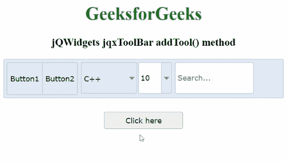

# jqwidgets jqxtolbar add tool()方法

> 原文:[https://www . geesforgeks . org/jqwidgets-jqxtoolbar-addtool-method/](https://www.geeksforgeeks.org/jqwidgets-jqxtoolbar-addtool-method/)

**jQWidgets** 是一个 JavaScript 框架，用于为 PC 和移动设备制作基于 web 的应用程序。它是一个非常强大、优化、独立于平台并且得到广泛支持的框架。jqxToolBar 用于说明一个 jQuery 小部件，它显示了一个工具栏，各种工具可以自发地添加到其中。此外，默认情况下，jqxToolBar 支持一些小部件，即 jqxButton、jqxToggleButton、jqxDropDownList、jqxComboBox 以及 jqxInput。但是，也可以附加自定义工具。

**添加工具()方法**用于向显示的 jqxToolBar 添加工具。它不返回任何东西。

**语法:**

```
$('#Selector').jqxToolBar('addTool', "button", "first", false, 
   function (type, tool, menuToolIninitialization) {
    var width = 90;
    if (menuToolIninitialization === true) {
        width = "100%";
    }
    tool.text("New_Button");
    tool.jqxButton({ width: width });
});
```

**参数:**

*   **类型:**是新工具的规定类型。其中，可能的值可以是按钮、dropdownlist、toggleButton、combobox、输入以及自定义。它属于字符串类型。
*   **位置:**是规定的刀具插入位置。这里可能的值是第一个和最后一个。它属于字符串类型。
*   **分隔符:**表示新工具后是否包含分隔符。这里可能的值有真有假。它属于布尔类型。
*   **初始化回调函数:**是新工具初始化后要调用的规定回调函数。它属于函数类型。这里可以传递三个参数，如下所示:
    1.  **类型:**是所述工具的类型。
    2.  **工具:**它是一个表示工具的声明的 jQuery 对象。
    3.  **菜单自动初始化:**它说明是为工具栏工具调用回调函数，即假，还是为弹出菜单工具调用回调函数，即真。它属于布尔类型。

**链接文件:**从给定链接下载 https://www.jqwidgets.com/download/。在 HTML 文件中，找到下载文件夹中的脚本文件。

> <link rel="”stylesheet”" href="”jqwidgets/styles/jqx.base.css”" type="”text/css”">
> <脚本类型=“text/JavaScript”src =“scripts/jquery-1 . 11 . 1 . min . js”></脚本>
> <脚本类型=“text/JavaScript”src =“jqwidgets/jqxcore . js”></脚本>
> <脚本类型=“text/JavaScript”src =“jqwidgets/jqxbuttons

下面的例子说明了 jQWidgets 中的 jqxToolBar addTool()方法。

**示例:**

## 超文本标记语言

```
<!DOCTYPE html>
<html lang="en">

<head>
    <link rel="stylesheet" href=
    "jqwidgets/styles/jqx.base.css" type="text/css" />
    <script type="text/javascript" 
        src="scripts/jquery-1.11.1.min.js"></script>
    <script type="text/javascript" 
        src="jqwidgets/jqxcore.js"></script>
    <script type="text/javascript" 
        src="jqwidgets/jqxbuttons.js"></script>
    <script type="text/javascript" 
        src="jqwidgets/jqxscrollbar.js"></script>
    <script type="text/javascript" 
        src="jqwidgets/jqxlistbox.js"></script>
    <script type="text/javascript" 
        src="jqwidgets/jqxdropdownlist.js"></script>
    <script type="text/javascript" 
        src="jqwidgets/jqxcombobox.js"></script>
    <script type="text/javascript" 
        src="jqwidgets/jqxinput.js"></script>
    <script type="text/javascript" 
    src="jqwidgets/jqxtoolbar.js"></script>
</head>

<body>
    <center>
        <h1 style="color:green">
            GeeksforGeeks
        </h1>

        <h3>jQWidgets jqxToolBar addTool() method
        </h3>

        <div id="jqxtb"></div>

        <div>
            <input type="button" id="jqxBtn" 
                style="margin-top: 25px" 
                value="Click here" />
        </div>
        <br>

        <div id="log"></div>
    </center>

    <script type="text/javascript">
        $(document).ready(function () {
            $("#jqxtb").jqxToolBar({
                width: "100%",
                theme: "energyblue",
                height: 70,
                tools: 
"button button | dropdownlist combobox | input",
                initTools:
                    function (type, index, tool, 
                    menuToolIninitialization) {
                        switch (index) {
                            case 0:
                                tool.text("Button1");
                                break;
                            case 1:
                                tool.text("Button2");
                                break;
                            case 2:
                                tool.jqxDropDownList({
                                    width: 100,
                                    source: ["Java", "Scala", "C++"],
                                    selectedIndex: 2
                                });
                                break;
                            case 3:
                                tool.jqxComboBox({
                                    width: 60,
                                    source: [4, 5, 8, 10, 15],
                                    selectedIndex: 3
                                });
                                break;
                            case 4:
                                tool.jqxInput({
                                    width: 140,
                                    placeHolder: "Search..."
                                });
                                break;
                        }
                    }
            });

            $("#jqxBtn").jqxButton({
                width: "140px",
                height: "30px",
            });
            $("#jqxBtn").on("click", function () {
                $('#jqxtb').jqxToolBar('addTool', 
                    "button", "first", true,
                    function (type, tool, menuToolIninitialization) {
                        var width = 90;
                        if (menuToolIninitialization === true) {
                            width = "90%";
                        }
                        tool.text("Button0");
                        tool.jqxButton({
                            width: width
                        });
                    });
            });
        });
    </script>
</body>

</html>
```

**输出:**



**参考:**[https://www . jqwidgets . com/jquery-widgets-documentation/documentation/jqxtoolbar/jquery-toolbar-API . htm？搜索=](https://www.jqwidgets.com/jquery-widgets-documentation/documentation/jqxtoolbar/jquery-toolbar-api.htm?search=)