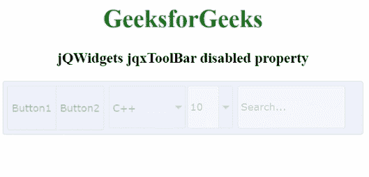

# jQWidgets jqxToolBar 禁用属性

> 原文:[https://www . geesforgeks . org/jqwidgets-jqxtoolbar-disabled-property/](https://www.geeksforgeeks.org/jqwidgets-jqxtoolbar-disabled-property/)

**jQWidgets** 是一个 JavaScript 框架，用于为 PC 和移动设备制作基于 web 的应用程序。它是一个非常强大、优化、独立于平台并且得到广泛支持的框架。 **jqxToolBar** 用于说明一个 jQuery 小部件，它显示了一个工具栏，各种工具可以自发地添加到其中。此外，默认情况下，jqxToolBar 支持一些小部件，即 jqxButton、jqxToggleButton、jqxDropDownList、jqxComboBox 以及 jqxInput。但是，也可以附加自定义工具。

**禁用属性**用于启用或禁用显示的 jqxToolBar，包括每个工具。它是布尔类型，默认值是*假*。

**语法:**

*   设置*禁用*属性:

    ```
    $('#Selector').jqxToolBar({ disabled: false});
    ```

*   返回*禁用的*属性:

    ```
    var disabled = $('#Selector').jqxToolBar('disabled');
    ```

**链接文件:**从给定链接下载 [jQWidgets](https://www.jqwidgets.com/download/) 。在 HTML 文件中，找到下载文件夹中的脚本文件。

> <link rel="”stylesheet”" href="”jqwidgets/styles/jqx.base.css”" type="”text/css”">
> <脚本类型=“text/JavaScript”src =“scripts/jquery-1 . 11 . 1 . min . js”></脚本>
> <脚本类型=“text/JavaScript”src =“jqwidgets/jqxcore . js”></脚本>
> <脚本类型=“text/JavaScript”src =“jqwidgets/jqxbuttons

下面的例子说明了 jQWidgets 中的 jqxToolBar **禁用属性**。

**示例:**

## 超文本标记语言

```
<!DOCTYPE html>
<html lang="en">

<head>
    <link rel="stylesheet" href=
        "jqwidgets/styles/jqx.base.css" type="text/css" />
    <script type="text/javascript" 
        src="scripts/jquery-1.11.1.min.js"></script>
    <script type="text/javascript" 
        src="jqwidgets/jqxcore.js"></script>
    <script type="text/javascript" 
        src="jqwidgets/jqxbuttons.js"></script>
    <script type="text/javascript" 
        src="jqwidgets/jqxscrollbar.js"></script>
    <script type="text/javascript" 
        src="jqwidgets/jqxlistbox.js"></script>
    <script type="text/javascript" 
        src="jqwidgets/jqxdropdownlist.js"></script>
    <script type="text/javascript" 
        src="jqwidgets/jqxcombobox.js"></script>
    <script type="text/javascript" 
        src="jqwidgets/jqxinput.js"></script>
    <script type="text/javascript" 
        src="jqwidgets/jqxtoolbar.js"></script>
</head>

<body>
    <center>
        <h1 style="color:green">
            GeeksforGeeks
        </h1>

        <h3>jQWidgets jqxToolBar disabled property</h3>

        <div id="jqxtb"></div>
    </center>

    <script type="text/javascript">
        $(document).ready(function () {
            $("#jqxtb").jqxToolBar({
                width: "470px",
                theme: "energyblue",
                height: 70,
                disabled: true,
                tools: 
        "button button | dropdownlist combobox | input",
                initTools: function (type, index, 
                tool, menuToolIninitialization) {
                    switch (index) {
                        case 0:
                            tool.text("Button1");
                            break;
                        case 1:
                            tool.text("Button2");
                            break;
                        case 2:
                            tool.jqxDropDownList({
                                width: 100,
                                source: ["Java", "Scala", "C++"],
                                selectedIndex: 2
                            });
                            break;
                        case 3:
                            tool.jqxComboBox({
                                width: 60,
                                source: [4, 5, 8, 10, 15],
                                selectedIndex: 3
                            });
                            break;
                        case 4:
                            tool.jqxInput({
                                width: 140,
                                placeHolder: "Search..."
                            });
                            break;
                    }
                }
            });
        });
    </script>
</body>

</html>
```

**输出:**



**参考:**[https://www . jqwidgets . com/jquery-widgets-documentation/documentation/jqxtoolbar/jquery-toolbar-API . htm](https://www.jqwidgets.com/jquery-widgets-documentation/documentation/jqxtoolbar/jquery-toolbar-api.htm)