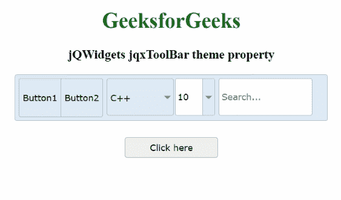

# jQWidgets jqxToolBar 主题属性

> 原文:[https://www . geesforgeks . org/jqwidgets-jqxtoolbar-theme-property/](https://www.geeksforgeeks.org/jqwidgets-jqxtoolbar-theme-property/)

**jQWidgets** 是一个 JavaScript 框架，用于为 PC 和移动设备制作基于 web 的应用程序。它是一个非常强大、优化、独立于平台并且得到广泛支持的框架。 **jqxToolBar** 用于说明一个 jQuery 小部件，它显示了一个工具栏，各种工具可以自发地添加到其中。此外， **jqxToolBar** 偏爱一些小部件，即 jqxButton、jqxToggleButton、jqxDropDownList、jqxComboBox 以及 jqxInput。但是，也可以附加自定义工具。

***主题*** 属性用于设置或返回 **jqxToolBar** 小部件的主题。它接受字符串类型值，默认值为空(")。为了使用这个属性，我们需要将主题样式表(即 *jqx.energyblue.css* )合并到标题部分。主题文件包含在“ *jqx.base.css* 文件之后。

**语法:**

*   设置*主题*属性。

    ```html
    $('#Selector').jqxToolBar({ theme: 'energyblue' });
    ```

*   返回*主题*属性。

    ```html
    var theme = $('#Selector').jqxToolBar('theme');
    ```

**链接文件:**从给定链接下载 [jQWidgets](https://www.jqwidgets.com/download/) 。在 HTML 文件中，找到下载文件夹中的脚本文件。

> <link rel="”stylesheet”" href="”jqwidgets/styles/jqx.base.css”" type="”text/css”">
> <脚本类型=“text/JavaScript”src =“scripts/jquery-1 . 11 . 1 . min . js”></脚本>
> <脚本类型=“text/JavaScript”src =“jqwidgets/jqxcore . js”></脚本>
> <脚本类型=“text/JavaScript”src =“jqwidgets/jqxbuttons

**示例:**下面的示例说明了 jQWidgets 中的 jqxToolBar *主题*属性。

## 超文本标记语言

```html
<!DOCTYPE html>
<html lang="en">

<head>
    <link rel="stylesheet" 
          href="jqwidgets/styles/jqx.base.css"
          type="text/css" />
    <script type="text/javascript" 
            src="scripts/jquery-1.11.1.min.js">
    </script>
    <script type="text/javascript" 
            src="jqwidgets/jqxcore.js">
    </script>
    <script type="text/javascript" 
            src="jqwidgets/jqxbuttons.js">
    </script>
    <script type="text/javascript" 
            src="jqwidgets/jqxscrollbar.js">
    </script>
    <script type="text/javascript" 
            src="jqwidgets/jqxlistbox.js">
    </script>
    <script type="text/javascript" 
            src="jqwidgets/jqxdropdownlist.js">
    </script>
    <script type="text/javascript" 
            src="jqwidgets/jqxcombobox.js">
    </script>
    <script type="text/javascript" 
            src="jqwidgets/jqxinput.js">
    </script>
    <script type="text/javascript" 
            src="jqwidgets/jqxtoolbar.js">
    </script>
</head>

<body>
    <center>
        <h1 style="color:green">
            GeeksforGeeks
        </h1>

        <h3>jQWidgets jqxToolBar theme property</h3>

        <div id="jqxtb"></div>

        <div>
            <input type="button" id="jqxBtn" 
                   style="margin-top: 25px" value="Click here" />
        </div>
        <br>
        <div id="log"></div>
    </center>

    <script type="text/javascript">
        $(document).ready(function () 
        {
            $("#jqxtb").jqxToolBar({
                width: "470px",
                theme: "energyblue",
                height: 70,
                tools: "button button | dropdownlist combobox | input",
                initTools:
                    function (type, index, tool, menuToolIninitialization) {
                        switch (index) {
                            case 0:
                                tool.text("Button1");
                                break;
                            case 1:
                                tool.text("Button2");
                                break;
                            case 2:
                                tool.jqxDropDownList({
                                    width: 100,
                                    source: ["Java", "Scala", "C++"],
                                    selectedIndex: 2
                                });
                                break;
                            case 3:
                                tool.jqxComboBox({
                                    width: 60,
                                    source: [4, 5, 8, 10, 15],
                                    selectedIndex: 3
                                });
                                break;
                            case 4:
                                tool.jqxInput({
                                    width: 140,
                                    placeHolder: "Search..."
                                });
                                break;
                        }
                    }
            });

            $("#jqxBtn").jqxButton({
                width: "140px",
                height: "30px",
            });
            $("#jqxBtn").on("click", function () {
                var th = $('#jqxtb').jqxToolBar('theme');
                $('#log').text("Theme name of toolbar: " + th);
            });
        });
    </script>
</body>
</html>
```

**输出:**



**参考:**[https://www . jqwidgets . com/jquery-widgets-documentation/documentation/jqxtoolbar/jquery-toolbar-API . htm？搜索=](https://www.jqwidgets.com/jquery-widgets-documentation/documentation/jqxtoolbar/jquery-toolbar-api.htm?search=)