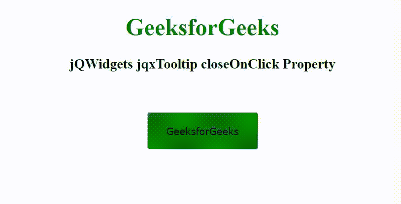

# jQWidgets jqxTooltip 收尾点击属性

> 原文:[https://www . geesforgeks . org/jqwidgets-jqxtooltip-closenclick-property/](https://www.geeksforgeeks.org/jqwidgets-jqxtooltip-closeonclick-property/)

jQWidgets 是一个 JavaScript 框架，用于为 PC 和移动设备制作基于 web 的应用程序。它是一个非常强大和优化的框架，独立于平台，并得到广泛支持。jqxTooltip 是一个 jQuery 小部件，用于显示弹出消息。jqxTooltip 小部件可以与任何 HTML 元素结合使用。

**关闭点击属性**用于设置或返回工具提示点击后是否关闭。它接受布尔类型值，默认值为真。

**语法:**

设置关闭点击属性。

```
$('Selector').jqxTooltip({ closeOnClick: Boolean });
```

返回关闭点击属性。

```
var closeOnClick = $('Selector').jqxTooltip('closeOnClick');
```

**链接文件:**从给定的链接 https://www.jqwidgets.com/download/.下载 jQWidgets 在 HTML 文件中，找到下载文件夹中的脚本文件。

> <link rel="”stylesheet”" href="”jqwidgets/styles/jqx.base.css”" type="”text/css”">
> < link rel= "样式表" href = " jqwidgets/style/jqx . energy blue . CSS ">
> <脚本类型= " text/JavaScript " src = " scripts/jquery-1 . 11 . 1 . min . js "></脚本>
> <脚本类型= " text/JavaScript " src = " jqwidgets/jqx-all . js ">jqwidgets/jqxbuttons . js "></script>
> <script type = " text/JavaScript " src = " jqwidgets/jqxtooltip . js "></script>

下面的例子说明了 jQWidgets jqxTooltip closeOnClick 属性。

**示例:**

## 超文本标记语言

```
<!DOCTYPE html>
<html lang="en">

<head>
    <link rel="stylesheet" href=
        "jqwidgets/styles/jqx.base.css" type="text/css" />
    <link rel="stylesheet" href=
        "jqwidgets/styles/jqx.energyblue.css">
    <script type="text/javascript" 
        src="scripts/jquery-1.11.1.min.js"></script>
    <script type="text/javascript" 
        src="jqwidgets/jqx-all.js"></script>
    <script type="text/javascript" 
        src="jqwidgets/jqxcore.js"></script>
    <script type="text/javascript" 
        src=".jqwidgets/jqxbuttons.js"></script>
    <script type="text/javascript" 
        src="jqwidgets/jqxtooltip.js"></script>
</head>

<body>
    <center>
        <h1 style="color: green;">
            GeeksforGeeks
        </h1>

        <h3>
            jQWidgets jqxTooltip closeOnClick Property
        </h3>
        <br><br>

        <input type="button" id="jqxBtn" 
            style="background: green;"
            value="GeeksforGeeks" />
    </center>

    <script type="text/javascript">
        $(document).ready(function() {
            $('#jqxBtn').jqxButton({
                width: 150,
                height: 50
            });

            $("#jqxBtn").jqxTooltip({
                theme: 'energyblue',
                width: 200,
                height: 30,
                position:'top',
                content: 'A computer science portal',
                closeOnClick: false
            });
        });
    </script>
</body>

</html>
```

**输出:**



**参考:**[https://www . jqwidgets . com/jquery-widgets-documentation/documentation/jqxtooltip/jquery-tooltip-API . htm](https://www.jqwidgets.com/jquery-widgets-documentation/documentation/jqxtooltip/jquery-tooltip-api.htm)