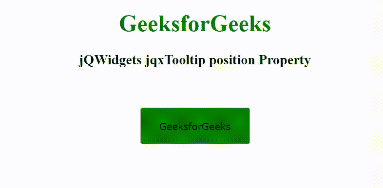

# jQWidgets jqxTooltip 位置属性

> 原文:[https://www . geesforgeks . org/jqwidgets-jqxtooltip-position-property/](https://www.geeksforgeeks.org/jqwidgets-jqxtooltip-position-property/)

**jQWidgets** 是一个 JavaScript 框架，用于为 PC 和移动设备制作基于 web 的应用程序。它是一个非常强大、优化、独立于平台并且得到广泛支持的框架。jqxTooltip 是一个 jQuery 小部件，用于显示弹出消息。jqxTooltip 小部件可以与任何 HTML 元素结合使用。

*位置*属性用于设置或返回 jqxTooltip 小部件的位置。它接受字符串类型值，其默认值为“默认值”。

可能的值如下

*   **“顶部”:**工具提示显示在主体元素上方的位置。
*   **“底部”:**工具提示显示在主体元素下方的位置。
*   **“左”:**工具提示显示的位置在主体元素的左侧。
*   **“右”:**工具提示显示的位置在主体元素的右侧。
*   **“左上角”:**工具提示显示的位置在主体元素的左上角。
*   **“左下角”:**工具提示显示的位置在主体元素的左下角。
*   **“右上角”:**工具提示显示的位置在主体元素的右上角。
*   **“右下角”:**工具提示显示的位置在主体元素的右下角。
*   **“绝对”:**工具提示的位置显示在主体元素的绝对位置上。绝对位置由坐标属性*绝对位置*和*绝对位置*定义。
*   **“鼠标”:**短时间后工具提示显示在宿主元素鼠标光标位置的位置。
*   **“鼠标回车”:**鼠标光标进入宿主元素的工具提示显示位置。
*   **“默认”:**工具提示显示的位置在主体元素的右下角。

**语法:**

设置*位置*属性。

```
$('Selector').jqxTooltip({ position: String });
```

返回*位置*属性。

```
var position = $('Selector').jqxTooltip('position');
```

**链接文件:**从给定链接下载 [jQWidgets](https://www.jqwidgets.com/download/) 。在 HTML 文件中，找到下载文件夹中的脚本文件。

> <link rel="”stylesheet”" href="”jqwidgets/styles/jqx.base.css”" type="”text/css”">
> < link rel= "样式表" href = " jqwidgets/style/jqx . energy blue . CSS ">
> <脚本类型= " text/JavaScript " src = " scripts/jquery-1 . 11 . 1 . min . js "></脚本>
> <脚本类型= " text/JavaScript " src = " jqwidgets/jqx-all . js ">jqwidgets/jqxbuttons . js "></script>
> <script type = " text/JavaScript " src = " jqwidgets/jqxtooltip . js "></script>

**示例:**以下示例说明了 jQWidgets jqxTooltip *位置*属性。

## 超文本标记语言

```
<!DOCTYPE html>
<html lang="en">

<head>
    <link rel="stylesheet" href=
        "jqwidgets/styles/jqx.base.css" type="text/css" />
    <link rel="stylesheet" href=
        "jqwidgets/styles/jqx.energyblue.css">
    <script type="text/javascript" 
        src="scripts/jquery-1.11.1.min.js"></script>
    <script type="text/javascript" 
        src="jqwidgets/jqx-all.js"></script>
    <script type="text/javascript" 
        src="jqwidgets/jqxcore.js"></script>
    <script type="text/javascript" 
        src=".jqwidgets/jqxbuttons.js"></script>
    <script type="text/javascript" 
        src="jqwidgets/jqxtooltip.js"></script>
</head>

<body>
    <center>
        <h1 style="color: green;">
            GeeksforGeeks
        </h1>

        <h3>
            jQWidgets jqxTooltip position Property
        </h3>
        <br><br>

        <input type="button" id="jqxBtn" 
            style="background: green;" 
            value="GeeksforGeeks" />
    </center>

    <script type="text/javascript">
        $(document).ready(function() {
            $('#jqxBtn').jqxButton({
                width: 150,
                height: 50
            });

            $("#jqxBtn").jqxTooltip({
                theme: 'energyblue',
                content: 'A computer science portal',
                position: 'top',
                width: 200,
                height: 30
            });
        });
    </script>
</body>

</html>
```

**输出:**



**参考:**[https://www . jqwidgets . com/jquery-widgets-documentation/documentation/jqxtooltip/jquery-tooltip-API . htm](https://www.jqwidgets.com/jquery-widgets-documentation/documentation/jqxtooltip/jquery-tooltip-api.htm)