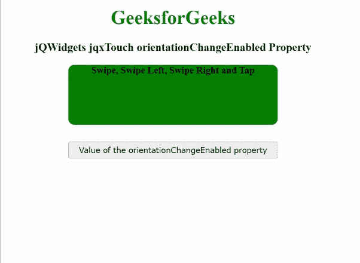

# jQWidgets jqxttouch orientationchangenabled 属性

> 原文:[https://www . geesforgeks . org/jqwidgets-jqxtouch-orientionchangenabled-property/](https://www.geeksforgeeks.org/jqwidgets-jqxtouch-orientationchangeenabled-property/)

**jQWidgets** 是一个 JavaScript 框架，用于为 PC 和移动设备制作基于 web 的应用程序。它是一个非常强大、优化、独立于平台并且得到广泛支持的框架。**jqxttouch**用于识别和触发触摸启用设备上的触摸事件，如“轻扫”、“向左轻扫”、“向右轻扫”、“轻敲”和“方向改变”。

**orientationchangenabled****属性**用于指示指定的 jqxTouch 小部件是否启用了 orientonchange 事件。此属性接受两个可能的值，即真和假。

**语法:**

*   设置 *方位变化启用*属性:

    ```
    $('#jqxTouch').jqxTouch({orientationChangeEnabled: true});
    ```

*   要获取*方向改变启用*属性:

    ```
    var orientationChangeEnabled = $('#jqxTouch')
        .jqxTouch('orientationChangeEnabled');
    ```

**链接文件:**从给定链接下载 [jQWidgets](https://www.jqwidgets.com/download/) 。在 HTML 文件中，找到下载文件夹中的脚本文件。

> <link rel="”stylesheet”" href="”jqwidgets/styles/jqx.base.css”" type="”text/css”">
> <脚本类型=“text/JavaScript”src =“scripts/jquery . js”></脚本>
> <脚本类型=“text/JavaScript”src =“jqwidgets/jqxcore . js”></脚本>
> <脚本类型=“text/JavaScript”src =“jqwidgets/jqxtouch . js”></脚本

**示例:**下面的示例说明了 jQWidgets jqxttouch***orientonchangenabled***属性。在下面的例子中，*orientonchangenabled*属性的值被设置为 true。

## 超文本标记语言

```
<!DOCTYPE html>
<html lang="en">

<head>
    <link rel="stylesheet" 
          href="jqwidgets/styles/jqx.base.css" 
          type="text/css"/>
    <script type="text/javascript" 
            src="scripts/jquery.js">
    </script>
    <script type="text/javascript" 
            src="jqwidgets/jqxcore.js">
    </script>
    <script type="text/javascript" 
            src="jqwidgets/jqxtouch.js">
    </script>
    <script type="text/javascript" 
            src="scripts/jqx-all.js">
    </script>
</head>

<body>
    <center>
        <h1 style="color: green;">
            GeeksforGeeks
        </h1>
        <h3>
            jQWidgets jqxTouch orientationChangeEnabled Property
        </h3>
        <div id="jqx_Touch">
            <div style="height: 100px; 
                      width: 350px;
                      color: black; 
                      border-radius: 10px;
                      background: green;">
                <b>Swipe, Swipe Left, Swipe Right and Tap</b>
            </div>
        </div>
        <input type="button" style="margin: 28px;"
               id="button_for_orientationChangeEnabled"
         value="Value of the orientationChangeEnabled property"/>
        <div id="log"></div>
        <script type="text/javascript">
            $(document).ready(function () {
                $('#jqx_Touch').jqxTouch({
                    orientationChangeEnabled: true
                });
                $('#jqx_Touch').on(
                  'swipeleft', function () {
                    $("#log").html("Swiped left");
                });
                $('#jqx_Touch').on(
                  'swiperight', function () {
                    $("#log").html("Swiped right");
                });
                $('#jqx_Touch').on(
                  'tap', function () {
                    $("#log").html("Tapped");
                });
                $('#jqx_Touch').on(
                  'swipe', function () {
                    $("#log").html("Swiped");
                });
                $("#button_for_orientationChangeEnabled").
                    jqxButton({
                        width: 350
                    });
                $("#button_for_orientationChangeEnabled").click(
                    function () {
                        var orientationChangeEnabled_Value =
                          $('#jqx_Touch').
                             jqxTouch('orientationChangeEnabled');
                     $("#log").html(orientationChangeEnabled_Value);
                    });
            });
        </script>
    </center>
</body>

</html>
```

**输出:**



**参考:**[https://www . jqwidgets . com/jquery-widgets-documentation/documentation/jqxtouch/jquery-touch-API . htm](https://www.jqwidgets.com/jquery-widgets-documentation/documentation/jqxtouch/jquery-touch-api.htm)