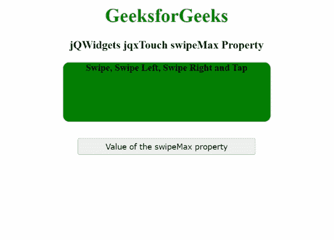

# jQWidgets jqxttouch swipeMax 属性

> 原文:[https://www . geesforgeks . org/jqwidgets-jqxtouch-swipemax-property/](https://www.geeksforgeeks.org/jqwidgets-jqxtouch-swipemax-property/)

**jQWidgets****是一个为 PC 和移动设备制作基于 web 的应用的 JavaScript 框架。它是一个非常强大、优化、独立于平台并且得到广泛支持的框架。****jqxttouch**用于识别和触发支持触摸的设备上的“扫动”、“向左扫动”、“向右扫动”、“轻敲”和“方向改变”等触摸事件。****

******swipeMax 属性**用于设置或获取指定 jqxTouch 小部件的最大滑动距离。通过后，触摸事件的传播将被恢复，因此滚动将可用。****

******语法:******

*   ****设置*开关最大值*属性:****

    ```
    **$('#jqxTouch').jqxTouch({swipeMax: 300});**
    ```

*   ****获取*swipeMax**T2***属性:****

    ```
    **var swipeMin = $('#jqxTouch').jqxTouch('swipeMax');**
    ```

******链接文件:**从给定链接下载 [jQWidgets](https://www.jqwidgets.com/download/) 。在 HTML 文件中，找到下载文件夹中的脚本文件。****

> <link rel="”stylesheet”" href="”jqwidgets/styles/jqx.base.css”" type="”text/css”"> ****<脚本类型=“text/JavaScript”src =“scripts/jquery . js”></脚本>
> <脚本类型=“text/JavaScript”src =“jqwidgets/jqxcore . js”></脚本>
> <脚本类型=“text/JavaScript”src =“jqwidgets/jqxtouch . js”></脚本****

******示例:**下面的示例说明了 jQWidgets jqxTouch**swipeMax**属性。在下面的示例中， *swipeMax* 属性的值被设置为 300。****

## ****超文本标记语言****

```
**<!DOCTYPE html>
<html lang="en">

<head>
    <link rel="stylesheet" 
          href="jqwidgets/styles/jqx.base.css"
          type="text/css"/>
    <script type="text/javascript" 
            src="scripts/jquery.js">
    </script>
    <script type="text/javascript" 
            src="jqwidgets/jqxcore.js">
    </script>
    <script type="text/javascript" 
            src="jqwidgets/jqxtouch.js">
    </script>
    <script type="text/javascript" 
            src="scripts/jqx-all.js">
    </script>
</head>

<body>
    <center>
        <h1 style="color: green;">
            GeeksforGeeks
        </h1>
        <h3>
            jQWidgets jqxTouch swipeMax Property
        </h3>
        <div id="jqx_Touch">
            <div style="height: 100px; 
                      width: 350px;
                      color: black; 
                      border-radius: 10px;
                      background: green;">
                <b>Swipe, Swipe Left, Swipe Right and Tap</b>
            </div>
        </div>
        <input type="button" style="margin: 28px;"
               id="button_for_swipeMax"
         value="Value of the swipeMax property"/>
        <div id="log"></div>
        <script type="text/javascript">
            $(document).ready(function () {
                $('#jqx_Touch').jqxTouch({
                    swipeMax: 300
                });
                $('#jqx_Touch').on('swipeleft', function () {
                    $("#log").html("Swiped left");
                });
                $('#jqx_Touch').on('swiperight', function () {
                    $("#log").html("Swiped right");
                });
                $('#jqx_Touch').on('tap', function () {
                    $("#log").html("Tapped");
                });
                $('#jqx_Touch').on('swipe', function () {
                    $("#log").html("Swiped");
                });
                $("#button_for_swipeMax").
                    jqxButton({
                        width: 300
                    });
                $("#button_for_swipeMax").click(
                    function () {
                        var swipeMax_Value =
                          $('#jqx_Touch').
                             jqxTouch('swipeMax');
                     $("#log").html(swipeMax_Value);
                    });
            });
        </script>
    </center>
</body>

</html>**
```

******输出:******

********

******参考:**[https://www . jqwidgets . com/jquery-widgets-documentation/documentation/jqxtouch/jquery-touch-API . htm](https://www.jqwidgets.com/jquery-widgets-documentation/documentation/jqxtouch/jquery-touch-api.htm)****