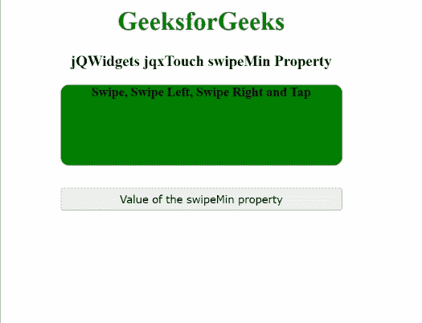

# jQWidgets jqxttouch swipeMin 物业

> 原文:[https://www . geesforgeks . org/jqwidgets-jqxtouch-swipemin-property/](https://www.geeksforgeeks.org/jqwidgets-jqxtouch-swipemin-property/)

**jQWidgets** 是一个 JavaScript 框架，用于为 PC 和移动设备制作基于 web 的应用程序。它是一个非常强大、优化、独立于平台并且得到广泛支持的框架。****jqxttouch****用于识别和触发支持触摸的设备上的触摸事件，如“轻扫”、“左扫”、“右扫”、“轻敲”和“方向改变”。****

******swipeMin** **属性**用于表示指定 jqxTouch 小部件的插件所需的最小滑动距离。****

******语法:******

*   ****为设置 *太古民**T5】属性:*******

    ```
    ****$('#jqxTouch').jqxTouch({swipeMin: 45});****
    ```

*   ******要获得 *swipeMin* 属性:******

    ```
    ****var swipeMin = $('#jqxTouch').jqxTouch('swipeMin');****
    ```

********链接文件:**从给定链接下载 [jQWidgets](https://www.jqwidgets.com/download/) 。在 HTML 文件中，找到下载文件夹中的脚本文件。******

> <link rel="”stylesheet”" href="”jqwidgets/styles/jqx.base.css”" type="”text/css”"> ****<脚本类型=“text/JavaScript”src =“scripts/jquery . js”></脚本>
> <脚本类型=“text/JavaScript”src =“jqwidgets/jqxcore . js”></脚本>
> <脚本类型=“text/JavaScript”src =“jqwidgets/jqxtouch . js”></脚本****

******示例:**下面的示例说明了 jQWidgets jqxttouch**swipeMin**属性。在下面的示例中， *swipeMin* 属性的值被设置为 45。****

## ****超文本标记语言****

```
**<!DOCTYPE html>
<html lang="en">

<head>
    <link rel="stylesheet" 
          href="jqwidgets/styles/jqx.base.css" 
          type="text/css"/>
    <script type="text/javascript" 
            src="scripts/jquery.js">
    </script>
    <script type="text/javascript" 
            src="jqwidgets/jqxcore.js">
    </script>
    <script type="text/javascript" 
            src="jqwidgets/jqxtouch.js">
    </script>
    <script type="text/javascript" 
            src="scripts/jqx-all.js">
    </script>
</head>

<body>
    <center>
        <h1 style="color: green;">
            GeeksforGeeks
        </h1>
        <h3>
            jQWidgets jqxTouch swipeMin Property
        </h3>
        <div id="jqx_Touch">
            <div style="height: 100px; 
                      width: 350px;
                      color: black; 
                      border-radius: 10px;
                      background: green;">
                <b>Swipe, Swipe Left, Swipe Right and Tap</b>
            </div>
        </div>
        <input type="button" style="margin: 28px;"
               id="button_for_swipeMin"
         value="Value of the swipeMin property"/>
        <div id="log"></div>
        <script type="text/javascript">
            $(document).ready(function () {
                $('#jqx_Touch').jqxTouch({
                    swipeMin: 45
                });
                $('#jqx_Touch').on('swipeleft', function () {
                    $("#log").html("Swiped left");
                });
                $('#jqx_Touch').on('swiperight', function () {
                    $("#log").html("Swiped right");
                });
                $('#jqx_Touch').on('tap', function () {
                    $("#log").html("Tapped");
                });
                $('#jqx_Touch').on('swipe', function () {
                    $("#log").html("Swiped");
                });
                $("#button_for_swipeMin").
                    jqxButton({
                        width: 350
                    });
                $("#button_for_swipeMin").click(
                    function () {
                        var swipeMin_Value =
                          $('#jqx_Touch').
                             jqxTouch('swipeMin');
                        $("#log").html(swipeMin_Value);
                    });
            });
        </script>
    </center>
</body>

</html>**
```

******输出:******

********

******参考:**[https://www . jqwidgets . com/jquery-widgets-documentation/documentation/jqxtouch/jquery-touch-API . htm](https://www.jqwidgets.com/jquery-widgets-documentation/documentation/jqxtouch/jquery-touch-api.htm)****