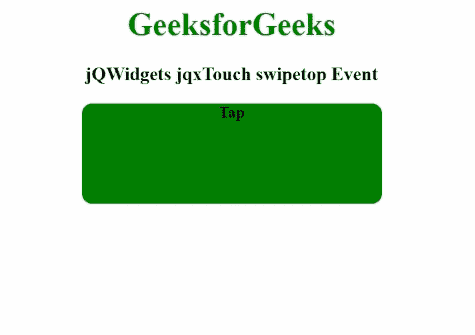

# jqwidgets jqxtuch swipetop 事件

> 哎哎哎:# t0]https://www . geeksforgeeks . org/jqwidgets-jqxtuch-swipetop-event/

**jQWidgets** 是一个 JavaScript 框架，用于为 PC 和移动设备制作基于 web 的应用程序。它是一个非常强大、优化、独立于平台并且得到广泛支持的框架。**jqxttouch****用于识别和触发支持触摸的设备上的触摸事件，如“轻扫”、“左扫”、“右扫”、“轻敲”和“方向改变”。**

**当用户向上轻击指定的 jqxTouch 小部件时，触发**轻击** **事件**。**

****语法:****

```html
$('#jqxTouch').on('swipetop', function () { // Code section });
```

****链接文件:**从给定链接下载 [jQWidgets](https://www.jqwidgets.com/download/) 。在 HTML 文件中，找到下载文件夹中的脚本文件。**

> <link rel="”stylesheet”" href="”jqwidgets/styles/jqx.base.css”" type="”text/css”"> **<脚本类型=“text/JavaScript”src =“scripts/jquery . js”></脚本>
> <脚本类型=“text/JavaScript”src =“jqwidgets/jqxcore . js”></脚本>
> <脚本类型=“text/JavaScript”src =“jqwidgets/jqxtouch . js”></脚本**

****示例:**以下示例说明了 jQWidgets jqxTouch****swi petop****事件**。****

## ****超文本标记语言****

```html
**<!DOCTYPE html>
<html lang="en">

<head>
    <link rel="stylesheet" 
          href="jqwidgets/styles/jqx.base.css" 
          type="text/css"/>
    <script type="text/javascript" 
            src="scripts/jquery.js">
    </script>
    <script type="text/javascript" 
            src="jqwidgets/jqxcore.js">
    </script>
    <script type="text/javascript" 
            src="jqwidgets/jqxtouch.js">
    </script>
    <script type="text/javascript" 
            src="scripts/jqx-all.js">
    </script>
</head>

<body>
    <center>
        <h1 style="color: green;">
            GeeksforGeeks
        </h1>
        <h3>
            jQWidgets jqxTouch swipetop Event
        </h3>
        <div id="jqx_Touch">
            <div style="height: 100px; 
                      width: 300px;
                      color: black; 
                      border-radius: 10px;
                      background: green;">
                <b>Tap</b>
            </div>
        </div>
        <div id="log"></div>
        <script type="text/javascript">
            $(document).ready(function () {
                $('#jqx_Touch').jqxTouch({
                    orientationChangeEnabled: true
                });
                $('#jqx_Touch').on('swipetop',
                                   function () {
                    $("#log").html("Swiped upward");
                });
            });
        </script>
    </center>
</body>

</html>**
```

******输出:******

********

******参考:**[https://www . jqwidgets . com/jquery-widgets-documentation/documentation/jqxtouch/jquery-touch-API . htm](https://www.jqwidgets.com/jquery-widgets-documentation/documentation/jqxtouch/jquery-touch-api.htm)****