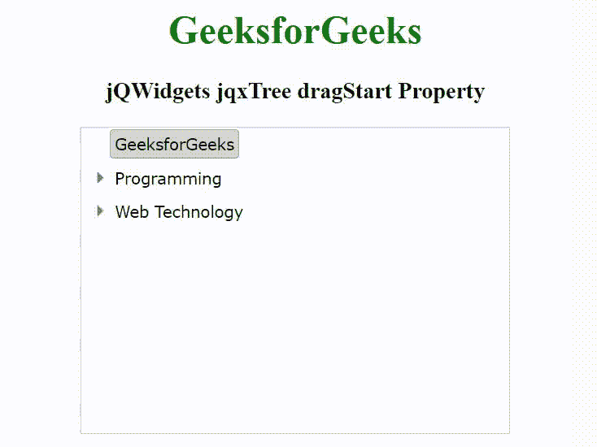

# jQWidgets jqxTree dragStart 属性

> 原文:[https://www . geesforgeks . org/jqwidgets-jqxtree-drag start-property/](https://www.geeksforgeeks.org/jqwidgets-jqxtree-dragstart-property/)

**jQWidgets** 是一个 JavaScript 框架，用于为 PC 和移动设备制作基于 web 的应用程序。它是一个非常强大、优化、独立于平台并且得到广泛支持的框架。jqxTree 代表一个 jQuery 小部件，用于显示项目的分层集合。要显示项目集合，我们可以从“UL”或使用其“源”属性进行填充。

**拖动开始属性**用于设置项目拖动开始时调用的回调函数。它接受函数类型值，默认值为空。

**语法:**

```html
$('selector').jqxTree({ dragStart: Function });
```

**链接文件:**从给定的链接 https://www.jqwidgets.com/download/.下载 jQWidgets 在 HTML 文件中，找到下载文件夹中的脚本文件。

> <link rel="”stylesheet”" href="”jqwidgets/styles/jqx.base.css”" type="”text/css”">
> <脚本类型=“text/JavaScript”src =“scripts/jquery-1 . 11 . 1 . min . js”></script>
> <脚本类型=“text/JavaScript”src =“jqwidgets/jqxcore . js”></script>
> <脚本类型=“text/JavaScript”src =“jqwidgets/jqx-1

下面的示例说明了 jQWidgets jqxTree dragStart 属性。

**示例:**

## 超文本标记语言

```html
<!DOCTYPE html>
<html lang="en">

<head>
    <link rel="stylesheet" href=
        "jqwidgets/styles/jqx.base.css" type="text/css" />
    <script type="text/javascript" 
        src="scripts/jquery-1.11.1.min.js"></script>
    <script type="text/javascript" 
        src="jqwidgets/jqxcore.js"></script>
    <script type="text/javascript" 
        src="jqwidgets/jqx-all.js"></script>
    <script type="text/javascript" 
        src="jqwidgets/jqxbuttons.js"></script>
    <script type="text/javascript" 
        src="jqwidgets/jqxscrollbar.js"></script>
    <script type="text/javascript" 
        src="jqwidgets/jqxpanel.js"></script>
    <script type="text/javascript" 
        src="jqwidgets/jqxtree.js"></script>

    <style>
        h1,
        h3 {
            text-align: center;
        }

        #jqxTree {
            width: 100%;
            margin: 0 auto;
        }
    </style>
</head>

<body>
    <h1 style="color: green;">
        GeeksforGeeks
    </h1>

    <h3>
        jQWidgets jqxTree dragStart Property
    </h3>

    <div id='jqxTree'>
        <ul>
            <li item-selected='true'>GeeksforGeeks</li>
            <li>Programming
                <ul>
                    <li>C</li>
                    <li>C++</li>
                    <li>Java</li>
                    <li>Python</li>
                </ul>
            </li>
            <li>Web Technology
                <ul>
                    <li>HTML</li>
                    <li>CSS</li>
                    <li>JavaScript</li>
                    <li>jQuery</li>
                    <li>PHP</li>
                </ul>
            </li>
        </ul>
    </div>

    <script type="text/javascript">
        $(document).ready(function() {
            $('#jqxTree').jqxTree({
                width: '350px',
                height: '250px',
                dragStart:  function() {
                    alert("Dragging Start");
                }
            });
        });
    </script>
</body>

</html>
```

**输出:**



**参考:**[https://www . jqwidgets . com/jquery-widgets-documentation/documentation/jqxtree/jquery-tree-API . htm](https://www.jqwidgets.com/jquery-widgets-documentation/documentation/jqxtree/jquery-tree-api.htm)