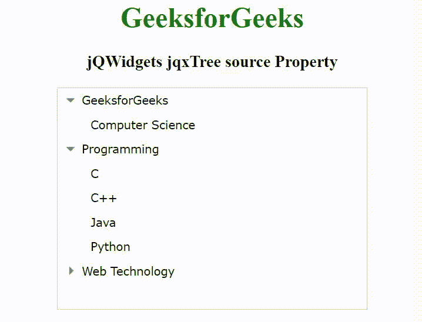

# jQWidgets jqxTree 源属性

> 原文:[https://www . geesforgeks . org/jqwidgets-jqxtree-source-property/](https://www.geeksforgeeks.org/jqwidgets-jqxtree-source-property/)

**jQWidgets** 是一个 JavaScript 框架，用于为 pc 和移动设备制作基于 web 的应用程序。它是一个非常强大、优化、独立于平台并且得到广泛支持的框架。jqxTree 代表一个 jQuery 小部件，用于显示项目的分层集合。要显示项目集合，我们可以从“UL”或使用其“源”属性进行填充。

*来源*属性用于设置或返回项目的来源。接受对象类型值，默认值为*空。*

树项目具有以下字段。

*   **标签:**代表物品的标签。
*   **值:**代表物品的价值。
*   **html:** 表示 html 项
*   **id:** 表示物品的 id。
*   **禁用:**表示项目是否启用/禁用。
*   **勾选:**表示该项目是否勾选/未勾选。
*   **展开:**表示小部件项是展开还是折叠。
*   **选中:**表示该项目是否被选中。
*   **项:**它代表一个子项数组。
*   **图标:**代表物品的图标。
*   **图标大小:**代表物品图标的大小。

**语法:**

```html
$('selector').jqxTree({ source: Object_data });
```

**链接文件:**从给定链接下载 [jQWidgets](https://www.jqwidgets.com/download/) 。在 HTML 文件中，找到下载文件夹中的脚本文件。

> <link rel="”stylesheet”" href="”jqwidgets/styles/jqx.base.css”" type="”text/css”">
> <脚本类型=“text/JavaScript”src =“scripts/jquery-1 . 11 . 1 . min . js”></script>
> <脚本类型=“text/JavaScript”src =“jqwidgets/jqxcore . js”></script>
> <脚本类型=“text/JavaScript”src =“jqwidgets/jqx-1

下面的例子说明了 jQWidgets jqxTree *源*属性。

**示例:**

## 超文本标记语言

```html
<!DOCTYPE html>
<html lang="en">

<head>
    <link rel="stylesheet" href=
        "jqwidgets/styles/jqx.base.css" type="text/css" />
    <script type="text/javascript" 
        src="scripts/jquery-1.11.1.min.js"></script>
    <script type="text/javascript" 
        src="jqwidgets/jqxcore.js"></script>
    <script type="text/javascript" 
        src="jqwidgets/jqx-all.js"></script>
    <script type="text/javascript" 
        src="jqwidgets/jqxbuttons.js"></script>
    <script type="text/javascript" 
        src="jqwidgets/jqxscrollbar.js"></script>
    <script type="text/javascript" 
        src="jqwidgets/jqxpanel.js"></script>
    <script type="text/javascript" 
        src="jqwidgets/jqxtree.js"></script>

    <style>
        h1,
        h3 {
            text-align: center;
        }

        #jqxTree {
            width: 100%;
            margin: 0 auto;
        }
    </style>
</head>

<body>
    <h1 style="color: green;">
        GeeksforGeeks
    </h1>

    <h3>
        jQWidgets jqxTree source Property
    </h3>

    <div id='jqxTree'></div>

    <script type="text/javascript">
        $(document).ready(function() {

            var data = [{
                label: "GeeksforGeeks",
                expanded: true,
                items: [{
                    label: "Computer Science"
                }]
            }, {
                label: "Programming",
                expanded: true,
                items: [{
                    label: "C"
                }, {
                    label: "C++"
                }, {
                    label: "Java"
                }, {
                    label: "Python"
                }, ]
            }, {
                label: "Web Technology",
                items: [{
                    label: "HTML"
                }, {
                    label: "CCSS"
                }, {
                    label: "JavaScript"
                }, {
                    label: "jQuery"
                }, {
                    label: "PHP"
                }]
            }];

            $('#jqxTree').jqxTree({
                source: data,
                width: '350px',
                height: '250px'
            });
        });
    </script>
</body>

</html>
```

**输出:**



**参考:**[https://www . jqwidgets . com/jquery-widgets-documentation/documentation/jqxtree/jquery-tree-API . htm](https://www.jqwidgets.com/jquery-widgets-documentation/documentation/jqxtree/jquery-tree-api.htm)