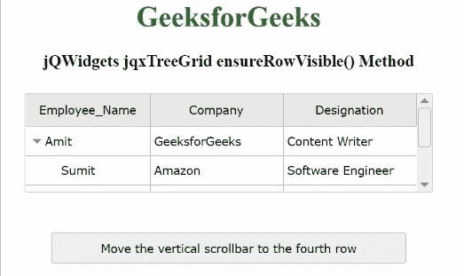

# jQWidgets jqxTreeGrid ensureRowVisible()方法

> 原文:[https://www . geesforgeks . org/jqwidgets-jqxtreegrid-ensurerowvisible-method/](https://www.geeksforgeeks.org/jqwidgets-jqxtreegrid-ensurerowvisible-method/)

**jQWidgets** 是一个 JavaScript 框架，用于为 PC 和移动设备制作基于 web 的应用程序。它是一个非常强大、优化、独立于平台并且得到广泛支持的框架。 **jqxTreeGrid** 用于以树状结构表示数据。这个小部件对于显示分层数据的多列、数据分页、排序和筛选、数据编辑、列大小调整、固定列、条件格式、聚合和行选择非常有用。这些小部件还读取和显示来自任何类型数据源的数据，如 XML、JSON、Array、CSV 或 TSV。

**ensureRowVisible()** 方法用于将垂直滚动条导航到指定 jqxTreeGrid 的行位置。

**语法:**

```
$("#treeGrid").jqxTreeGrid('ensureRowVisible', rowKey);
```

**参数:**该方法接受如下所示的参数。

*   **行键:**这是垂直滚动条将导航到的指定行。

**返回值:**此方法不返回值。

**链接文件:**从给定链接下载 [jQWidgets](https://www.jqwidgets.com/download/) 。在 HTML 文件中，找到下载文件夹中的脚本文件。

> <link rel="”stylesheet”" href="”jqwidgets/styles/jqx.base.css”" type="”text/css”">
> <脚本类型=“text/JavaScript”src =“scripts/jquery . js”></脚本>
> <脚本类型=“text/JavaScript”src =“jqwidgets/jqxcore . js”></脚本>
> <脚本类型=“text/JavaScript”src =“jqwidgets/jqxdata . js”>>

**示例:**下面的示例说明了 jQWidgets jqxTreeGrid**ensureRowVisible()**方法。在下面的示例中，垂直滚动条将向上移动到第四行。

## 超文本标记语言

```
<!DOCTYPE html>
<html lang="en">
   <head>
      <link rel="stylesheet" href=
         "jqwidgets/styles/jqx.base.css" type="text/css"/>
      <script type="text/javascript" 
         src="scripts/jquery.js"></script>
      <script type="text/javascript" 
         src="jqwidgets/jqxcore.js"></script>
      <script type="text/javascript" 
         src="jqwidgets/jqxdata.js"></script>
      <script type="text/javascript" 
         src="jqwidgets/jqxbuttons.js"></script>
      <script type="text/javascript" 
         src="jqwidgets/jqxscrollbar.js"></script>
      <script type="text/javascript" 
         src="jqwidgets/jqxlistbox.js"></script>
      <script type="text/javascript" 
         src="jqwidgets/jqxdropdownlist.js"></script>
      <script type="text/javascript" 
         src="jqwidgets/jqxdatatable.js"></script>
      <script type="text/javascript" 
         src="jqwidgets/jqxtreegrid.js"></script>
   </head>
   <body>
      <center>
         <h1 style="color: green;">
            GeeksforGeeks
         </h1>
         <h3>
            jQWidgets jqxTreeGrid ensureRowVisible() Method
         </h3>
         <div id="jqxTreeGrid" style="margin: 25px;">
         </div>
         <input type="button" style="margin: 20px;" 
            id="button_for_ensureRowVisible"
            value="Move the vertical scrollbar
            to the fourth row"/>
         <div id="log"></div>
         <script type="text/javascript">
            $(document).ready(function () {
                var A = [{
                    "ID": 1,
                    "Employee_Name": "Amit",
                    "Company": "GeeksforGeeks",
                    "Designation": "Content Writer",
                    "expanded": true,
                    A1: [{
                        "ID": 2,
                        "Employee_Name": "Sumit",
                        "Company": "Amazon",
                        "Designation": "Software Engineer",
                    }, {
                        "ID": 3,
                        "Employee_Name": "Vivek",
                        "Company": "Apple",
                        "Designation": "Product Manager",
                        "expanded": true,
                        A1: [{
                            "ID": 4,
                            "Employee_Name": "Soni",
                            "Company": "Flipkart",
                            "Designation": "HR",
                        }]
                    }]
                }];

                var Data_Source = {
                    dataFields: [{
                        name: 'ID'
                    }, {
                        name: 'Employee_Name'
                    }, {
                        name: 'Company'
                    }, {
                        name: 'Designation'
                    }, {
                        name: 'A1',
                        type: 'array'
                    }, {
                        name: 'expanded'
                    }],
                    hierarchy: {
                        root: 'A1'
                    },
                    id: 'ID',
                    localData: A
                };

                var Data = new
                    $.jqx.dataAdapter(Data_Source);

                $("#jqxTreeGrid").jqxTreeGrid({
                    height: 110,
                    source: Data,
                    ready: function () {
                        $("#jqxTreeGrid").jqxTreeGrid(
                            'expandRow', '1');
                        $("#jqxTreeGrid").jqxTreeGrid(
                            'expandRow', '3');
                    },
                    columns: [{
                        text: 'Employee_Name',
                        align: 'center',
                        dataField: 'Employee_Name',
                        width: 140
                    }, {
                        text: 'Company',
                        align: 'center',
                        dataField: 'Company',
                        width: 150
                    }, {
                        text: 'Designation',
                        align: 'center',
                        dataField: 'Designation',
                        width: 150
                    }]

                });
                $("#button_for_ensureRowVisible").jqxButton({
                    width: 400,
                    height: 35
                });
                $('#button_for_ensureRowVisible').click(
                    function () {
                        $("#jqxTreeGrid").
                            jqxTreeGrid('ensureRowVisible',
                                4);
                    });
            });
         </script>
      </center>
   </body>
</html>
```

**输出:**



**参考:**[https://www . jqwidgets . com/jquery-widgets-documentation/documentation/jqxtreegrid/jquery-tree grid-API . htm？搜索=](https://www.jqwidgets.com/jquery-widgets-documentation/documentation/jqxtreegrid/jquery-treegrid-api.htm?search=)