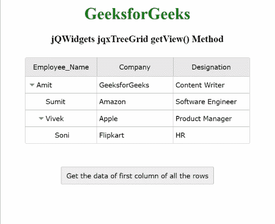

# jQWidgets jqxTreeGrid getView()方法

> 原文:[https://www . geesforgeks . org/jqwidgets-jqxtreegrid-getview-method/](https://www.geeksforgeeks.org/jqwidgets-jqxtreegrid-getview-method/)

**jQWidgets** 是一个 JavaScript 框架，用于为 PC 和移动设备制作基于 web 的应用程序。它是一个非常强大、优化、独立于平台并且得到广泛支持的框架。 **jqxTreeGrid** 用于以树状结构表示数据。这个小部件对于显示分层数据的多列、数据分页、排序和筛选、数据编辑、列大小调整、固定列、条件格式、聚合和行选择非常有用。这些小部件还读取和显示来自任何类型数据源的数据，如 XML、JSON、Array、CSV 或 TSV。

**getView()** 方法用于返回指定 jqxTreeGrid 的所有行的数组。该方法还考虑了应用的过滤和排序。

有一些保留的行成员:

*   **checked:** 是一个布尔值，返回该行的 checked 状态。
*   **展开:**是返回行展开状态的布尔值。
*   **图标:**是返回该行图标 URL 的字符串值。
*   **叶:**是一个布尔值，它返回行的叶在层次结构中的存在。
*   **级别:**是返回行的层次级别的整数值。
*   **父级:**是为根行返回 null 的对象，否则返回父行的对象。
*   **记录:**是返回该行子行集合的数组。
*   **selected:** 是返回该行选中状态的布尔值。
*   **uid:** 是返回该行唯一 id 或关键字的数字或字符串值。

**语法:**

```
$("Selector").jqxTreeGrid('getView');
```

**参数:**此方法不接受任何参数。

**返回值:**该方法返回所有行的数组。

**链接文件:**从给定链接下载 [jQWidgets](https://www.jqwidgets.com/download/) 。在 HTML 文件中，找到下载文件夹中的脚本文件。

> <link rel="”stylesheet”" href="”jqwidgets/styles/jqx.base.css”" type="”text/css”">
> <脚本类型=“text/JavaScript”src =“scripts/jquery . js”></脚本>
> <脚本类型=“text/JavaScript”src =“jqwidgets/jqxcore . js”></脚本>
> <脚本类型=“text/JavaScript”src =“jqwidgets/jqxdata . js”>>

**示例:**下面的示例说明了 jQWidgets jqxTreeGrid**getView()**方法。在下面的示例中，返回所有行的第一列的数据。

## 超文本标记语言

```
<!DOCTYPE html>
<html lang="en">

<head>
    <link rel="stylesheet" 
          href="jqwidgets/styles/jqx.base.css" 
          type="text/css"/>
    <script type="text/javascript" 
            src="scripts/jquery.js">
    </script>
    <script type="text/javascript" 
            src="jqwidgets/jqxcore.js">
    </script>
    <script type="text/javascript" 
            src="jqwidgets/jqxdata.js">
    </script>
    <script type="text/javascript" 
            src="jqwidgets/jqxbuttons.js">
    </script>
    <script type="text/javascript" 
            src="jqwidgets/jqxscrollbar.js">
    </script>
    <script type="text/javascript" 
            src="jqwidgets/jqxlistbox.js">
    </script>
    <script type="text/javascript" 
            src="jqwidgets/jqxdropdownlist.js">
    </script>
    <script type="text/javascript" 
            src="jqwidgets/jqxdatatable.js">
    </script>
    <script type="text/javascript" 
            src="jqwidgets/jqxtreegrid.js">
    </script>
</head>

<body>
    <center>
        <h1 style="color: green;">
            GeeksforGeeks
        </h1>
        <h3>
            jQWidgets jqxTreeGrid getView() Method
        </h3>
        <div id="jqxTreeGrid" style="margin: 25px;">
        </div>
        <input type="button" style="margin: 20px;" 
               id="button_for_getView" 
               value="Get the data of first column
                      of all the rows"/>
        <div id="log"></div>
        <script type="text/javascript">
            $(document).ready(function () {
                var A = [{
                    "ID": 1,
                    "Employee_Name": "Amit",
                    "Company": "GeeksforGeeks",
                    "Designation": "Content Writer",
                    "expanded": true,
                    A1: [{
                        "ID": 2,
                        "Employee_Name": "Sumit",
                        "Company": "Amazon",
                        "Designation": "Software Engineer",
                    }, {
                        "ID": 3,
                        "Employee_Name": "Vivek",
                        "Company": "Apple",
                        "Designation": "Product Manager",
                        "expanded": true,
                        A1: [{
                            "ID": 4,
                            "Employee_Name": "Soni",
                            "Company": "Flipkart",
                            "Designation": "HR",
                        }]
                    }]
                }];

                var Data_Source = {
                    dataFields: [{
                        name: 'ID'
                    }, {
                        name: 'Employee_Name'
                    }, {
                        name: 'Company'
                    }, {
                        name: 'Designation'
                    }, {
                        name: 'A1',
                        type: 'array'
                    }, {
                        name: 'expanded'
                    }],
                    hierarchy: {
                        root: 'A1'
                    },
                    id: 'ID',
                    localData: A
                };

                var Data = new
                    $.jqx.dataAdapter(Data_Source);

                $("#jqxTreeGrid").jqxTreeGrid({
                    source: Data,
                    editable: true,
                    ready: function () {
                        $("#jqxTreeGrid").jqxTreeGrid(
                            'expandRow', '1');
                        $("#jqxTreeGrid").jqxTreeGrid(
                            'expandRow', '3');
                    },
                    columns: [{
                        text: 'Employee_Name',
                        align: 'center',
                        dataField: 'Employee_Name',
                        width: 140
                    }, {
                        text: 'Company',
                        align: 'center',
                        dataField: 'Company',
                        width: 150
                    }, {
                        text: 'Designation',
                        align: 'center',
                        dataField: 'Designation',
                        width: 150
                    }]

                });
                $("#button_for_getView").jqxButton({
                    width: 300,
                    height: 35
                });
                $('#button_for_getView').click(
                    function () {
                        var View = $("#jqxTreeGrid").
                        jqxTreeGrid('getView');
                        var View_String = "";
                        var Display_View = function (records) {
                            var a = 0;
                            while (a < records.length) {
                                View_String += records[a].
                                Employee_Name + " ";
                                if (records[a].records) {
                                    Display_View(
                                      records[a].records);
                                }
                                a++;
                            }
                        };
                        Display_View(View);
                        $("#log").html(JSON.stringify(
                            View_String))
                    });
            });
        </script>
    </center>
</body>

</html>
```

**输出:**



**参考:**[https://www . jqwidgets . com/jquery-widgets-documentation/documentation/jqxtreegrid/jquery-tree grid-API . htm？搜索=](https://www.jqwidgets.com/jquery-widgets-documentation/documentation/jqxtreegrid/jquery-treegrid-api.htm?search=)