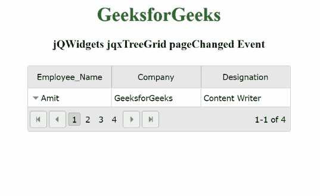

# jQWidgets jqxTreeGrid 页面更改事件

> 原文:[https://www . geesforgeks . org/jqwidgets-jqxtreegrid-page changed-event/](https://www.geeksforgeeks.org/jqwidgets-jqxtreegrid-pagechanged-event/)

**jQWidgets** 是一个 JavaScript 框架，用于为 PC 和移动设备制作基于 web 的应用程序。它是一个非常强大、优化、独立于平台并且得到广泛支持的框架。 **jqxTreeGrid** 用于以树状结构表示数据。这个小部件对于显示分层数据的多列、数据分页、排序和筛选、数据编辑、列大小调整、固定列、条件格式、聚合和行选择非常有用。这些小部件还读取和显示来自任何类型数据源的数据，如 XML、JSON、Array、CSV 或 TSV。

**pageChanged** 事件用于在指定 jqxTreeGrid 的当前页面发生变化时触发。

**语法:**

```html
$('#treeGrid').on('pageChanged',  function (event)
{
   // Argument of the Event
   var args = event.args;
   // Page number
   var pageNum = args.pagenum;
   // Old page number
   var oldPageNum = args.oldpagenum;
   // Page Size
   var pageSize args.pagesize;
});
```

**链接文件:**从给定链接下载 [jQWidgets](https://www.jqwidgets.com/download/) 。在 HTML 文件中，找到下载文件夹中的脚本文件。

> <link rel="”stylesheet”" href="”jqwidgets/styles/jqx.base.css”" type="”text/css”">
> <脚本类型=“text/JavaScript”src =“scripts/jquery . js”></script>
> <脚本类型=“text/JavaScript”src =“jqwidgets/jqxcore . js”></script>
> <脚本类型=“text/JavaScript”src =“jqwidgets/jqxdata . js”>

**示例:**以下示例说明了 jQWidgets jqxTreeGrid**page changed**事件。在下面的示例中，返回上一个页码。

## 超文本标记语言

```html
<!DOCTYPE html>
<html lang="en">
  <head>
    <link rel="stylesheet"
            href="jqwidgets/styles/jqx.base.css"
            type="text/css" />
    <script type="text/javascript" 
            src="scripts/jquery.js">
    </script>
    <script type="text/javascript" 
            src="jqwidgets/jqxcore.js">
    </script>
    <script type="text/javascript" 
            src="jqwidgets/jqxdata.js">
    </script>
    <script type="text/javascript" 
            src="jqwidgets/jqxbuttons.js">
    </script>
    <script type="text/javascript" 
            src="jqwidgets/jqxscrollbar.js">
    </script>
    <script type="text/javascript" 
            src="jqwidgets/jqxlistbox.js">
    </script>
    <script type="text/javascript" 
            src="jqwidgets/jqxdropdownlist.js">
    </script>
    <script type="text/javascript" 
            src="jqwidgets/jqxdatatable.js">
    </script>
    <script type="text/javascript" 
            src="jqwidgets/jqxtreegrid.js">
    </script>
  </head>

  <body>
    <center>
      <h1 style="color: green">GeeksforGeeks</h1>
      <h3>jQWidgets jqxTreeGrid pageChanged Event</h3>
      <div id="jqxTreeGrid" style="margin: 25px"></div>
      <div id="log"></div>

      <script type="text/javascript">
        $(document).ready(function () {
          var A = [
            {
              ID: 1,
              Employee_Name: "Amit",
              Company: "GeeksforGeeks",
              Designation: "Content Writer",
              expanded: true,
              A1: [
                {
                  ID: 2,
                  Employee_Name: "Sumit",
                  Company: "Amazon",
                  Designation: "Software Engineer",
                },
                {
                  ID: 3,
                  Employee_Name: "Vivek",
                  Company: "Apple",
                  Designation: "Product Manager",
                  expanded: true,
                  A1: [
                    {
                      ID: 4,
                      Employee_Name: "Soni",
                      Company: "Flipkart",
                      Designation: "HR",
                    },
                  ],
                },
              ],
            },
          ];

          var Data_Source = {
            dataFields: [
              {
                name: "ID",
              },
              {
                name: "Employee_Name",
              },
              {
                name: "Company",
              },
              {
                name: "Designation",
              },
              {
                name: "A1",
                type: "array",
              },
              {
                name: "expanded",
              },
            ],
            hierarchy: {
              root: "A1",
            },
            id: "ID",
            localData: A,
          };

          var Data = new $.jqx.dataAdapter(Data_Source);

          $("#jqxTreeGrid").jqxTreeGrid({
            source: Data,
            pageable: true,
            pageSize: 1,
            ready: function () {
              $("#jqxTreeGrid").jqxTreeGrid("expandRow", "1");
              $("#jqxTreeGrid").jqxTreeGrid("expandRow", "3");
            },
            columns: [
              {
                text: "Employee_Name",
                align: "center",
                dataField: "Employee_Name",
                width: 140,
              },
              {
                text: "Company",
                align: "center",
                dataField: "Company",
                width: 150,
              },
              {
                text: "Designation",
                align: "center",
                dataField: "Designation",
                width: 150,
              },
            ],
          });
          $("#jqxTreeGrid").on("pageChanged", function (event) {
            var Arguments = event.args;
            var Previous_Page_Number = Arguments.pagenum;
            $("#log").html(
              JSON.stringify(
                "The previous page number was : " + Previous_Page_Number
              )
            );
          });
        });
      </script>
    </center>
  </body>
</html>
```

**输出:**



**参考:**[https://www . jqwidgets . com/jquery-widgets-documentation/documentation/jqxtreegrid/jquery-tree grid-API . htm？搜索=](https://www.jqwidgets.com/jquery-widgets-documentation/documentation/jqxtreegrid/jquery-treegrid-api.htm?search=)