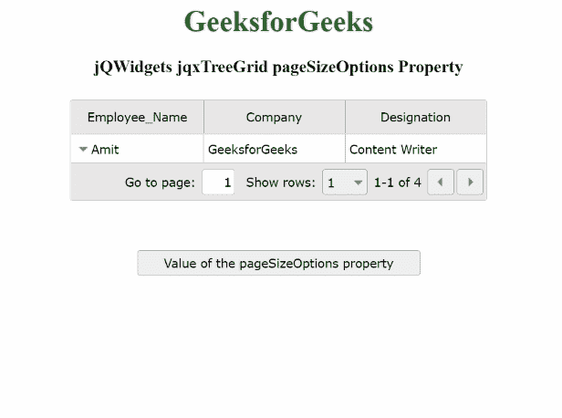

# jQWidgets jqxTreeGrid 页面大小选项属性

> 原文:[https://www . geesforgeks . org/jqwidgets-jqxtreegrid-pagesizeoptions-property/](https://www.geeksforgeeks.org/jqwidgets-jqxtreegrid-pagesizeoptions-property/)

**jQWidgets****是一个为 PC 和移动设备制作基于 web 的应用的 JavaScript 框架。它是一个非常强大、优化、独立于平台并且得到广泛支持的框架。****jqxTreeGrid**用于以树状结构表示数据。这个小部件对于显示分层数据的多列、数据分页、排序和筛选、数据编辑、列大小调整、固定列、条件格式、聚合和行选择非常有用。这些小部件还读取和显示来自任何类型数据源的数据，如 XML、JSON、Array、CSV 或 TSV。****

******页面大小选项**属性用于设置或获取指定 jqxTreeGrid 的页面大小选项。当 ***可分页*** 属性的值设置为真且**页面模式**属性的值设置为“高级”时，该属性将生效。****

******语法:******

*   ****设置**页面大小选项**属性:****

    ```
    **$('#treeGrid').jqxTreeGrid({ 
        pageSizeOptions: ['1', '2', '3', '4'] 
    });** 
    ```

*   ****获取**页面大小选项** ***s*** 属性。：****

    ```
    **var pageSizeOptions = 
        $('#treeGrid').jqxTreeGrid('pageSizeOptions');** 
    ```

******链接文件:**从给定链接下载https://www.jqwidgets.com/download/。在 HTML 文件中，找到下载文件夹中的脚本文件。****

> <link rel="”stylesheet”" href="”jqwidgets/styles/jqx.base.css”" type="”text/css”"> ****<脚本类型=“text/JavaScript”src =“scripts/jquery . js”></script>
> <脚本类型=“text/JavaScript”src =“jqwidgets/jqxcore . js”></script>
> <脚本类型=“text/JavaScript”src =“jqwidgets/jqxdata . js”>T21****

******示例:**以下示例说明了 jQWidgets jqxTreeGrid***pageSizeOptions***属性。在以下示例中， ***页面大小选项*** 属性的值已设置为['1 '，' 2 '，' 3 '，' 4']。****

## ****超文本标记语言****

```
**<!DOCTYPE html>
<html lang="en">

<head>
    <link rel="stylesheet" 
          href="jqwidgets/styles/jqx.base.css" 
          type="text/css" />
    <script type="text/javascript" 
            src="scripts/jquery.js">
    </script>
    <script type="text/javascript" 
            src="jqwidgets/jqxcore.js">
    </script>
    <script type="text/javascript" 
            src="jqwidgets/jqxdata.js">
    </script>
    <script type="text/javascript" 
            src="jqwidgets/jqxbuttons.js">
    </script>
    <script type="text/javascript" 
            src="jqwidgets/jqxscrollbar.js">
    </script>
    <script type="text/javascript" 
            src="jqwidgets/jqxlistbox.js">
    </script>
    <script type="text/javascript" 
            src="jqwidgets/jqxdropdownlist.js">
    </script>
    <script type="text/javascript" 
            src="jqwidgets/jqxdatatable.js">
    </script>
    <script type="text/javascript" 
            src="jqwidgets/jqxtreegrid.js">
    </script>
    <script type="text/javascript" 
            src="jqwidgets/jqx-all.js">
    </script>
</head>

<body>
    <center>
        <h1 style="color: green;">
            GeeksforGeeks
        </h1>
        <h3>
            jQWidgets jqxTreeGrid pageSizeOptions Property
        </h3>

        <div id="jqxTreeGrid" style="margin: 25px;">
        </div>

        <input type="button" style="margin: 29px;" 
               id="jqxbutton_for_pageSizeOptions"
               value="Value of the pageSizeOptions property" />

        <div id="log"></div>

        <script type="text/javascript">

            $(document).ready(function () {
                var A = [{
                    "ID": 1,
                    "Employee_Name": "Amit",
                    "Company": "GeeksforGeeks",
                    "Designation": "Content Writer",
                    "expanded": true,
                    A1: [{
                        "ID": 2,
                        "Employee_Name": "Sumit",
                        "Company": "Amazon",
                        "Designation": "Software Engineer",
                    }, {
                        "ID": 3,
                        "Employee_Name": "Vivek",
                        "Company": "Apple",
                        "Designation": "Product Manager",
                        "expanded": true,
                        A1: [{
                            "ID": 4,
                            "Employee_Name": "Soni",
                            "Company": "Flipkart",
                            "Designation": "HR",
                        }]
                    }]
                }];

                var Data_Source = {
                    dataFields: [{
                        name: 'ID'
                    }, {
                        name: 'Employee_Name'
                    }, {
                        name: 'Company'
                    }, {
                        name: 'Designation'
                    }, {
                        name: 'A1',
                        type: 'array'
                    }, {
                        name: 'expanded'
                    }],
                    hierarchy: {
                        root: 'A1'
                    },
                    id: 'ID',
                    localData: A,
                };

                var Data = new
                    $.jqx.dataAdapter(Data_Source);

                $("#jqxTreeGrid").jqxTreeGrid({
                    source: Data,
                    pageable: true,
                    pageSize: 1,
                    pagerMode: 'advanced',
                    pageSizeOptions: ['1', '2',
                        '3', '4'],
                    ready: function () {
                        $("#jqxTreeGrid").jqxTreeGrid(
                            'expandRow', '1');
                        $("#jqxTreeGrid").jqxTreeGrid(
                            'expandRow', '3');
                    },
                    columns: [{
                        text: 'Employee_Name',
                        align: 'center',
                        dataField: 'Employee_Name',
                        width: 145
                    }, {
                        text: 'Company',
                        align: 'center',
                        dataField: 'Company',
                        width: 155
                    }, {
                        text: 'Designation',
                        align: 'center',
                        dataField: 'Designation',
                        width: 155
                    }]
                });
                $("#jqxbutton_for_pageSizeOptions").
                    jqxButton({
                        width: 310
                    });

                $('#jqxbutton_for_pageSizeOptions').
                    click(function () {
                        var value_of_pageSizeOptions =
                            $('#jqxTreeGrid').
                                jqxTreeGrid(
                                    'pageSizeOptions');
                        $("#log").html(JSON.stringify(
                            value_of_pageSizeOptions))
                    });
            });
        </script>
    </center>
</body>

</html>**
```

******输出:******

********

******参考:**[https://www . jqwidgets . com/jquery-widgets-documentation/documentation/jqxtreegrid/jquery-tree grid-API . htm？搜索=](https://www.jqwidgets.com/jquery-widgets-documentation/documentation/jqxtreegrid/jquery-treegrid-api.htm?search=)****