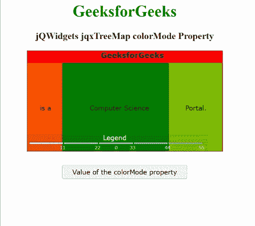

# jqwidgets jqxtree map color mode property

> 原文:[https://www . geesforgeks . org/jqwidgets-jqxtreemap-color mode-property/](https://www.geeksforgeeks.org/jqwidgets-jqxtreemap-colormode-property/)

**jQWidgets** 是一个 JavaScript 框架，用于为 PC 和移动设备制作基于 web 的应用程序。它是一个非常强大、优化、独立于平台并且得到广泛支持的框架。 ***jqxTreeMap*** 用于展示嵌套矩形的层次数据集。在这里，树的每一个分支都表示为一个矩形，然后用代表子分支的更小的矩形平铺显示。这里，叶节点的矩形具有与数据上的指定维度成比例的面积。

**颜色模式** **属性**用于设置或获取指定 jqxTreeMap 的扇区渲染行为。此属性接受三个可能的值，如下所示:

*   **父扇区:**该模式用于子扇区继承其父扇区的颜色。在这里，颜色根据孩子的值和颜色范围属性而变化。
*   **自动颜色:**该模式用于根据基本颜色、颜色范围属性和值自动生成颜色。
*   **范围颜色:**对于该模式，用户可以设置颜色范围的数组。这里，每个颜色范围都有诸如最小值、最大值和颜色等属性。

**语法:**

*   用于设置*颜色模式*属性:

    ```html
    $("#jqxTreeMap").jqxTreeMap({colorMode: 'autoColors'});  
    ```

*   要获取*颜色模式*属性:

    ```html
    var colorMode = 
        $('#jqxTreeMap').jqxTreeMap('colorMode'); 
    ```

**链接文件:**从给定链接下载 [jQWidgets](https://www.jqwidgets.com/download/) 。在 HTML 文件中，找到下载文件夹中的脚本文件。

> <link rel="”stylesheet”" href="”jqwidgets/styles/jqx.base.css”" type="”text/css”">
> <脚本类型=“text/JavaScript”src =“scripts/jquery . js”></脚本>
> <脚本类型=“text/JavaScript”src =“jqwidgets/jqxcore . js”></脚本>
> <脚本类型=“text/JavaScript”src =“jqwidgets/jqxtool tip . js”>【T16

**示例:**下面的示例说明了 jQWidgets jqxtremap**color mode**T4 属性。在下面的例子中， ***颜色模式*** 属性的值被设置为“颜色模式”。

## 超文本标记语言

```html
<!DOCTYPE html>
<html lang="en">

<head>
    <link rel="stylesheet"
          href="jqwidgets/styles/jqx.base.css" 
          type="text/css"/>
    <script type="text/javascript" 
            src="scripts/jquery.js">
    </script>
    <script type="text/javascript" 
            src="jqwidgets/jqxcore.js">
    </script>
    <script type="text/javascript" 
            src="jqwidgets/jqxtooltip.js">
    </script>
    <script type="text/javascript" 
            src="jqwidgets/jqxtreemap.js">
    </script>
    <script type="text/javascript" 
            src="scripts/gettheme.js">
    </script>
</head>

<body>
    <center>
        <h1 style="color: green;">
            GeeksforGeeks
        </h1>
        <h3>
            jQWidgets jqxTreeMap colorMode Property
        </h3>
        <div id="Tree_Map"></div>
        <input type="button" style="margin: 28px;" 
               id="button_for_colorMode" 
               value="Value of the colorMode property"/>
        <div id="log"></div>
        <script type="text/javascript">
            $(document).ready(function () {
                var Data_of_TreeMap = [{
                    label: 'GeeksforGeeks',
                    value: 70,
                    color: '#ff0300'
                }, {
                    label: 'is a',
                    value: 10,
                    parent: 'GeeksforGeeks',
                    color: '#ff5400'
                }, {
                    label: 'Computer Science',
                    value: 30,
                    parent: 'GeeksforGeeks',
                    color: '#008000'
                }, {
                    label: 'Portal.',
                    value: 15,
                    parent: 'GeeksforGeeks',
                    color: '#7fbf00'
                }
                ];
                $('#Tree_Map').jqxTreeMap({
                    width: 390,
                    height: 200,
                    source: Data_of_TreeMap,
                    colorMode: "autoColors"
                });
                $("#button_for_colorMode").jqxButton({
                    width: 250
                });
                $("#button_for_colorMode").click(
                    function () {
                        var colorMode_Value = 
                            $('#Tree_Map').
                            jqxTreeMap('colorMode');
                        $("#log").html((
                          colorMode_Value));
                    });
            });
        </script>
    </center>
</body>

</html>
```

**输出:**



**参考:**[https://www . jqwidgets . com/jquery-widgets-documentation/documentation/jqxtreemap/jquery-tree map-API . htm](https://www.jqwidgets.com/jquery-widgets-documentation/documentation/jqxtreemap/jquery-treemap-api.htm)