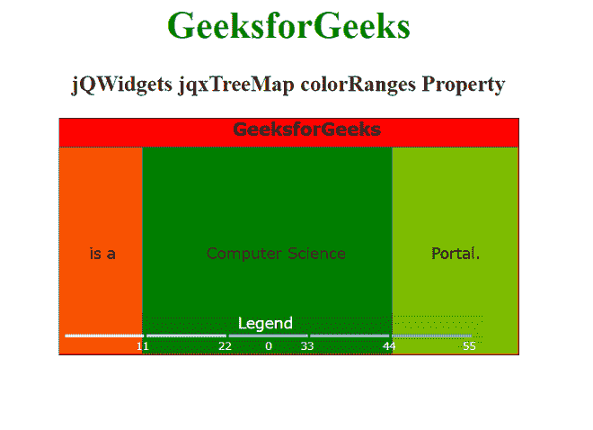

# jQWidgets jqxTreeMap 颜色范围属性

> 原文:[https://www . geesforgeks . org/jqwidgets-jqxtreemap-color ranges-property/](https://www.geeksforgeeks.org/jqwidgets-jqxtreemap-colorranges-property/)

***jQWidgets*** 是一个 JavaScript 框架，用于为 PC 和移动设备制作基于 web 的应用程序。它是一个非常强大、优化、独立于平台并且得到广泛支持的框架。 ***jqxTreeMap*** 用于展示嵌套矩形的层次数据集。在这里，树的每一个分支都表示为一个矩形，然后用代表子分支的更小的矩形平铺显示。这里，叶节点的矩形具有与数据上的指定维度成比例的面积。

***【颜色范围】*** 属性用于设置或获取指定 jqxTreeMap 的颜色范围。

**语法:**

*   设置 ***颜色范围*** 属性:

    ```
    $('#jqxTreeMap').jqxTreeMap({ colorRanges: [
       { color: '#000000', min: 5,  max: 125  }
    ]
    });
    ```

*   获取 ***颜色范围*** 属性:

    ```
    var colorRanges = $('#jqxTreeMap')
        .jqxTreeMap('colorRanges');
    ```

**链接文件:**从给定链接下载 [jQWidgets](https://www.jqwidgets.com/download/) 。在 HTML 文件中，找到下载文件夹中的脚本文件。

> <link rel="”stylesheet”" href="”jqwidgets/styles/jqx.base.css”" type="”text/css”">
> <脚本类型=“text/JavaScript”src =“scripts/jquery . js”></脚本>
> <脚本类型=“text/JavaScript”src =“jqwidgets/jqxcore . js”></脚本>
> <脚本类型=“text/JavaScript”src =“jqwidgets/jqxtool tip . js”>

**示例:**下面的示例说明了 jQWidgets jqxTreeMap***color range***属性。

## 超文本标记语言

```
<!DOCTYPE html>
<html lang="en">

<head>
    <link rel="stylesheet" 
          href="jqwidgets/styles/jqx.base.css" 
          type="text/css"/>
    <script type="text/javascript" 
            src="scripts/jquery.js">
    </script>
    <script type="text/javascript" 
            src="jqwidgets/jqxcore.js">
    </script>
    <script type="text/javascript" 
            src="jqwidgets/jqxtooltip.js">
    </script>
    <script type="text/javascript" 
            src="jqwidgets/jqxtreemap.js">
    </script>
    <script type="text/javascript" 
            src="scripts/gettheme.js">
    </script>
    <script type="text/javascript" 
            src="scripts/jqx-all.js">
    </script>
</head>

<body>
    <center>
        <h1 style="color: green;">
            GeeksforGeeks
        </h1>
        <h3>
            jQWidgets jqxTreeMap colorRanges Property
        </h3>
        <div id="Tree_Map"></div>
        <script type="text/javascript">
            $(document).ready(function () {
                var Data_of_TreeMap = [{
                    label: 'GeeksforGeeks',
                    value: 70,
                    color: '#ff0300'
                }, {
                    label: 'is a',
                    value: 10,
                    parent: 'GeeksforGeeks',
                    color: '#ff5400'
                }, {
                    label: 'Computer Science',
                    value: 30,
                    parent: 'GeeksforGeeks',
                    color: '#008000'
                }, {
                    label: 'Portal.',
                    value: 15,
                    parent: 'GeeksforGeeks',
                    color: '#7fbf00'
                }
                ];
                $('#Tree_Map').jqxTreeMap({
                    width: 390,
                    height: 200,
                    source: Data_of_TreeMap,
                    colorRanges: {
                        color: '#000000',
                        min: 5,
                        max: 125
                    },
                    colorMode: 'autoColors'
                });
            });
        </script>
    </center>
</body>

</html>
```

**输出:**



**参考:**[https://www . jqwidgets . com/jquery-widgets-documentation/documentation/jqxtreemap/jquery-tree map-API . htm？搜索=](https://www.jqwidgets.com/jquery-widgets-documentation/documentation/jqxtreemap/jquery-treemap-api.htm?search=)