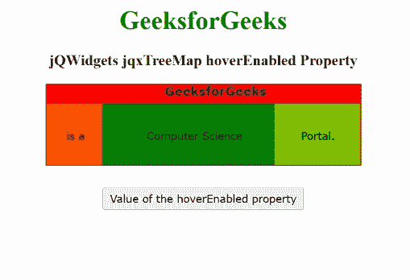

# jQWidgets jqxTreeMap 悬停启用属性

> 原文:[https://www . geeksforgeeks . org/jqwidgets-jqxtreemap-hover enabled-property/](https://www.geeksforgeeks.org/jqwidgets-jqxtreemap-hoverenabled-property/)

**jQWidgets** 是一个 JavaScript 框架，用于为 PC 和移动设备制作基于 web 的应用程序。它是一个非常强大、优化、独立于平台并且得到广泛支持的框架。 **jqxTreeMap** 用于显示嵌套矩形的层次数据集。在这里，树的每一个分支都表示为一个矩形，然后用代表子分支的更小的矩形平铺显示。这里，叶节点的矩形具有与数据上的指定维度成比例的面积。

**悬停启用属性**用于设置或获取鼠标光标在指定的 jqxTreeMap 的某个扇区上时，该扇区是否有轮廓。此属性接受布尔值。

**语法:**

*   设置*悬停启用*属性:

    ```
    $('#jqxTreeMap').jqxTreeMap({ hoverEnabled: true });  
    ```

*   要获取*悬停启用的*属性:

    ```
    var hoverEnabled = $('#jqxTreeMap').jqxTreeMap('hoverEnabled'); 
    ```

**链接文件:**从给定链接下载 [jQWidgets](https://www.jqwidgets.com/download/) 。在 HTML 文件中，找到下载文件夹中的脚本文件。

> <link rel="”stylesheet”" href="”jqwidgets/styles/jqx.base.css”" type="”text/css”">
> <脚本类型=“text/JavaScript”src =“scripts/jquery . js”></脚本>
> <脚本类型=“text/JavaScript”src =“jqwidgets/jqxcore . js”></脚本>
> <脚本类型=“text/JavaScript”src =“jqwidgets/jqxtool tip . js”>【T16

**示例:**以下示例说明了 jQWidgets jqxtremap**悬停启用***T5*T8】属性。在以下示例中， ***悬停启用*** 属性的值已设置为真。

## 超文本标记语言

```
<!DOCTYPE html>
<html lang="en">

<head>
    <link rel="stylesheet"
          href="jqwidgets/styles/jqx.base.css" 
          type="text/css"/>
    <script type="text/javascript" 
            src="scripts/jquery.js">
    </script>
    <script type="text/javascript" 
            src="jqwidgets/jqxcore.js">
    </script>
    <script type="text/javascript" 
            src="jqwidgets/jqxtooltip.js">
    </script>
    <script type="text/javascript" 
            src="jqwidgets/jqxtreemap.js">
    </script>
    <script type="text/javascript" 
            src="scripts/gettheme.js">
    </script>
</head>

<body>
    <center>
        <h1 style="color: green;">
            GeeksforGeeks
        </h1>
        <h3>
            jQWidgets jqxTreeMap hoverEnabled Property
        </h3>
        <div id="Tree_Map"></div>
        <input type="button" style="margin: 28px;" 
               id="button_for_hoverEnabled" 
          value="Value of the hoverEnabled property"/>
        <div id="log"></div>
        <script type="text/javascript">
            $(document).ready(function () {
                var Data_of_TreeMap = [{
                    label: 'GeeksforGeeks',
                    value: 70,
                    color: '#ff0300'
                }, {
                    label: 'is a',
                    value: 10,
                    parent: 'GeeksforGeeks',
                    color: '#ff5400'
                }, {
                    label: 'Computer Science',
                    value: 30,
                    parent: 'GeeksforGeeks',
                    color: '#008000'
                }, {
                    label: 'Portal.',
                    value: 15,
                    parent: 'GeeksforGeeks',
                    color: '#7fbf00'
                }
                ];
                $('#Tree_Map').jqxTreeMap({
                    width: 390,
                    height: 100,
                    source: Data_of_TreeMap,
                    hoverEnabled: true
                });
                $("#button_for_hoverEnabled").jqxButton({
                    width: 250
                });
                $("#button_for_hoverEnabled").click(
                    function () {
                        var hoverEnabled_Value = 
                            $('#Tree_Map').
                            jqxTreeMap('hoverEnabled');
                        $("#log").html((
                          hoverEnabled_Value));
                    });
            });
        </script>
    </center>
</body>

</html>
```

**输出:**



**参考:**[https://www . jqwidgets . com/jquery-widgets-documentation/documentation/jqxtreemap/jquery-tree map-API . htm](https://www.jqwidgets.com/jquery-widgets-documentation/documentation/jqxtreemap/jquery-treemap-api.htm)