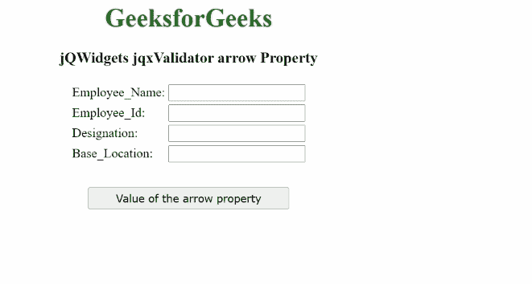

# jQWidgets jqxValidator 箭头属性

> 原文:[https://www . geesforgeks . org/jqwidgets-jqxvalidator-arrow-property/](https://www.geeksforgeeks.org/jqwidgets-jqxvalidator-arrow-property/)

**jQWidgets** 是一个 JavaScript 框架，用于为 PC 和移动设备制作基于 web 的应用程序。它是一个非常强大、优化、独立于平台并且得到广泛支持的框架。 **jqxValidator** 用于在 JavaScript 的帮助下验证 HTML 表单。根据用户输入验证的要求，它有一些内置规则，如电子邮件、SSN、ZIP、最大值、最小值、间隔等。自定义规则也可以根据具体要求编写。

***箭头*** 属性用于设置或获取指定 **jqxValidator** 的提示箭头是否显示。该方法接受两个值，即“*真*”和“*假*”。

**语法:**

*   用于设置 ***箭头*** 属性。

    ```html
    $('#jqxValidator').jqxValidator( { arrow: false } );  
    ```

*   获取 ***箭头*** 属性。

    ```html
    var arrow = $('#jqxValidator').jqxValidator('arrow'); 
    ```

**链接文件:**从给定链接下载 [jQWidgets](https://www.jqwidgets.com/download/) 。在 HTML 文件中，找到下载文件夹中的脚本文件。

> <link rel="”stylesheet”" href="”jqwidgets/styles/jqx.base.css”" type="”text/css”">
> <脚本类型=“text/JavaScript”src =“scripts/jquery . js”></脚本>
> <脚本类型=“text/JavaScript”src =“jqwidgets/jqxcore . js”></脚本>
> T12】脚本类型=“text/JavaScript”src =“jqwidgets/jqxvalidator . js”></脚本

**示例:**以下示例说明了 jQWidgets ***箭头*** 属性。在下面的例子中， ***箭头*** 属性的值被设置为*真。*

## 超文本标记语言

```html
<!DOCTYPE html>
<html lang="en">

<head>
    <link rel="stylesheet" 
          href="jqwidgets/styles/jqx.base.css" 
          type="text/css"/>
    <script type="text/javascript" 
            src="scripts/jquery.js">
    </script>
    <script type="text/javascript" 
            src="jqwidgets/jqxcore.js">
    </script>
    <script type="text/javascript" 
            src="jqwidgets/jqx-all.js">
    </script>
    <script type="text/javascript" 
            src="jqwidgets/jqxvalidator.js">
    </script>
</head>

<body>
    <center>
        <h1 style="color:green;">
            GeeksforGeeks
        </h1>
        <h3>
            jQWidgets jqxValidator arrow Property
        </h3>
        <form id="Employee_Form">
            <table>
                <tr>
                    <td>Employee_Name:</td>
                    <td>
                        <input type="text" id="Employee_Name"/>
                    </td>
                </tr>
                <tr>
                    <td>Employee_Id:</td>
                    <td>
                        <input type="text" id="Employee_Id"/>
                    </td>
                </tr>
                <tr>
                    <td>Designation:</td>
                    <td>
                        <input type="text" id="Designation"/>
                    </td>
                </tr>
                <tr>
                    <td>Base_Location:</td>
                    <td>
                        <input type="text" id="Base_Location"/>
                    </td>
                </tr>
            </table>
        </form>
        <input type="button" style="margin:28px;" 
               id="button_for_arrow" 
               value="Value of the arrow property"/>
        <div id="log"></div>

        <script type="text/javascript">
            $(document).ready(function () {
                $('#Employee_Form').jqxValidator({
                    arrow: true,
                    Rules: [
                        {
                            input: '#Employee_Name',
                            message: 'Employee name is mandatory!',
                            rule: 'required'
                        },
                        {
                            input: '#Employee_Id',
                            message: 'Employee_Id is mandatory!',
                            rule: 'required'
                        },
                        {
                            input: '#Designation',
                            message: 'Designation is mandatory!',
                            rule: 'required'
                        },
                        {
                            input: '#Base_Location',
                            message: 'base location is mandatory!',
                            rule: 'required'
                        }],
                });
                $("#button_for_arrow").jqxButton({
                    width: 250
                });
                $("#button_for_arrow").click(
                    function () {
                        var Value_of_arrow =
                            $('#Employee_Form').jqxValidator('arrow');

                            $("#log").html(
                               JSON.stringify(Value_of_arrow));
                    });
               });
        </script>
    </center>
</body>
</html>
```

**输出:**



**参考:**[https://www . jqwidgets . com/jquery-widgets-documentation/documentation/jqxvalidator/jquery-validator-API . htm？搜索=](https://www.jqwidgets.com/jquery-widgets-documentation/documentation/jqxvalidator/jquery-validator-api.htm?search=)