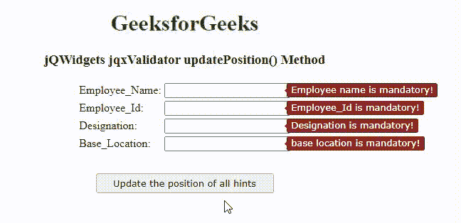

# jQWidgets jqxValidator updatePosition()方法

> 原文:[https://www . geesforgeks . org/jqwidgets-jqxvalidator-updateposition-method/](https://www.geeksforgeeks.org/jqwidgets-jqxvalidator-updateposition-method/)

**jQWidgets** 是一个 JavaScript 框架，用于为 PC 和移动设备制作基于 web 的应用程序。它是一个非常强大、优化、独立于平台并且得到广泛支持的框架。 **jqxValidator** 用于在 JavaScript 的帮助下验证 HTML 表单。根据用户输入验证的要求，它有一些内置规则，如电子邮件、SSN、ZIP、最大值、最小值、间隔等。这里自定义规则也可以根据具体要求编写。

**updatePosition()****方法用于更新指定 jqxvalidator 的所有提示的位置。此方法在调整当前窗口大小时很有用。**

****语法:****

```
$('#jqxValidator').jqxValidator('updatePosition');
```

****参数:**此方法不接受任何参数。**

****返回值:**此方法不返回值。**

****链接文件:**从给定链接下载 [jQWidgets](https://www.jqwidgets.com/download/) 。在 HTML 文件中，找到下载文件夹中的脚本文件。**

> <link rel="”stylesheet”" href="”jqwidgets/styles/jqx.base.css”" type="”text/css”"> **<脚本类型=“text/JavaScript”src =“scripts/jquery . js”></脚本>
> <脚本类型=“text/JavaScript”src =“jqwidgets/jqxcore . js”></脚本>
> T12】脚本类型=“text/JavaScript”src =“jqwidgets/jqxvalidator . js”></脚本**

****示例:**下面的示例说明了 jQWidgets**updatePosition()**方法。在下面的示例中，运行代码后，当前窗口的大小已经调整，这就是为什么提示的位置已经改变。所以调用 **updatePosition()** 方法后，所有提示的位置都会更新到默认位置。**

## **超文本标记语言**

```
<!DOCTYPE html>
<html lang="en">

<head>
    <link rel="stylesheet" href=
    "jqwidgets/styles/jqx.base.css" type="text/css" />
    <script type="text/javascript" 
        src="scripts/jquery.js"></script>
    <script type="text/javascript" 
        src="jqwidgets/jqxcore.js"></script>
    <script type="text/javascript" 
        src="jqwidgets/jqxvalidator.js"></script>
</head>

<body>
    <center>
        <h1 style="color: green;">
            GeeksforGeeks
        </h1>
        <h3>
            jQWidgets jqxValidator updatePosition() Method
        </h3>

        <form id="Employee_Form">
            <table>
                <tr>
                    <td>Employee_Name:</td>
                    <td>
                        <input type="text" id="Employee_Name" />
                    </td>
                </tr>
                <tr>
                    <td>Employee_Id:</td>
                    <td>
                        <input type="text" id="Employee_Id" />
                    </td>
                </tr>
                <tr>
                    <td>Designation:</td>
                    <td>
                        <input type="text" id="Designation" />
                    </td>
                </tr>
                <tr>
                    <td>Base_Location:</td>
                    <td>
                        <input type="text" id="Base_Location" />
                    </td>
                </tr>
            </table>
        </form>
        <input type="button" style="margin: 28px;" 
            id="button_for_updatePosition"
            value="Update the position of all hints" />

        <script type="text/javascript">
            $(document).ready(function () {
                $('#Employee_Form').jqxValidator({
                    Rules: [{
                        input: '#Employee_Name',
                        message: 'Employee name is mandatory!',
                        rule: 'required'
                    },
                    {
                        input: '#Employee_Id',
                        message: 'Employee_Id is mandatory!',
                        rule: 'required'
                    },
                    {
                        input: '#Designation',
                        message: 'Designation is mandatory!',
                        rule: 'required'
                    },
                    {
                        input: '#Base_Location',
                        message: 'base location is mandatory!',
                        rule: 'required'
                    }],
                });

                $("#button_for_updatePosition").jqxButton({
                    width: 250
                });

                $('#Employee_Form').jqxValidator('validate');

                $("#button_for_updatePosition").click(
                    function () {
                        $('#Employee_Form').jqxValidator(
                            'updatePosition');
                    });
            });
        </script>
    </center>
</body>

</html>
```

****输出:****

****

****参考:**[https://www . jqwidgets . com/jquery-widgets-documentation/documentation/jqxvalidator/jquery-validator-API . htm？搜索=](https://www.jqwidgets.com/jquery-widgets-documentation/documentation/jqxvalidator/jquery-validator-api.htm?search=)**