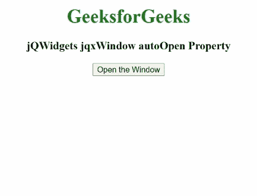

# jQWidgets jqxWindow 自动打开属性

> 原文:[https://www . geesforgeks . org/jqwidgets-jqxwindow-auto open-property/](https://www.geeksforgeeks.org/jqwidgets-jqxwindow-autoopen-property/)

**简介:jQWidgets** 是一个 JavaScript 框架，用于为 PC 和移动设备制作基于 web 的应用程序。它是一个非常强大、优化、独立于平台并且得到广泛支持的框架。 **jqxWindow** 用于在应用程序中输入数据或查看信息。

**自动打开**属性用于设置或返回指定窗口创建后是否显示。它接受真或假的布尔值。

**语法:**

设置“自动打开”属性。

```
$('#jqxWindow').jqxWindow({ autoOpen: true});  
```

获取自动打开属性。

```
var autoOpen = $('#jqxWindow').jqxWindow('autoOpen'); 
```

**链接文件:**从给定链接下载 [jQWidgets](https://www.jqwidgets.com/download/) 。在 HTML 文件中，找到下载文件夹中的脚本文件。

> <link rel="”stylesheet”" href="”jqwidgets/styles/jqx.base.css”" type="”text/css”">
> < link rel= "样式表" href = " jqwidgets/style/jqx . summer . CSS " type = " text/CSS "/>
> <脚本类型= " text/JavaScript " src = " scripts/jquery-1 . 10 . 2 . min . js "></脚本>
> <脚本类型= " text/JavaScript " src = " jqwidgets/jqxcore . js "

**示例:**此示例说明了 jQWidgets 中的 jqxWindow **自动打开**属性。对于本例，自动打开设置为假。因此，单击“打开窗口”按钮后，指定的窗口将会打开。

## 超文本标记语言

```
<!DOCTYPE html>
<html lang="en">

<head>
    <link rel="stylesheet" href=
        "jqwidgets/styles/jqx.base.css" type="text/css" />
    <link rel="stylesheet" href=
        "jqwidgets/styles/jqx.summer.css" type="text/css" />
    <script type="text/javascript" 
        src="scripts/jquery-1.10.2.min.js"></script>
    <script type="text/javascript" 
        src="jqwidgets/jqxcore.js"></script>
    <script type="text/javascript" 
        src="jqwidgets/jqxwindow.js"></script>
    <script type="text/javascript" 
        src="jqwidgets/jqxbuttons.js"></script>
</head>

<body>
    <center>
        <h1 style="color: green;">
            GeeksforGeeks 
        </h1>

        <h3>
            jQWidgets jqxWindow autoOpen Property
        </h3>

        <div id='jqxwindow'>
            <div>Header</div>
            <div>GeeksforGeeks</div>
        </div>

        <button id="button">Open the Window</button>
    </center>

    <script type="text/javascript">
        $(document).ready(function () {
            $("#jqxwindow").jqxWindow({
                height: 100,
                width: 200,
                theme: 'energyblue',
                autoOpen: false
            });
            $("#button").click(function () {
                $("#jqxwindow").jqxWindow('open');
            });
        });
    </script>
</body>

</html>
```

**输出:**



**参考:**[https://www . jqwidgets . com/jquery-widgets-documentation/documentation/jqxwindow/jquery-window-API . htm？搜索=](https://www.jqwidgets.com/jquery-widgets-documentation/documentation/jqxwindow/jquery-window-api.htm?search=)