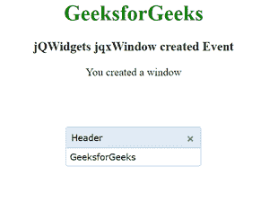

# jQWidgets jqxWindow 创建的事件

> 原文:[https://www . geesforgeks . org/jqwidgets-jqxwindow-created-event/](https://www.geeksforgeeks.org/jqwidgets-jqxwindow-created-event/)

**jQWidgets** 是一个 JavaScript 框架，用于为 PC 和移动设备制作基于 web 的应用程序。它是一个非常强大、优化、独立于平台并且得到广泛支持的框架。 **jqxWindow** 用于在应用程序中输入数据或查看信息。

当用户创建新窗口时，触发**创建的** **事件**。

**语法:**

```
$('#jqxWindow').on('created', function (event) {
 // Some code here
}); 
```

**链接文件:**从给定链接下载 [jQWidgets](https://www.jqwidgets.com/download/) 。在 HTML 文件中，找到下载文件夹中的脚本文件。

> <link rel="”stylesheet”" href="”jqwidgets/styles/jqx.base.css”" type="”text/css”">
> < link rel= "样式表" href = " jqwidgets/style/jqx . summer . CSS " type = " text/CSS "/>
> <脚本类型= " text/JavaScript " src = " scripts/jquery-1 . 10 . 2 . min . js "></脚本>
> <脚本类型= " text/JavaScript " src = " jqwidgets/jqxcore . js "

**示例:**下面的示例说明了 jqxWindow **在 jQWidgets 中创建了** **事件**。

## 超文本标记语言

```
<!DOCTYPE html>
<html lang="en">

<head>
    <link rel="stylesheet" 
          href="jqwidgets/styles/jqx.base.css" 
          type="text/css"/>
    <link rel="stylesheet" 
          href="jqwidgets/styles/jqx.summer.css" 
          type="text/css"/>
    <script type="text/javascript" 
            src="scripts/jquery-1.10.2.min.js">
    </script>
    <script type="text/javascript" 
            src="jqwidgets/jqxcore.js">
    </script>
    <script type="text/javascript" 
            src="jqwidgets/jqxwindow.js">
    </script>
    <script type="text/javascript" 
            src="jqwidgets/jqxbuttons.js">
    </script>
    <script type="text/javascript">
        $(document).ready(function () {
            $('#jqxwindow').on('created',
                               function (event) {
                $("#log").html("You created a window")
            });
            $('#jqxwindow').jqxWindow({
                theme: 'energyblue'
            });
        });
    </script>
</head>

<body>
    <center>
        <h1 style="color: green;">
            GeeksforGeeks
        </h1>
        <h3> 
            jQWidgets jqxWindow created Event 
        </h3>
        <div id='jqxwindow'>
            <div> Header</div>
            <div>GeeksforGeeks</div>
        </div>
        <div id="log"></div>
    </center>
</body>

</html>
```

**输出:**



**参考:**[https://www . jqwidgets . com/jquery-widgets-documentation/documentation/jqxwindow/jquery-window-API . htm](https://www.jqwidgets.com/jquery-widgets-documentation/documentation/jqxwindow/jquery-window-api.htm)