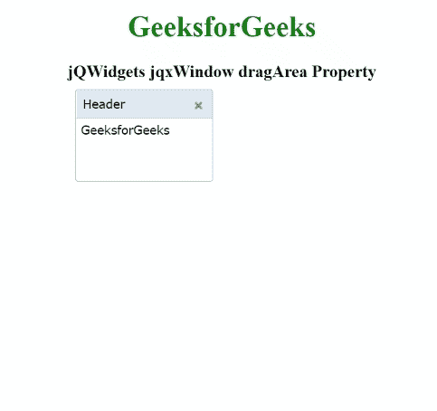

# jQWidgets jqxWindow dragArea 属性

> 原文:[https://www . geesforgeks . org/jqwidgets-jqxwindow-drag area-property/](https://www.geeksforgeeks.org/jqwidgets-jqxwindow-dragarea-property/)

**jQWidgets** 是一个 JavaScript 框架，用于为 PC 和移动设备制作基于 web 的应用程序。它是一个非常强大、优化、独立于平台并且得到广泛支持的框架。 **jqxWindow** 用于在应用程序中输入数据或查看信息。

*拖动区域*属性用于设置或获取可用于拖动或移动指定 jqxWindow 的屏幕区域。默认情况下，*拖动区域*为空，这意味着用户可以在文档的正文边界拖动给定的窗口。

**语法:**

设置*拖动区域*属性。

```html
$('#jqxWindow').jqxWindow({ dragArea: { 
    left:300, top:300, width:600, height:600 }});  
```

获取*拖动区域*属性:

```html
var dragArea = $('#jqxWindow').jqxWindow('dragArea'); 
```

**链接文件:**从给定链接下载 [jQWidgets](https://www.jqwidgets.com/download/) 。在 HTML 文件中，找到下载文件夹中的脚本文件。

> <link rel="”stylesheet”" href="”jqwidgets/styles/jqx.base.css”" type="”text/css”">
> < link rel= "样式表" href = " jqwidgets/style/jqx . summer . CSS " type = " text/CSS "/>
> <脚本类型= " text/JavaScript " src = " scripts/jquery-1 . 10 . 2 . min . js "></脚本>
> <脚本类型= " text/JavaScript " src = " jqwidgets/jqxcore . js "

**示例:**下面的示例说明了 jQWidgets 中的 jqxWindow*drag area***T5】属性。在下面的例子中，*拖动区域*已经设置为“左:10，顶:10，宽:300，高:300”。**

## 超文本标记语言

```html
<!DOCTYPE html>
<html lang="en">

<head>
    <link rel="stylesheet" href=
        "jqwidgets/styles/jqx.base.css" type="text/css" />
    <link rel="stylesheet" href=
        "jqwidgets/styles/jqx.summer.css" type="text/css" />
    <script type="text/javascript" 
        src="scripts/jquery-1.10.2.min.js"></script>
    <script type="text/javascript" 
        src="jqwidgets/jqxcore.js"></script>
    <script type="text/javascript" 
        src="jqwidgets/jqxwindow.js"></script>
    <script type="text/javascript" 
        src="jqwidgets/jqxbuttons.js"></script>

    <script type="text/javascript">
        $(document).ready(function () {
            $("#jqxwindow").jqxWindow({
                height: 100,
                width: 150,
                theme: 'energyblue',
                dragArea: {
                    left: 10,
                    top: 10,
                    width: 300,
                    height: 300
                }
            });
        });
    </script>
</head>

<body>
    <center>
        <h1 style="color: green;"> GeeksforGeeks </h1>
        <h3> jQWidgets jqxWindow dragArea Property </h3>
        <div id='content'>
            <div id='jqxwindow'>
                <div> Header</div>
                <div>
                    <div>GeeksforGeeks</div>
                </div>
            </div>
        </div>
    </center>
</body>

</html>
```

**输出:**



**参考:**[https://www . jqwidgets . com/jquery-widgets-documentation/documentation/jqxwindow/jquery-window-API . htm？搜索=](https://www.jqwidgets.com/jquery-widgets-documentation/documentation/jqxwindow/jquery-window-api.htm?search=)