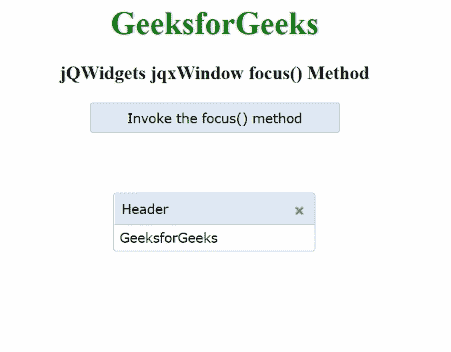

# jQWidgets jqxWindow 焦点()方法

> 原文:[https://www . geesforgeks . org/jqwidgets-jqxwindow-focus-method/](https://www.geeksforgeeks.org/jqwidgets-jqxwindow-focus-method/)

**jQWidgets** 是一个 JavaScript 框架，用于为 PC 和移动设备制作基于 web 的应用程序。它是一个非常强大、优化、独立于平台并且得到广泛支持的框架。 **jqxWindow** 用于在应用程序中输入数据或查看信息。

**聚焦()**方法用于聚焦指定窗口。这个方法不需要任何参数。

**语法:**

```
$('#jqxWindow').jqxWindow('focus');
```

**链接文件:**从给定链接下载 https://www.jqwidgets.com/download/。在 HTML 文件中，找到下载文件夹中的脚本文件。

> <link rel="”stylesheet”" href="”jqwidgets/styles/jqx.base.css”" type="”text/css”">
> < link rel= "样式表" href = " jqwidgets/style/jqx . summer . CSS " type = " text/CSS "/>
> <脚本类型= " text/JavaScript " src = " scripts/jquery-1 . 10 . 2 . min . js "></脚本>
> <脚本类型= " text/JavaScript " src = " jqwidgets/jqxcore . js "

**示例:**下面的示例说明了 jQWidgets **focus()** 方法。

## 超文本标记语言

```
<!DOCTYPE html>
<html lang="en">

<head>
    <link rel="stylesheet" 
          href="jqwidgets/styles/jqx.base.css" 
          type="text/css" />
    <link rel="stylesheet" 
          href="jqwidgets/styles/jqx.summer.css" 
          type="text/css" />
    <script type="text/javascript" 
            src="scripts/jquery-1.10.2.min.js">
    </script>
    <script type="text/javascript" 
            src="jqwidgets/jqxcore.js">
    </script>
    <script type="text/javascript" 
            src="jqwidgets/jqxwindow.js">
    </script>
    <script type="text/javascript" 
            src="jqwidgets/jqxbuttons.js">
    </script>
    <script type="text/javascript">
        $(document).ready(function () {
            $('#jqxwindow').jqxWindow({
                theme: 'energyblue'
            });
            $("#jqxbutton").jqxButton({
                theme: 'energyblue',
                width: 250,
                height: 30
            });
            $('#jqxbutton').click(function () {
                $("#jqxwindow").jqxWindow('focus')
            });
        });
    </script>
</head>

<body>
    <center>
        <h1 style="color: green;"> 
          GeeksforGeeks 
        </h1>
        <h3> 
          jQWidgets jqxWindow focus() Method 
        </h3>
        <input type="button" 
               id="jqxbutton" 
               value="Invoke the focus() method"/>
        <div id='content'>
            <div id='jqxwindow'>
                <div> Header</div>
                <div>
                    <div>GeeksforGeeks</div>
                </div>
            </div>
        </div>
    </center>
</body>

</html>
```

**输出:**



**注意:**在上面的输出中，点击“Invoke the focus()方法”按钮后，指定的窗口获得焦点，然后通过点击键盘上的向上、向下、向左、向右箭头按钮，就可以进行上面的移动。

**参考:**[https://www . jqwidgets . com/jquery-widgets-documentation/documentation/jqxwindow/jquery-window-API . htm？搜索](https://www.jqwidgets.com/jquery-widgets-documentation/documentation/jqxwindow/jquery-window-api.htm?search=)