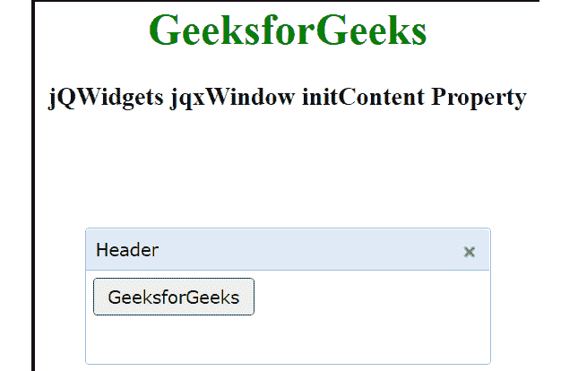

# jqwidgets jqxwindow init content property

> 哎哎哎:# t0]https://www . geeksforgeeks . org/jqwidgets-jqxwindow-init content-property/

**jQWidgets** 是一个 JavaScript 框架，用于为 PC 和移动设备制作基于 web 的应用程序。它是一个非常强大、优化、独立于平台并且得到广泛支持的框架。 **jqxWindow** 用于在应用程序中输入数据或查看信息。

*initContent* 属性用于初始化指定 jqxWindow 的内容。

**语法:**

```html
$('#jqxWindow').jqxWindow({
    initContent: function() {

     // code for widgets 
     initialization here.
     }
 });
```

**链接文件:**从给定链接下载 [jQWidgets](https://www.jqwidgets.com/download/) 。在 HTML 文件中，找到下载文件夹中的脚本文件。

> <link rel="”stylesheet”" href="”jqwidgets/styles/jqx.base.css”" type="”text/css”">
> < link rel= "样式表" href = " jqwidgets/style/jqx . summer . CSS " type = " text/CSS "/>
> <脚本类型= " text/JavaScript " src = " scripts/jquery-1 . 10 . 2 . min . js "></脚本>
> <脚本类型= " text/JavaScript " src = " jqwidgets/jqxcore . js "

**示例:**下面的示例说明了 jQWidgets 中的 jqxWindow***init content*属性。**

## **超文本标记语言**

```html
<!DOCTYPE html>
<html lang="en">

<head>
    <link rel="stylesheet" href=
        "jqwidgets/styles/jqx.base.css" type="text/css" />
    <link rel="stylesheet" 
        href="jqwidgets/styles/jqx.summer.css" type="text/css" />
    <script type="text/javascript" 
        src="scripts/jquery-1.10.2.min.js"></script>
    <script type="text/javascript" 
        src="jqwidgets/jqxcore.js"></script>
    <script type="text/javascript" 
        src="jqwidgets/jqxwindow.js"></script>
    <script type="text/javascript" 
        src="jqwidgets/jqxbuttons.js"></script>

    <script type="text/javascript">
        $(document).ready(function () {
            $("#jqxwindow").jqxWindow({
                height: 100,
                width: 300,
                theme: 'energyblue',
                initContent: function () {
                    $('#jqxwindow1').jqxButton({
                        width: '120px',
                        disabled: false
                    });
                }
            });
        });
    </script>
</head>

<body>
    <center>
        <h1 style="color: green;"> GeeksforGeeks </h1>
        <h3> jQWidgets jqxWindow initContent Property </h3>
        <div id='jqxwindow'>
            <div> Header</div>
            <div>
                <input type="button" 
                    value="GeeksforGeeks" id="jqxwindow1" />
            </div>
        </div>
    </center>
</body>

</html>
```

****输出:****

**

initContent** 

****参考:**[https://www . jqwidgets . com/jquery-widgets-documentation/documentation/jqxwindow/jquery-window-API . htm？搜索=](https://www.jqwidgets.com/jquery-widgets-documentation/documentation/jqxwindow/jquery-window-api.htm?search=)**