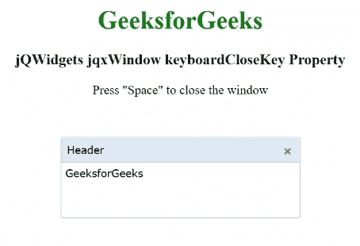

# jQWidgets jqxWindow keyboardCloseKey 属性

> 原文:[https://www . geesforgeks . org/jqwidgets-jqxwindow-keyboardclosekey-property/](https://www.geeksforgeeks.org/jqwidgets-jqxwindow-keyboardclosekey-property/)

**jQWidgets** 是一个 JavaScript 框架，用于为 PC 和移动设备制作基于 web 的应用程序。它是一个非常强大、优化、独立于平台并且得到广泛支持的框架。 **jqxWindow** 用于在应用程序中输入数据或查看信息。

**键盘关闭键**属性用于设置或返回用于在指定窗口聚焦时关闭该窗口的键。它的可能值是每个键码，“Esc”代表转义键。

**语法:**

设置键盘关闭键属性。

```
$('#jqxWindow').jqxWindow({ keyboardCloseKey: 32 });  
```

获取键盘关闭键属性。

```
var keyboardCloseKey = $('#jqxWindow').jqxWindow('keyboardCloseKey'); 
```

**链接文件:**从给定链接下载 [jQWidgets](https://www.jqwidgets.com/download/) 。在 HTML 文件中，找到下载文件夹中的脚本文件。

> <link rel="”stylesheet”" href="”jqwidgets/styles/jqx.base.css”" type="”text/css”">
> < link rel= "样式表" href = " jqwidgets/style/jqx . summer . CSS " type = " text/CSS "/>
> <脚本类型= " text/JavaScript " src = " scripts/jquery-1 . 10 . 2 . min . js "></脚本>
> <脚本类型= " text/JavaScript " src = " jqwidgets/jqxcore . js "

**示例:**下面的示例说明了 jQWidgets 中的 jqxWindow**keyboardCloseKey**属性。在下面的例子中，键盘关闭键被设置为 32，相当于空格键。

## 超文本标记语言

```
<!DOCTYPE html>
<html lang="en">

<head>
    <link rel="stylesheet" href=
        "jqwidgets/styles/jqx.base.css" type="text/css" />
    <link rel="stylesheet" href=
        "jqwidgets/styles/jqx.summer.css" type="text/css" />
    <script type="text/javascript" 
        src="scripts/jquery-1.10.2.min.js"></script>
    <script type="text/javascript" 
        src="jqwidgets/jqxcore.js"></script>
    <script type="text/javascript" 
        src="jqwidgets/jqxwindow.js"></script>
    <script type="text/javascript"
        src="jqwidgets/jqxbuttons.js"></script>

    <script type="text/javascript">
        $(document).ready(function () {
            $("#jqxwindow").jqxWindow({
                height: 100,
                width: 300,
                theme: 'energyblue',
                keyboardCloseKey: 32
            });
            $('#jqxwindow').jqxWindow('focus');
        });
    </script>
</head>

<body>
    <center>
        <h1 style="color: green;">GeeksforGeeks</h1>
        <h3>jQWidgets jqxWindow keyboardCloseKey Property</h3>
        Press "Space" to close the window
        <div id='content'>
            <div id='jqxwindow'>
                <div> Header</div>
                <div>
                    <div>GeeksforGeeks</div>
                </div>
            </div>
        </div>
    </center>
</body>

</html>
```

**输出:**



**参考:**[https://www . jqwidgets . com/jquery-widgets-documentation/documentation/jqxwindow/jquery-window-API . htm？搜索=](https://www.jqwidgets.com/jquery-widgets-documentation/documentation/jqxwindow/jquery-window-api.htm?search=)