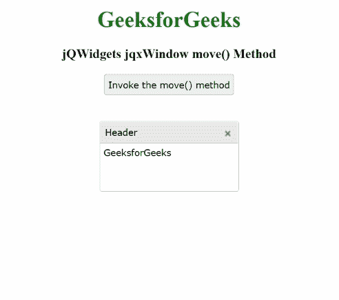

# jQWidgets jqxWindow move()方法

> 原文:[https://www . geesforgeks . org/jqwidgets-jqxwindow-move-method/](https://www.geeksforgeeks.org/jqwidgets-jqxwindow-move-method/)

**简介:jQWidgets** 是一个 JavaScript 框架，用于为 PC 和移动设备制作基于 web 的应用程序。它是一个非常强大、优化、独立于平台并且得到广泛支持的框架。jqxWindow 用于在应用程序中输入数据或查看信息。

使用 **move()** 方法将当前窗口移动到指定的参数中。

**语法:**

```
$('selector').jqxWindow('move', top, left);
```

**参数:**该函数接受两个参数，如下图所示:

*   **顶部:**指定当前窗口移动的顶部编号。
*   **左:**指定当前窗口将要移动的左数。

**链接文件:**从给定链接下载 [jQWidgets](https://www.jqwidgets.com/download/) 。在 HTML 文件中，找到下载文件夹中的脚本文件。

> <link rel="”stylesheet”" href="”jqwidgets/styles/jqx.base.css”" type="”text/css”">
> 
> <link rel="”stylesheet”" href="”jqwidgets/styles/jqx.summer.css”" type="”text/css”">

**示例:**下面的示例说明了 jQWidgets **move()** 方法。

## 超文本标记语言

```
<!DOCTYPE html>
<html lang="en">
  <head>
    <link rel="stylesheet" href=
          "jqwidgets/styles/jqx.base.css" type="text/css"/>
    <link rel="stylesheet" href=
          "jqwidgets/styles/jqx.summer.css" type="text/css"/>
    <script type="text/javascript" src="scripts/jquery-1.10.2.min.js">
    </script>
    <script type="text/javascript" src="jqwidgets/jqxcore.js">
    </script>
    <script type="text/javascript" src="jqwidgets/jqxwindow.js">
    </script>
    <script type="text/javascript" src="jqwidgets/jqxbuttons.js">
    </script>
    <script type="text/javascript">
      $(document).ready(function() {
        $('#jqxwindow').jqxWindow({
          width: 200,
          height: 100
        });
        $("#jqxbutton").jqxButton({
          height: 30
        });
        $('#jqxbutton').click(function() {
          $("#jqxwindow").jqxWindow('move', 100, 200);
        });
      });
    </script>
  </head>
  <body>
    <center>
      <h1 style="color: green;"> GeeksforGeeks </h1>
      <h3> jQWidgets jqxWindow move() Method </h3>
      <input type="button" id="jqxbutton" 
                 value="Invoke the move() method" />
      <div id='content'>
        <div id='jqxwindow'>
          <div> Header</div>
          <div>
             <div>GeeksforGeeks</div>
          </div>
        </div>
      </div>
    </center>
  </body>
</html>
```

**输出:**



**参考:**[https://www . jqwidgets . com/jquery-widgets-documentation/documentation/jqxwindow/jquery-window-API . htm？搜索=](https://www.jqwidgets.com/jquery-widgets-documentation/documentation/jqxwindow/jquery-window-api.htm?search=)