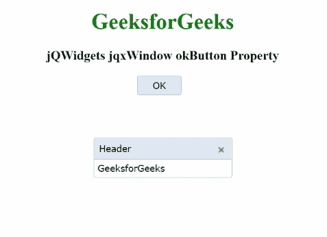

# jQWidgets jqxWindow okButton 属性

> 原文:[https://www . geesforgeks . org/jqwidgets-jqxwindow-ok button-property/](https://www.geeksforgeeks.org/jqwidgets-jqxwindow-okbutton-property/)

**jQWidgets** 是一个 JavaScript 框架，用于为 PC 和移动设备制作基于 web 的应用程序。它是一个非常强大、优化、独立于平台并且得到广泛支持的框架。 **jqxWindow** 用于在应用程序中输入数据或查看信息。

**确定按钮**属性用于设置或获取确定/提交按钮，该确定按钮用于与用户交互。当按下 ok 按钮时，窗口将关闭。

**语法:**

设置*确定按钮*属性。

```
$('#jqxWindow').jqxWindow({ okButton: $('#okButton')});  
```

获取*确定按钮*属性:

```
var okButton = $('#jqxWindow').jqxWindow('okButton'); 
```

**链接文件:**从给定链接下载 [jQWidgets](https://www.jqwidgets.com/download/) 。在 HTML 文件中，找到下载文件夹中的脚本文件。

> <link rel="”stylesheet”" href="”jqwidgets/styles/jqx.base.css”" type="”text/css”">
> < link rel= "样式表" href = " jqwidgets/style/jqx . summer . CSS " type = " text/CSS "/>
> <脚本类型= " text/JavaScript " src = " scripts/jquery-1 . 10 . 2 . min . js "></脚本>
> <脚本类型= " text/JavaScript " src = " jqwidgets/jqxcore . js "

**示例:**以下示例说明了 jQWidgets 中的 jqxWindow **okButton** 属性。

## 超文本标记语言

```
<!DOCTYPE html>
<html lang="en">

<head>
    <link rel="stylesheet" href=
        "jqwidgets/styles/jqx.base.css" type="text/css" />
    <link rel="stylesheet" href=
        "jqwidgets/styles/jqx.summer.css" type="text/css" />
    <script type="text/javascript" 
        src="scripts/jquery-1.10.2.min.js"></script>
    <script type="text/javascript" 
        src="jqwidgets/jqxcore.js"></script>
    <script type="text/javascript" 
        src="jqwidgets/jqxwindow.js"></script>
    <script type="text/javascript" 
        src="jqwidgets/jqxbuttons.js"></script>

    <script type="text/javascript">
        $(document).ready(function () {
            $('#jqxwindow').jqxWindow({
                theme: 'energyblue',
                resizable: false,
                okButton: $('#ok'),
                initContent: function () {
                    $('#ok').jqxButton({
                        width: '65px',
                        theme: 'energyblue'
                    });
                    $('#ok').focus();
                }
            });
        });
    </script>
</head>

<body>
    <center>
        <h1 style="color: green;"> GeeksforGeeks </h1>
        <h3> jQWidgets jqxWindow okButton Property </h3>
        <input type="button" id="ok" value="OK" 
            style="margin-right: 10px" />
        <div id='content'>
            <div id='jqxwindow'>
                <div> Header</div>
                <div>
                    <div>GeeksforGeeks</div>
                </div>
            </div>
        </div>
    </center>
</body>

</html>
```

**输出:**



**参考:**[https://www . jqwidgets . com/jquery-widgets-documentation/documentation/jqxwindow/jquery-window-API . htm？搜索=](https://www.jqwidgets.com/jquery-widgets-documentation/documentation/jqxwindow/jquery-window-api.htm?search=)