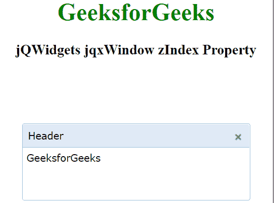

# jQWidgets jqxWindow zIndex 性质

> 原文:[https://www . geesforgeks . org/jqwidgets-jqxwindow-zindex-property/](https://www.geeksforgeeks.org/jqwidgets-jqxwindow-zindex-property/)

**jQWidgets** 是一个 JavaScript 框架，用于为 PC 和移动设备制作基于 web 的应用程序。它是一个非常强大、优化、独立于平台并且得到广泛支持的框架。 **jqxWindow** 用于在应用程序中输入数据或查看信息。

*****属性用于设置或获取指定的 jqxWindow z-index。*****

*******语法:*******

*****设置 *zIndex* 属性。*****

```html
***$('#jqxWindow').jqxWindow({ zIndex: 9999});*** 
```

 *****获得 *zIndex* 属性。*****

```html
***var zIndex = $('#jqxWindow').jqxWindow('zIndex');*** 
```

*******链接文件:**从给定链接下载 [jQWidgets](https://www.jqwidgets.com/download/) 。在 HTML 文件中，找到下载文件夹中的脚本文件。*****

> <link rel="”stylesheet”" href="”jqwidgets/styles/jqx.base.css”" type="”text/css”"> *****< link rel= "样式表" href = " jqwidgets/style/jqx . energy blue . CSS " type = " text/CSS "/>
> <script type = " text/JavaScript " src = " scripts/jquery-1 . 10 . 2 . min . js "></script>
> <script type = " text/JavaScript " src = " jqwidgets/jqxcore。*****

*******示例:**下面的示例说明了 jQWidgets 中的 jqxWindow*zIndex***T5】属性。在下面的示例中，zIndex 已被设置为 9999。*******

## *****超文本标记语言*****

```html
***<!DOCTYPE html>
<html lang="en">

<head>
    <link rel="stylesheet" href=
        "jqwidgets/styles/jqx.base.css" type="text/css" />
    <link rel="stylesheet" href=
    "jqwidgets/styles/jqx.energyblue.css" type="text/css" />
    <script type="text/javascript" 
        src="scripts/jquery-1.10.2.min.js"></script>
    <script type="text/javascript" 
        src="jqwidgets/jqxcore.js"></script>
    <script type="text/javascript" 
        src="jqwidgets/jqxwindow.js"></script>
    <script type="text/javascript" 
        src="jqwidgets/jqxbuttons.js"></script>

    <script type="text/javascript">
        $(document).ready(function () {
            $("#jqxwindow").jqxWindow({
                height: 100,
                width: 300,
                theme: "energyblue",
                zIndex: 9999,
            });
        });
    </script>
</head>

<body>
    <center>
        <h1 style="color: green;">
            GeeksforGeeks
        </h1>

        <h3>jQWidgets jqxWindow zIndex Property</h3>

        <div id="content">
            <div id="jqxwindow">
                <div>Header</div>
                <div>
                    <div>GeeksforGeeks</div>
                </div>
            </div>
        </div>
    </center>
</body>

</html>***
```

*******输出:*******

**********

*******参考:**[https://www . jqwidgets . com/jquery-widgets-documentation/documentation/jqxwindow/jquery-window-API . htm？搜索=](https://www.jqwidgets.com/jquery-widgets-documentation/documentation/jqxwindow/jquery-window-api.htm?search=)*****